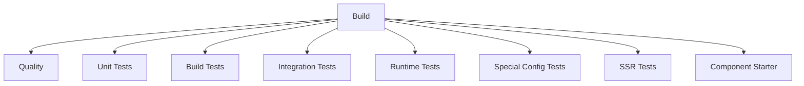

# Stencil Continuous Integration (CI)

This document explains Stencil's CI setup for the v5 monorepo.

## CI Environment

Stencil's CI runs on GitHub Actions using pnpm and supports Node.js 22 and 24.

## Workflow Structure

## Workflows

### Main (`main.yml`)

The orchestrator workflow that runs on push to `main`/`v5` branches and on pull requests.

### Build (`build.yml`)

Builds all packages and uploads artifacts for downstream jobs.

### Quality (`quality.yml`)

Runs quality checks (Linux only):
- `pnpm format:check` - Code formatting (oxfmt)
- `pnpm lint:check` - Linting (oxlint)
- `pnpm typecheck` - TypeScript type checking
- `pnpm knip` - Unused code detection

### Test Workflows

| Workflow | Matrix | Description |
|----------|--------|-------------|
| `test-unit.yml` | Linux | Unit tests for packages (`pnpm test`) |
| `test-build.yml` | Linux/Windows × Node 22/24 | Build test suite (`test/build`) |
| `test-integration.yml` | Linux/Windows × Node 22/24 | Integration tests (`test/integration`) |
| `test-runtime.yml` | Linux/Windows × Node 22/24 | Runtime tests (`test/runtime`) |
| `test-special-config.yml` | Linux/Windows × Node 22/24 | Special config tests (`test/special-config`) |
| `test-ssr.yml` | Linux/Windows × Node 22/24 | SSR tests (`test/ssr`) |
| `test-component-starter.yml` | Linux/Windows × Node 22/24 | Smoke test with component starter template |

## Release Workflows

Release workflows are managed separately and support both v4 (legacy) and v5 (monorepo with changesets).

| Workflow | Description |
|----------|-------------|
| `release-dev.yml` | Developer builds from main |
| `release-nightly.yml` | Nightly builds |
| `release-production.yml` | Production releases |
| `publish-npm.yml` | NPM publishing |

## Test Matrix

Integration test workflows use `fail-fast: false` so sibling jobs continue even if one fails. This reduces the need to re-run all jobs when investigating failures.

## Concurrency

When a `git push` is made to a branch, existing CI jobs for that branch are cancelled and a new run begins.
