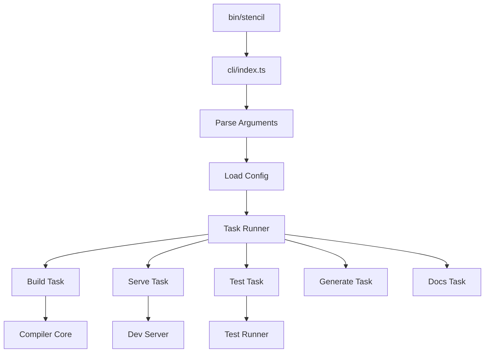

# CLI Architecture

The Stencil CLI is the primary entry point for developers interacting with Stencil. It provides a comprehensive command-line interface for building, serving, testing, and managing Stencil projects.

**Location:** [`src/cli/`](../src/cli/)

## Architecture Overview



## Core Components

### Entry Point (`/bin/stencil`)

The Node.js executable that bootstraps the CLI:

```javascript
#!/usr/bin/env node
'use strict';
require('../cli/index.js').run(process.argv.slice(2));
```

### Main CLI Module (`/src/cli/index.ts`)

The main CLI orchestrator that:
- Parses command-line arguments
- Loads configuration
- Executes appropriate tasks
- Handles errors and exits

Key function: `run(args: string[])`

### Command Parser (`/src/cli/parse-flags.ts`)

Parses command-line arguments into structured flags:

```typescript
interface ConfigFlags {
  task?: TaskCommand;
  args?: string[];
  knownArgs?: string[];
  unknownArgs?: string[];
  
  // Build flags
  build?: boolean;
  cache?: boolean;
  ci?: boolean;
  debug?: boolean;
  dev?: boolean;
  docs?: boolean;
  es5?: boolean;
  log?: boolean;
  prerender?: boolean;
  prod?: boolean;
  serve?: boolean;
  watch?: boolean;
  
  // Paths
  config?: string;
  root?: string;
  
  // Dev server
  address?: string;
  port?: number;
}
```

### Configuration Loading (`/src/cli/load-config.ts`)

Responsible for finding and loading the Stencil configuration:

1. **Search Order**:
   - Explicit `--config` path
   - `stencil.config.ts` in current directory
   - `stencil.config.js` in current directory
   - Walk up directory tree

2. **Config Validation**:
   - TypeScript compilation
   - Schema validation
   - Default values
   - Path resolution

### Task System

Tasks are the core operations that Stencil can perform:

#### Build Task (`/src/cli/task-build.ts`)

Compiles the project:

```typescript
export const taskBuild = async (
  coreCompiler: CoreCompiler,
  config: ValidatedConfig
) => {
  if (config.flags.watch) {
    await taskWatch(coreCompiler, config);
    return;
  }
  
  const compiler = await coreCompiler.createCompiler(config);
  const results = await compiler.build();
  
  if (results.hasError) {
    process.exit(1);
  }
};
```

#### Watch Task (`/src/cli/task-watch.ts`)

Continuous build with file watching:

- Creates compiler in watch mode
- Optionally starts dev server
- Monitors file changes
- Triggers rebuilds

#### Serve Task (`/src/cli/task-serve.ts`)

Starts the development server:

- HTTP server for static files
- WebSocket server for HMR
- Automatic browser refresh
- Error overlay

#### Generate Task (`/src/cli/task-generate.ts`)

Scaffolds new components:

```bash
stencil generate my-component
```

Creates:
- Component TypeScript file
- Stylesheet
- E2E test
- Unit test

#### Docs Task (`/src/cli/task-docs.ts`)

Generates documentation:

- JSON output for tooling
- Markdown for repositories
- Custom formats via plugins

## Telemetry System (`/src/cli/telemetry/`)

Anonymous usage tracking for improving Stencil:

### What's Collected

- Command usage
- Build times
- Error types (not content)
- System info (OS, Node version)
- Project size metrics

### Privacy

- No personal information
- No source code
- No file paths
- Opt-out via `--no-telemetry`

### Implementation

```typescript
export const telemetry = async (
  config: Config,
  action: TelemetryAction
) => {
  if (config.telemetry === false) {
    return;
  }
  
  const data = {
    action,
    version: config.version,
    node: process.version,
    platform: process.platform,
    // ... other metrics
  };
  
  await sendTelemetry(data);
};
```

## Version Checking (`/src/cli/check-version.ts`)

Checks for Stencil updates:

1. **Check Frequency**: Once per day
2. **Version Comparison**: SemVer comparison
3. **Update Notification**: Non-blocking message
4. **Cache Location**: `~/.stencil/version-cache.json`

## Process Management

### Signal Handling

```typescript
process.on('SIGINT', () => {
  config.logger.info('Exiting...');
  destroy();
});
```

### Exit Codes

- `0`: Success
- `1`: General error
- `2`: Invalid configuration
- `3`: Build error

## Logger System

The CLI includes a sophisticated logging system:

### Log Levels

1. **Debug**: Verbose internal details
2. **Info**: General information
3. **Warn**: Potential issues
4. **Error**: Actual problems

### Features

- Colored output
- Timestamps
- Log filtering
- File output option

## Common Patterns

### Task Lifecycle

1. **Parse**: Command-line arguments
2. **Load**: Configuration file
3. **Validate**: Merged configuration
4. **Initialize**: Compiler instance
5. **Execute**: Task logic
6. **Report**: Results and diagnostics
7. **Exit**: With appropriate code

### Error Handling

```typescript
try {
  await runTask(config);
} catch (e) {
  if (shouldIgnoreError(e)) {
    return;
  }
  
  config.logger.error(e);
  process.exit(1);
}
```

### Configuration Merging

Priority order (highest to lowest):
1. CLI flags
2. Environment variables
3. Config file
4. Defaults

## Testing the CLI

### Unit Tests

```bash
npm test src/cli
```

### Integration Tests

Test full CLI commands:

```typescript
describe('cli', () => {
  it('should build project', async () => {
    const { exitCode, output } = await runCLI(['build']);
    expect(exitCode).toBe(0);
    expect(output).toContain('build finished');
  });
});
```

### Manual Testing

```bash
# Test locally
node bin/stencil build --dev

# Test with npm link
npm link
cd /path/to/test/project
stencil build
```

## Debugging

### Debug Mode

```bash
stencil build --debug
```

Enables:
- Verbose logging
- Source maps
- Unminified output
- Performance timing

### Node Debugging

```bash
node --inspect bin/stencil build
```

Connect Chrome DevTools for debugging.

## Common Issues

### Configuration Not Found

**Problem**: CLI can't find `stencil.config.ts`

**Solution**: 
- Check file exists
- Verify working directory
- Use `--config` flag

### TypeScript Errors

**Problem**: Config file has TypeScript errors

**Solution**:
- Ensure TypeScript is installed
- Check for syntax errors
- Verify imports

### Permission Errors

**Problem**: Can't write to output directory

**Solution**:
- Check file permissions
- Run as appropriate user
- Clear output directory

## Future Improvements

1. **Plugin System**: Allow CLI extensions
2. **Interactive Mode**: Guided setup
3. **Performance**: Faster startup time
4. **Diagnostics**: Better error messages
5. **Customization**: User-defined tasks 