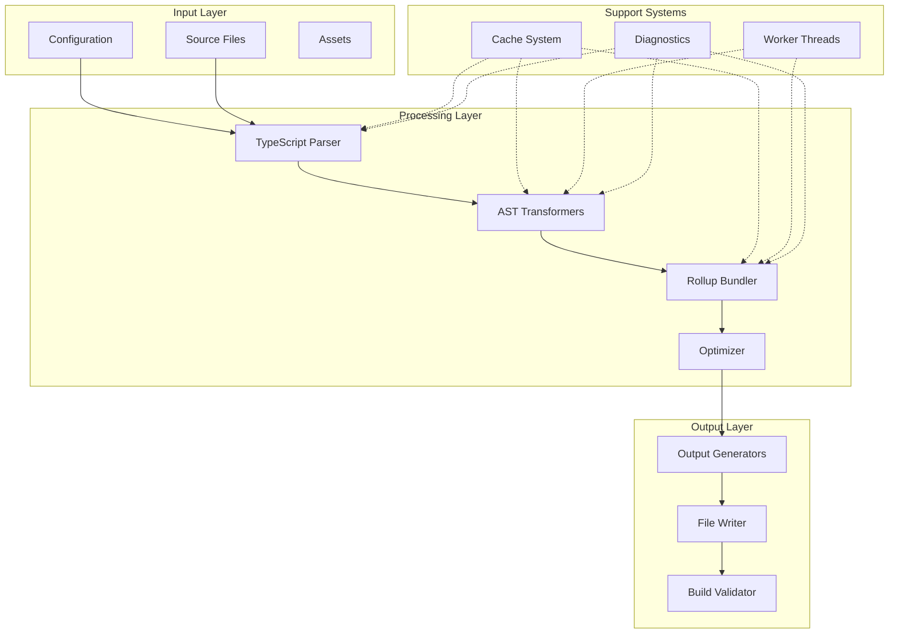
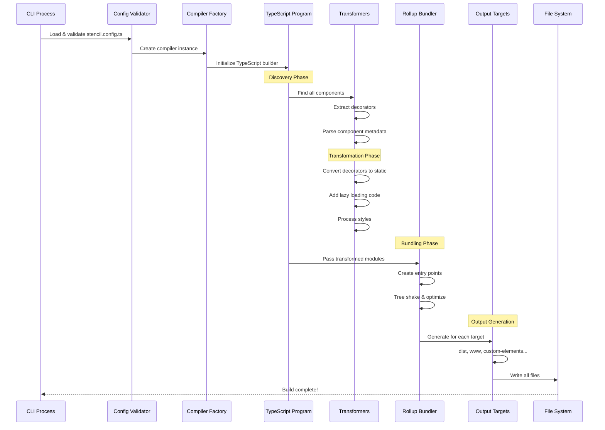
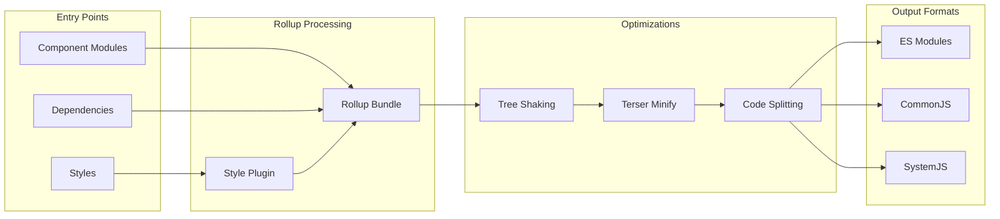
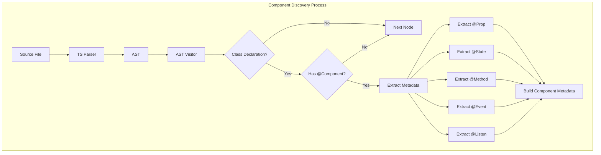
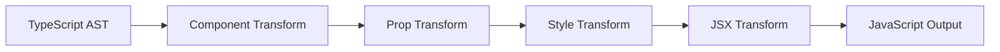
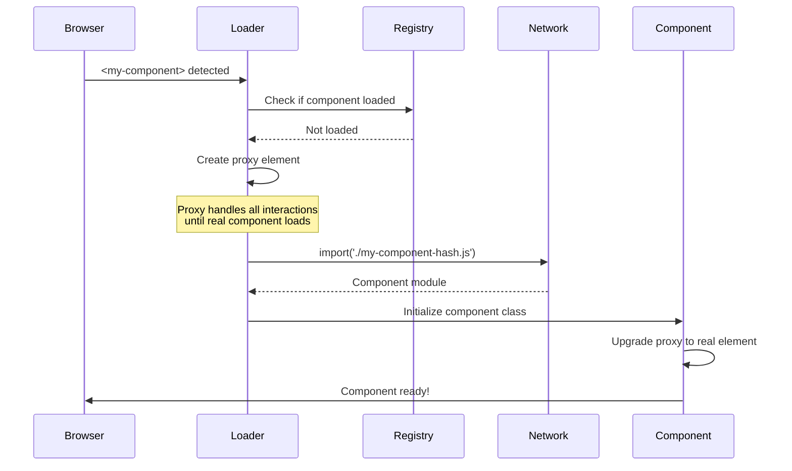
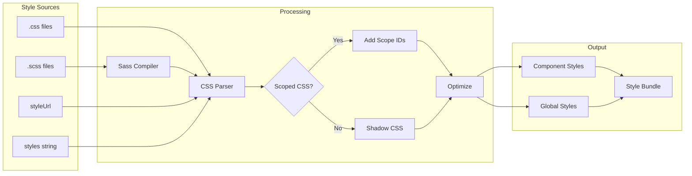
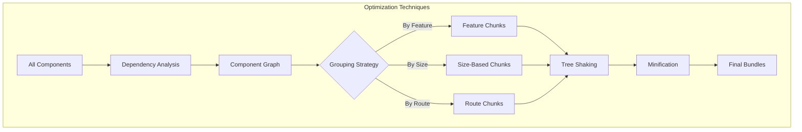
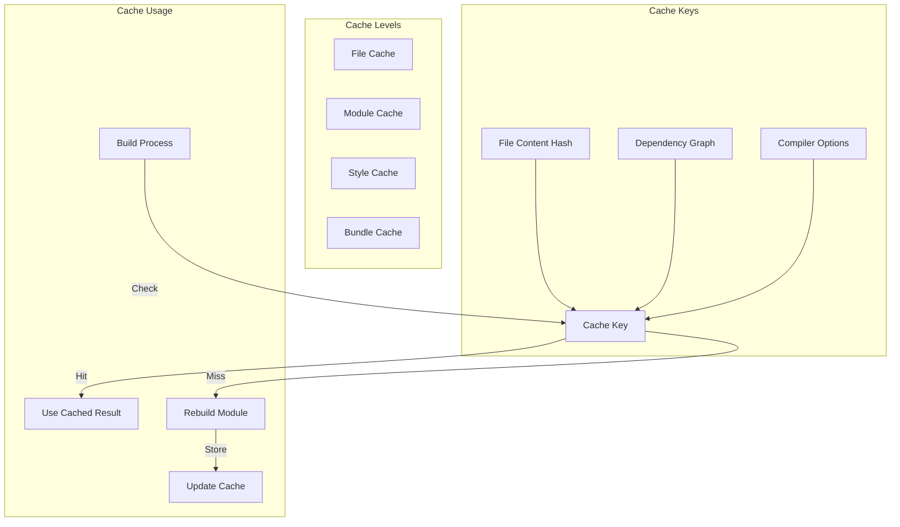
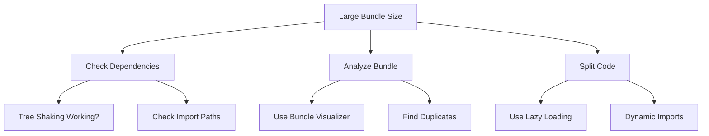

# Compiler Architecture

The Stencil Compiler is the core engine that transforms TypeScript/JSX components into optimized web components. It orchestrates the entire build pipeline from source code to production-ready output.

**Location:** [`src/compiler/`](../src/compiler/)

## Table of Contents

1. [Overview](#overview)
   - [What is the Compiler?](#what-is-the-compiler)
   - [Key Features](#key-features)
   - [Architecture Overview](#architecture-overview)

2. [Build Journey](#build-journey)
   - [What Happens When You Run `stencil build`?](#what-happens-when-you-run-stencil-build)
   - [Phase 1: Initialization & Configuration](#phase-1-initialization--configuration)
   - [Phase 2: Creating the Compiler](#phase-2-creating-the-compiler)
   - [Phase 3: TypeScript Compilation](#phase-3-typescript-compilation)
   - [Phase 4: Component Transformation](#phase-4-component-transformation)
   - [Phase 5: Module Bundling with Rollup](#phase-5-module-bundling-with-rollup)
   - [Phase 6: Output Target Generation](#phase-6-output-target-generation)
   - [Phase 7: File Writing & Validation](#phase-7-file-writing--validation)

3. [Core Components](#core-components)
   - [Compiler Entry](#compiler-entry)
   - [Compiler Context](#compiler-context)
   - [Build Context](#build-context)

4. [Deep Dives](#deep-dives)
   - [Component Discovery & Metadata](#component-discovery--metadata-extraction)
   - [Transform Pipeline](#transform-pipeline)
   - [Lazy Loading Implementation](#lazy-loading-implementation)
   - [Style Processing](#style-processing)
   - [Bundle Optimization](#bundle-optimization)

5. [Build Features](#build-features)
   - [Incremental Builds](#incremental-builds)
   - [Watch Mode](#watch-mode)
   - [Caching System](#caching-system)
   - [Worker Architecture](#worker-architecture)

6. [Output Targets](#output-targets)
   - [Dist Output](#dist-output)
   - [WWW Output](#www-output)
   - [Custom Elements Output](#custom-elements-output)
   - [Creating Custom Output Targets](#creating-custom-output-targets)

7. [Advanced Topics](#advanced-topics)
   - [Plugin System](#plugin-system)
   - [Static Analysis](#static-analysis)
   - [Prerendering](#prerendering)
   - [Service Worker Generation](#service-worker-generation)

8. [Optimization & Performance](#optimization--performance)
   - [Tree Shaking](#tree-shaking)
   - [Code Splitting](#code-splitting)
   - [Minification](#minification)
   - [Memory Management](#memory-management)

9. [Debugging & Diagnostics](#debugging--diagnostics)
   - [Debug Mode](#debug-mode)
   - [Build Analysis](#build-analysis)
   - [Common Build Errors](#common-build-errors)
   - [Performance Profiling](#performance-profiling)

11. [Development Guide](#development-guide)
    - [Testing Compiler Changes](#testing-compiler-changes)
    - [Build Scripts](#build-scripts)
    - [Contributing](#contributing)

12. [Future Improvements](#future-improvements)

---

## Quick Start

This document covers the internals of the Stencil Compiler. If you're looking for:
- **Using Stencil**: See the [official documentation](https://stenciljs.com)
- **CLI Usage**: See [CLI Architecture](./cli.md)
- **Runtime Behavior**: See [Runtime Architecture](./runtime.md)
- **Dev Server**: See [Dev Server Architecture](./dev-server.md)

---

## Overview

### What is the Compiler?

The Stencil Compiler is a sophisticated build tool that:
- Transforms modern TypeScript/JSX into standard JavaScript
- Converts decorators into static metadata
- Generates multiple output formats (ES modules, CommonJS, Custom Elements)
- Optimizes code for production (tree shaking, minification, code splitting)
- Handles styles (CSS, Sass, CSS-in-JS)
- Manages lazy loading and hydration
- Provides hot module replacement for development

### Key Features

```mermaid
graph TD
    Compiler[Stencil Compiler]
    
    Compiler --> Transform[TypeScript/JSX Transform]
    Compiler --> Bundle[Module Bundling]
    Compiler --> Optimize[Production Optimization]
    Compiler --> Output[Multi-Target Output]
    Compiler --> Dev[Development Features]
    
    Transform --> Decorators[Decorator Processing]
    Transform --> JSX[JSX to h() calls]
    Transform --> Types[Type Checking]
    
    Bundle --> Rollup[Rollup Integration]
    Bundle --> Splitting[Code Splitting]
    Bundle --> Lazy[Lazy Loading]
    
    Optimize --> TreeShake[Tree Shaking]
    Optimize --> Minify[Minification]
    Optimize --> Compress[Compression]
    
    Output --> Dist[NPM Distribution]
    Output --> WWW[Web Application]
    Output --> Custom[Custom Elements]
    
    Dev --> HMR[Hot Module Replacement]
    Dev --> Watch[File Watching]
    Dev --> Cache[Build Caching]
```

### Architecture Overview

The compiler is built with a modular architecture:



---

## Build Journey

### What Happens When You Run `stencil build`?

When you run `stencil build` in your terminal, you're kicking off a sophisticated compilation pipeline that transforms your modern component code into optimized, production-ready web components. Let's follow this journey step by step.

### The Complete Build Flow



### Phase 1: Initialization & Configuration

When you run `stencil build`, the first thing that happens is the CLI entry point ([`src/cli/run.ts`](../src/cli/run.ts)) springs into action:

```typescript
// The journey begins here
export const run = async (init: CliInitOptions) => {
  const { args, logger, sys } = init;
  const flags = parseFlags(args);
  
  // Load and validate your stencil.config.ts
  const validated = await coreCompiler.loadConfig({
    config: { flags },
    configPath: foundConfig.configPath,
    logger,
    sys,
  });
  
  // Now we can start the build!
  await taskBuild(coreCompiler, validated.config);
};
```

The configuration loading process ([`src/compiler/sys/config.ts`](../src/compiler/sys/config.ts)) does several important things:
- Validates all your output targets
- Sets up default values for missing options
- Resolves all file paths relative to your project root
- Prepares TypeScript compiler options

### Phase 2: Creating the Compiler

Next, a compiler instance is created ([`src/compiler/compiler.ts`](../src/compiler/compiler.ts)):

```typescript
export const createCompiler = async (userConfig: Config): Promise<Compiler> => {
  const config = getConfig(userConfig);
  const compilerCtx = new CompilerContext();
  
  // Set up in-memory file system for fast builds
  compilerCtx.fs = createInMemoryFs(sys);
  
  // Initialize build cache
  compilerCtx.cache = new Cache(config, createInMemoryFs(sys));
  
  // Patch TypeScript for Stencil's needs
  patchTypescript(config, compilerCtx.fs);
  
  return {
    build: () => createFullBuild(config, compilerCtx),
    createWatcher: () => createWatchBuild(config, compilerCtx),
    destroy: () => compilerCtx.reset()
  };
};
```

The compiler maintains two important contexts:
- **CompilerContext**: Persistent state across builds (cache, module map, etc.)
- **BuildContext**: State for the current build (diagnostics, file changes, etc.)

### Phase 3: TypeScript Compilation

Now the real magic begins. Stencil creates a TypeScript "BuilderProgram" that will handle the compilation:

```mermaid
graph TD
    subgraph "TypeScript Integration"
        TSConfig[tsconfig.json] --> TSProgram[TS Program]
        TSProgram --> TSHost[Watch Host]
        TSHost --> Stencil[Stencil Callback]
    end
    
    subgraph "Component Discovery"
        SourceFiles[.tsx/.ts files] --> AST[TypeScript AST]
        AST --> Decorators[@Component]
        Decorators --> Metadata[Component Metadata]
    end
    
    subgraph "Transformation Pipeline"
        Metadata --> T1[Decorator Transform]
        T1 --> T2[Prop Transform]
        T2 --> T3[Style Transform]  
        T3 --> T4[JSX Transform]
        T4 --> Output[JavaScript + Metadata]
    end
```

The TypeScript compilation happens in [`src/compiler/transpile/run-program.ts`](../src/compiler/transpile/run-program.ts):

```typescript
export const runTsProgram = async (
  config: ValidatedConfig,
  compilerCtx: CompilerCtx,
  buildCtx: BuildCtx,
  tsBuilder: ts.BuilderProgram,
): Promise<boolean> => {
  // Custom transformers that convert Stencil decorators
  const transformers: ts.CustomTransformers = {
    before: [
      convertDecoratorsToStatic(config, buildCtx.diagnostics, tsTypeChecker),
      performAutomaticKeyInsertion,
    ],
    after: [
      convertStaticToMeta(config, compilerCtx, buildCtx, tsTypeChecker)
    ]
  };
  
  // Emit transformed files
  tsBuilder.emit(undefined, emitCallback, undefined, false, transformers);
  
  // Extract component metadata from transformed modules
  buildCtx.components = getComponentsFromModules(buildCtx.moduleFiles);
};
```

### Phase 4: Component Transformation

This is where your modern component code gets transformed. Let's say you have a component like this:

```typescript
@Component({
  tag: 'my-button',
  styleUrl: 'my-button.css',
  shadow: true
})
export class MyButton {
  @Prop() size: string;
  @State() clicked = false;
  
  @Event() myClick: EventEmitter;
  
  @Method()
  async doSomething() {
    // ...
  }
  
  render() {
    return <button onClick={() => this.handleClick()}>Click me!</button>;
  }
}
```

The transformation pipeline converts this into:

```javascript
export class MyButton {
  constructor() {
    this.clicked = false;
  }
  
  async doSomething() {
    // ...
  }
  
  render() {
    return h("button", { onClick: () => this.handleClick() }, "Click me!");
  }
  
  // All decorators become static properties
  static get is() { return "my-button"; }
  static get encapsulation() { return "shadow"; }
  static get properties() {
    return {
      "size": { "type": "string", "attribute": "size" },
      "clicked": { "type": "boolean", "mutable": true }
    };
  }
  static get events() {
    return [{ "name": "myClick", "bubbles": true }];
  }
  static get methods() {
    return { "doSomething": {} };
  }
  static get style() { return MY_BUTTON_CSS; }
}
```

### Phase 5: Module Bundling with Rollup

After TypeScript compilation, Stencil uses Rollup to bundle the modules ([`src/compiler/bundle/`](../src/compiler/bundle/)):



The bundling configuration is built dynamically based on your output targets:

```typescript
const rollupConfig = {
  input: entryPoints,
  plugins: [
    stencilCorePlugin(config, compilerCtx, buildCtx),
    nodeResolve({ browser: true }),
    commonjs(),
    json()
  ],
  treeshake: config.minifyJs,
  output: {
    format: 'es',
    sourcemap: config.sourceMap,
    chunkFileNames: config.hashFileNames ? 'p-[hash].js' : '[name]-[hash].js'
  }
};
```

### Phase 6: Output Target Generation

This is where Stencil's flexibility shines. Based on your configuration, it generates different outputs:

```mermaid
graph TD
    subgraph "Build Artifacts"
        Bundles[Bundled Modules]
        Metadata[Component Metadata]
        Types[TypeScript Definitions]
    end
    
    Bundles --> DistOutput[dist Output]
    Bundles --> WwwOutput[www Output]
    Bundles --> CustomElements[Custom Elements]
    
    DistOutput --> DistFiles[/dist/
    • esm/
    • cjs/
    • loader/
    • types/]
    
    WwwOutput --> WwwFiles[/www/
    • build/
    • index.html
    • host.config.json]
    
    CustomElements --> CEFiles[/dist/components/
    • individual files
    • tree-shakeable]
```

Each output target has its own generator:

**WWW Output** ([`src/compiler/output-targets/output-www.ts`](../src/compiler/output-targets/output-www.ts)):
- Generates an `index.html` that loads your app
- Copies and optimizes assets
- Inlines critical CSS
- Adds preload hints

**Dist Output** ([`src/compiler/output-targets/dist-lazy/`](../src/compiler/output-targets/dist-lazy/)):
- Creates npm-publishable packages
- Generates multiple module formats (ESM, CJS)
- Includes a loader for lazy loading
- Creates TypeScript definitions

**Custom Elements** ([`src/compiler/output-targets/dist-custom-elements/`](../src/compiler/output-targets/dist-custom-elements/)):
- Each component as a standalone custom element
- No lazy loading - direct imports
- Tree-shakeable by modern bundlers

### Phase 7: File Writing & Validation

Finally, everything gets written to disk ([`src/compiler/build/write-build.ts`](../src/compiler/build/write-build.ts)):

```typescript
export const writeBuild = async (
  config: ValidatedConfig,
  compilerCtx: CompilerCtx,
  buildCtx: BuildCtx,
): Promise<void> => {
  // Commit all file operations from in-memory FS to disk
  const commitResults = await compilerCtx.fs.commit();
  
  // Update build context with results
  buildCtx.filesWritten = commitResults.filesWritten;
  buildCtx.filesDeleted = commitResults.filesDeleted;
  
  // Cache successful build artifacts
  await compilerCtx.cache.commit();
  
  // Generate service workers if configured
  await outputServiceWorkers(config, buildCtx);
  
  // Validate all expected files were created
  await validateBuildFiles(config, compilerCtx, buildCtx);
};
```

---

## Core Components

### Compiler Entry (`/src/compiler/compiler.ts`)

The main compiler factory that creates compiler instances:

```typescript
export const createCompiler = async (userConfig: Config): Promise<Compiler> => {
  const config = getConfig(userConfig);
  const compilerCtx = new CompilerContext();
  
  // Initialize subsystems
  compilerCtx.fs = createInMemoryFs(sys);
  compilerCtx.cache = new Cache(config, createInMemoryFs(sys));
  compilerCtx.worker = createSysWorker(config);
  
  // Patch TypeScript for Stencil
  patchTypescript(config, compilerCtx.fs);
  
  return {
    build: () => createFullBuild(config, compilerCtx),
    createWatcher: () => createWatchBuild(config, compilerCtx),
    destroy: () => compilerCtx.reset()
  };
};
```

### Compiler Context (`/src/compiler/build/compiler-ctx.ts`)

Persistent state across builds:

```typescript
class CompilerContext {
  // Build state
  activeBuildId: number;
  activeFilesUpdated: string[];
  hasSuccessfulBuild: boolean;
  
  // Caching
  cache: Cache;
  moduleMap: ModuleMap;
  changedFiles: Set<string>();
  rollupCache: Map<string, RollupCache>();
  stylesheetCache: Map<string, StylesheetResult>();
  
  // File system
  fs: InMemoryFileSystem;
  
  // Component registry
  collections: CollectionCompilerMeta[] = [];
  
  // Worker management
  worker: CompilerWorkerContext;
  
  reset() {
    this.moduleMap.clear();
    this.changedFiles.clear();
    this.stylesheetCache.clear();
    // Keep rollupCache for performance
  }
}
```

### Build Context (`/src/compiler/build/build-ctx.ts`)

Per-build state and results:

```typescript
class BuildContext {
  // Build identity
  buildId = generateBuildId();
  timestamp = Date.now();
  
  // Build metadata
  startTime: number;
  isRebuild: boolean;
  
  // Component data
  components: ComponentCompilerMeta[] = [];
  entryModules: EntryModule[] = [];
  moduleFiles: Module[] = [];
  
  // Build stats
  filesWritten = 0;
  buildDuration = 0;
  bundleSize = 0;
  
  // Build results
  diagnostics: Diagnostic[] = [];
  buildResults: CompilerBuildResults;
  
  // File changes
  filesAdded: string[] = [];
  filesChanged: string[] = [];
  filesDeleted: string[] = [];
  
  createTimeSpan(msg: string) {
    const start = performance.now();
    return {
      finish: (finishMsg: string) => {
        const duration = performance.now() - start;
        this.debug(`${finishMsg} in ${duration}ms`);
      }
    };
  }
}
```

---

## Deep Dives

### Component Discovery & Metadata Extraction

When Stencil processes your source files, it needs to identify which classes are components and extract all their metadata. This happens through a sophisticated AST (Abstract Syntax Tree) analysis.



Here's what happens when Stencil encounters a component:

**Location:** [`src/compiler/transformers/decorators-to-static/convert-decorators.ts`](../src/compiler/transformers/decorators-to-static/convert-decorators.ts)

```typescript
// Your component with decorators
@Component({
  tag: 'my-component',
  styleUrl: 'my-component.css',
  shadow: true
})
export class MyComponent {
  @Prop() name: string;
  @State() isActive = false;
  
  @Watch('name')
  onNameChange(newValue: string, oldValue: string) {
    console.log(`Name changed from ${oldValue} to ${newValue}`);
  }
}
```

Gets transformed into static metadata:

```typescript
export class MyComponent {
  constructor() {
    this.isActive = false;
  }
  
  static get is() { return "my-component"; }
  static get encapsulation() { return "shadow"; }
  static get originalStyleUrls() {
    return ["my-component.css"];
  }
  static get styleUrls() {
    return ["my-component.css"];
  }
  static get properties() {
    return {
      "name": {
        "type": "string",
        "member": "name",
        "reflectToAttr": false,
        "mutable": false,
        "required": false,
        "optional": false,
        "attribute": "name"
      }
    };
  }
  static get states() {
    return {
      "isActive": {}
    };
  }
  static get watchers() {
    return [{
      "propName": "name",
      "methodName": "onNameChange"
    }];
  }
}
```

### Transform Pipeline

The transformation pipeline converts your TypeScript/JSX into a standard JavaScript output. This happens in [`src/compiler/transpile/run-program.ts`](../src/compiler/transpile/run-program.ts).



#### Key Transformers

**Component Transformer** (`component-transpile.ts`):
- Converts decorators to static properties
- Generates lazy-loading code
- Adds runtime metadata

**Native Constructor Transform** (`native-constructor.ts`):
- Converts ES6 classes for ES5 compatibility
- Preserves custom element semantics

**Style Transform** (`style-imports.ts`):
- Extracts and processes styles
- Handles CSS modules
- Generates scoped selectors

### Lazy Loading Implementation

One of Stencil's most powerful features is lazy loading. Here's how it's implemented:



The lazy loading system ([`src/compiler/transformers/component-lazy/lazy-component.ts`](../src/compiler/transformers/component-lazy/lazy-component.ts)) works by:

1. **Generating a Proxy Component**: A lightweight proxy is created for each component
2. **Registering with the Loader**: The proxy is registered with Stencil's runtime loader
3. **Dynamic Import on Demand**: When the component is used, it's dynamically imported
4. **Upgrading the Element**: The proxy is upgraded to the real component

### Style Processing

Stencil handles styles in a sophisticated way to support both Shadow DOM and scoped CSS:



For scoped CSS (non-Shadow DOM), Stencil adds unique scope IDs:

```css
/* Original */
.button {
  background: blue;
}

/* Scoped */
.button.sc-my-component-h {
  background: blue;
}
```

### Bundle Optimization

Stencil employs several strategies to create optimal bundles:



The bundling logic ([`src/compiler/bundle/bundle-output.ts`](../src/compiler/bundle/bundle-output.ts)) considers:

1. **Component Dependencies**: Components that import each other are bundled together
2. **Chunk Size**: Keeps chunks between 10KB-50KB for optimal loading
3. **Common Dependencies**: Shared utilities are extracted to common chunks
4. **Entry Points**: Each major feature can have its own entry point

---

## Build Features

### Incremental Builds

To speed up rebuilds, Stencil implements a multi-level caching system:



### Watch Mode

```typescript
const createWatchBuild = (
  config: Config,
  compilerCtx: CompilerCtx
) => {
  const watchRunner = new WatchRunner(config, compilerCtx);
  
  // Watch source files
  compilerCtx.fs.watch(config.srcDir, {
    recursive: true,
    callback: (event, filename) => {
      if (shouldRebuild(filename)) {
        watchRunner.queue(filename);
      }
    }
  });
  
  // Debounced rebuild
  let rebuildTimer: NodeJS.Timeout;
  watchRunner.on('queue', () => {
    clearTimeout(rebuildTimer);
    rebuildTimer = setTimeout(() => {
      watchRunner.start();
    }, config.watchTimeout || 200);
  });
  
  return watchRunner;
};
```

### Caching System

To speed up rebuilds, Stencil implements a multi-level caching system:


### Worker Architecture

```typescript
class NodeWorkerController {
  workers: NodeWorkerMain[];
  taskQueue: CompilerWorkerTask[];
  
  async run(task: WorkerTask) {
    const worker = this.getAvailableWorker();
    return worker.run(task);
  }
}
```

Tasks distributed to workers:
- TypeScript compilation
- Style processing
- Bundle generation
- Optimization passes

---

## Output Targets

### Dist Output

For npm packages:

```typescript
const outputDist = async (
  config: Config,
  compilerCtx: CompilerCtx,
  buildCtx: BuildCtx,
  outputTarget: OutputTargetDist
) => {
  // Generate entry point
  await generateDistEntry(config, buildCtx, outputTarget);
  
  // Generate loader
  await generateDistLoader(config, compilerCtx, outputTarget);
  
  // Copy collection files
  await generateDistCollection(config, compilerCtx, buildCtx, outputTarget);
  
  // Generate types
  if (outputTarget.typesDir) {
    await generateTypes(config, compilerCtx, buildCtx, outputTarget);
  }
};
```

### WWW Output

Generates web app:

```
www/
├── build/           # Component builds
├── index.html       # App entry
└── host.config.json # Dev server config
```

### Custom Elements Output

Generates standard custom elements:

```typescript
// No lazy loading, direct registration
import { MyComponent } from './my-component.js';
customElements.define('my-component', MyComponent);
```

### Creating Custom Output Targets

You can create custom output targets by implementing the `OutputTarget` interface and registering them in your `stencil.config.ts`.

```typescript
interface OutputTarget {
  type: 'dist' | 'www' | 'custom' | 'docs' | 'stats';
  dir?: string;
  buildDir?: string;
}

// Generate outputs for each target
const generateOutputTargets = async (
  config: Config,
  compilerCtx: CompilerCtx,
  buildCtx: BuildCtx
) => {
  const outputTargets = config.outputTargets;
  
  await Promise.all(
    outputTargets.map(outputTarget => {
      switch (outputTarget.type) {
        case 'dist':
          return outputDist(config, compilerCtx, buildCtx, outputTarget);
        case 'www':
          return outputWww(config, compilerCtx, buildCtx, outputTarget);
        case 'custom':
          return outputTarget.generator(config, compilerCtx, buildCtx);
      }
    })
  );
};
```

---

## Advanced Topics

### Plugin System

Custom Stencil plugin for Rollup:

```typescript
export const stencilPlugin = (): Plugin => ({
  name: 'stencil',
  
  resolveId(id) {
    // Custom resolution logic
  },
  
  load(id) {
    // Load Stencil modules
  },
  
  transform(code, id) {
    // Transform component code
  }
});
```

### Custom Plugins

User-defined plugins:

```typescript
{
  plugins: [
    sass(),
    myCustomPlugin({
      transform(code, id) {
        // Custom transformation
        return code;
      }
    })
  ]
}
```

### Static Analysis

Dependency analysis:

```typescript
interface ComponentGraph {
  // component tag -> dependent tags
  [tagName: string]: string[];
}

// Used for:
// - Optimal loading order
// - Bundle generation
// - Tree shaking
```

Automated documentation:

```typescript
interface ComponentDoc {
  tag: string;
  description: string;
  props: PropDoc[];
  methods: MethodDoc[];
  events: EventDoc[];
  styles: StyleDoc[];
}
```

### Prerendering

Static site generation at build time:

```typescript
const prerenderConfig = {
  entryUrls: ['/'],
  hydrateOptions: {
    timeout: 10000,
    staticComponents: ['app-header', 'app-footer']
  }
};
```

### Service Worker Generation

Automatic PWA support:

```typescript
const swConfig = {
  swSrc: 'src/sw.js',
  globPatterns: ['**/*.{js,css,html}']
};
```

---

## Optimization & Performance

### Tree Shaking

Remove unused code:

```typescript
const treeShakeBundle = (
  bundle: Bundle,
  buildCtx: BuildCtx
) => {
  const used = new Set<string>();
  
  // Mark entry points as used
  bundle.entryPoints.forEach(entry => {
    markAsUsed(entry, used, bundle.graph);
  });
  
  // Remove unused modules
  bundle.modules = bundle.modules.filter(
    module => used.has(module.id)
  );
};
```

### Minification

Production optimizations:

```typescript
const minifyBundle = async (
  code: string,
  config: Config
) => {
  if (!config.minifyJs) {
    return code;
  }
  
  const result = await terser.minify(code, {
    ecma: config.buildEs5 ? 5 : 2017,
    module: true,
    toplevel: true,
    compress: {
      passes: 2,
      global_defs: {
        'process.env.NODE_ENV': 'production'
      }
    },
    mangle: {
      properties: {
        regex: /^__/  // Mangle private properties
      }
    }
  });
  
  return result.code;
};
```

### Code Splitting

Automatic chunking:

```typescript
const createLazyChunks = (
  components: ComponentCompilerMeta[],
  buildCtx: BuildCtx
) => {
  const chunks = new Map<string, ComponentCompilerMeta[]>();
  
  components.forEach(cmp => {
    // Group by dependencies
    const chunkKey = getChunkKey(cmp, buildCtx.componentGraph);
    
    if (!chunks.has(chunkKey)) {
      chunks.set(chunkKey, []);
    }
    
    chunks.get(chunkKey).push(cmp);
  });
  
  // Create optimal chunks
  return optimizeChunks(chunks, {
    maxSize: 50000,  // 50KB max chunk
    minSize: 10000   // 10KB min chunk
  });
};
```

### Memory Management

To prevent out of memory errors, Stencil manages memory carefully:
- Uses in-memory file system for fast builds
- Caches compiled modules and styles
- Reuses Rollup cache across builds
- Minimizes TypeScript compilation time

---

## Debugging & Diagnostics

### Debug Mode

Enable detailed debugging with:

```bash
stencil build --debug --log
```

This enables:
- Component discovery details
- Transform pipeline steps  
- Bundle generation info
- File write operations
- Cache hit/miss ratios
- Build timing for each phase

### Build Analysis

```typescript
// Analyze build performance
const analyzeBuild = (buildCtx: BuildCtx) => {
  console.log('Build Analysis:');
  console.log(`  Duration: ${buildCtx.buildDuration}ms`);
  console.log(`  Components: ${buildCtx.components.length}`);
  console.log(`  Modules: ${buildCtx.moduleFiles.length}`);
  console.log(`  Bundles: ${buildCtx.bundles.length}`);
  console.log(`  Files Written: ${buildCtx.filesWritten}`);
  
  // Component graph
  console.log('\nComponent Dependencies:');
  buildCtx.componentGraph.forEach((deps, component) => {
    console.log(`  ${component}: ${deps.join(', ')}`);
  });
};
```

### Common Build Errors

#### 1. TypeScript Compilation Errors

**Error:** `Cannot find module '@stencil/core'`

```typescript
// Problem
import { Component } from '@stencil/core';  // Error: Cannot find module

// Solution: Check your tsconfig.json
{
  "compilerOptions": {
    "moduleResolution": "node",
    "baseUrl": ".",
    "paths": {
      "@stencil/core": ["node_modules/@stencil/core"]
    }
  }
}
```

#### 2. Component Metadata Errors

**Error:** `Component tag must contain a hyphen`

```typescript
// Problem
@Component({
  tag: 'mycomponent'  // Error: needs hyphen
})

// Solution
@Component({
  tag: 'my-component'  // Valid: contains hyphen
})
```

#### 3. Bundle Size Issues

If your bundles are too large:



### Performance Profiling

Monitor build performance:

```typescript
const stats = await compiler.build();
console.log({
  duration: stats.duration,
  componentCount: stats.componentCount,
  bundleSize: stats.bundleSize
});
```

---

## Development Guide

### Testing Compiler Changes

```bash
npm test src/compiler
```

Integration tests:
```typescript
describe('compiler', () => {
  it('should compile component', async () => {
    const results = await compile({
      srcDir: './test/fixtures'
    });
    
    expect(results.hasError).toBe(false);
    expect(results.components).toHaveLength(1);
  });
});
```

### Build Scripts

```json
{
  "scripts": {
    "build": "node scripts/build.js",
    "build.prod": "node scripts/build.js --prod",
    "build.dev": "node scripts/build.js --dev",
    "watch": "node scripts/build.js --watch"
  }
}
```

### Custom Build Script

```typescript
// scripts/build.js
const { createNodeLogger, createNodeSys } = require('@stencil/core/compiler');

async function build() {
  const logger = createNodeLogger();
  const sys = createNodeSys();
  
  const validated = await loadConfig({
    config: {
      flags: parseArgs(process.argv.slice(2))
    },
    logger,
    sys
  });
  
  const compiler = await createCompiler(validated.config);
  
  if (validated.config.flags.watch) {
    const watcher = await compiler.createWatcher();
    process.on('SIGINT', () => watcher.close());
  } else {
    const results = await compiler.build();
    await compiler.destroy();
    
    if (results.hasError) {
      process.exit(1);
    }
  }
}

build().catch(console.error);
```
