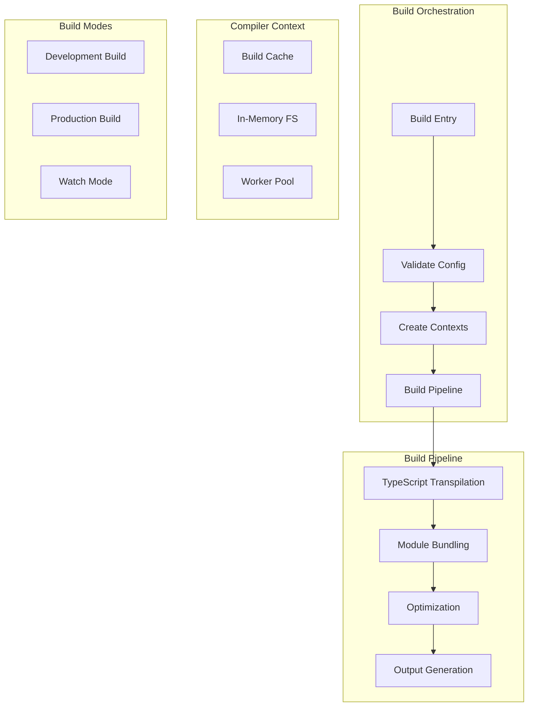
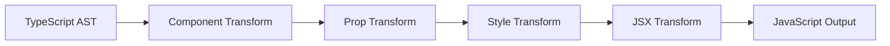

# Compiler Architecture

The Stencil Compiler is the core engine that transforms TypeScript/JSX components into optimized web components. It orchestrates the entire build pipeline from source code to production-ready output.

**Location:** [`src/compiler/`](../src/compiler/)

## Architecture Overview



## Core Components

### Compiler Entry (`/src/compiler/compiler.ts`)

The main compiler factory that creates compiler instances:

```typescript
export const createCompiler = async (userConfig: Config): Promise<Compiler> => {
  const config = getConfig(userConfig);
  const compilerCtx = new CompilerContext();
  
  // Initialize subsystems
  compilerCtx.fs = createInMemoryFs(sys);
  compilerCtx.cache = new Cache(config, createInMemoryFs(sys));
  compilerCtx.worker = createSysWorker(config);
  
  // Patch TypeScript for Stencil
  patchTypescript(config, compilerCtx.fs);
  
  return {
    build: () => createFullBuild(config, compilerCtx),
    createWatcher: () => createWatchBuild(config, compilerCtx),
    destroy: () => compilerCtx.reset()
  };
};
```

### Compiler Context (`/src/compiler/build/compiler-ctx.ts`)

Persistent state across builds:

```typescript
class CompilerContext {
  // Build state
  activeBuildId: number;
  activeFilesUpdated: string[];
  hasSuccessfulBuild: boolean;
  
  // Caching
  cache: Cache;
  moduleMap: ModuleMap;
  changedFiles: Set<string>();
  rollupCache: Map<string, RollupCache>();
  stylesheetCache: Map<string, StylesheetResult>();
  
  // File system
  fs: InMemoryFileSystem;
  
  // Component registry
  collections: CollectionCompilerMeta[] = [];
  
  // Worker management
  worker: CompilerWorkerContext;
  
  reset() {
    this.moduleMap.clear();
    this.changedFiles.clear();
    this.stylesheetCache.clear();
    // Keep rollupCache for performance
  }
}
```

### Build Context (`/src/compiler/build/build-ctx.ts`)

Per-build state and results:

```typescript
class BuildContext {
  // Build identity
  buildId = generateBuildId();
  timestamp = Date.now();
  
  // Build metadata
  startTime: number;
  isRebuild: boolean;
  
  // Component data
  components: ComponentCompilerMeta[] = [];
  entryModules: EntryModule[] = [];
  moduleFiles: Module[] = [];
  
  // Build stats
  filesWritten = 0;
  buildDuration = 0;
  bundleSize = 0;
  
  // Build results
  diagnostics: Diagnostic[] = [];
  buildResults: CompilerBuildResults;
  
  // File changes
  filesAdded: string[] = [];
  filesChanged: string[] = [];
  filesDeleted: string[] = [];
  
  createTimeSpan(msg: string) {
    const start = performance.now();
    return {
      finish: (finishMsg: string) => {
        const duration = performance.now() - start;
        this.debug(`${finishMsg} in ${duration}ms`);
      }
    };
  }
}
```

## Build Flow

### 1. Build Initialization

```typescript
// src/compiler/build/build.ts
export const build = async (
  config: ValidatedConfig,
  compilerCtx: CompilerCtx,
  buildCtx: BuildCtx,
  tsBuilder: ts.BuilderProgram
) => {
  // Reset working directory
  process.chdir(config.rootDir);
  
  // Empty output directories on first build
  await emptyOutputTargets(config, compilerCtx, buildCtx);
  
  // Load package.json
  await readPackageJson(config, compilerCtx, buildCtx);
  
  // Run TypeScript compilation
  await runTsProgram(config, compilerCtx, buildCtx, tsBuilder);
  
  // Generate styles
  buildCtx.stylesPromise = generateGlobalStyles(config, compilerCtx, buildCtx);
  
  // Generate outputs
  await generateOutputTargets(config, compilerCtx, buildCtx);
  
  // Write build artifacts
  await writeBuild(config, compilerCtx, buildCtx);
};
```

### 2. Component Discovery

Finds and analyzes all components:

```typescript
// Decorator detection
@Component({
  tag: 'my-component',
  styleUrl: 'my-component.css',
  shadow: true
})
export class MyComponent {
  @Prop() name: string;
  @State() count: number;
  @Event() myEvent: EventEmitter;
  @Method() async doSomething() {}
  @Watch('name') onNameChange() {}
}
```

The compiler extracts:
- Component metadata
- Properties and their types
- Methods and events
- Lifecycle hooks
- Style imports

### 3. TypeScript Compilation

The build process uses the TypeScript compiler API:

```typescript
const runTsProgram = async (
  config: Config,
  compilerCtx: CompilerCtx,
  buildCtx: BuildCtx,
  tsBuilder: ts.BuilderProgram
) => {
  const tsProgramTimer = buildCtx.createTimeSpan('ts program');
  
  // Get changed files
  const affectedFiles = tsBuilder.getSemanticDiagnosticsOfNextAffectedFile();
  
  // Process each file
  while (affectedFiles) {
    const sourceFile = affectedFiles.affected as ts.SourceFile;
    
    // Transform Stencil decorators
    const transformed = transformStencilProgram(
      tsBuilder.getProgram(),
      sourceFile,
      config
    );
    
    // Collect component metadata
    collectComponentMetadata(transformed, buildCtx);
  }
  
  tsProgramTimer.finish('ts program finished');
};
```

#### Transform Pipeline



#### Key Transformers

**Component Transformer** (`component-transpile.ts`):
- Converts decorators to static properties
- Generates lazy-loading code
- Adds runtime metadata

**Native Constructor Transform** (`native-constructor.ts`):
- Converts ES6 classes for ES5 compatibility
- Preserves custom element semantics

**Style Transform** (`style-imports.ts`):
- Extracts and processes styles
- Handles CSS modules
- Generates scoped selectors

### 4. Module Bundling

Rollup handles module bundling:

```typescript
const bundleComponents = async (
  config: Config,
  compilerCtx: CompilerCtx,
  buildCtx: BuildCtx
) => {
  // Generate bundles for different output targets
  const bundleOptions = [
    {
      id: 'lazy',
      platform: 'client',
      format: 'es',
      entryPoints: buildCtx.entryModules,
      requiresHashedFilenames: true
    },
    {
      id: 'esm-browser', 
      platform: 'client-browser',
      format: 'es',
      entryPoints: buildCtx.entryModules,
      requiresHashedFilenames: false
    }
  ];
  
  for (const bundleOpts of bundleOptions) {
    const rollupBuild = await rollup.rollup({
      input: bundleOpts.entryPoints.map(e => e.path),
      plugins: [
        stencilCorePlugin(config, compilerCtx, buildCtx),
        nodeResolve({
          preferBuiltins: false,
          browser: true
        }),
        commonjs(),
        json()
      ],
      cache: compilerCtx.rollupCache.get(bundleOpts.id),
      treeshake: config.minifyJs,
      preserveEntrySignatures: 'strict'
    });
    
    // Generate output
    const { output } = await rollupBuild.generate({
      format: bundleOpts.format,
      sourcemap: config.sourceMap,
      banner: getBuildBanner(config),
      chunkFileNames: bundleOpts.requiresHashedFilenames 
        ? 'p-[hash].js' 
        : '[name]-[hash].js'
    });
    
    // Cache for rebuilds
    compilerCtx.rollupCache.set(bundleOpts.id, rollupBuild.cache);
    
    // Store results for output generation
    buildCtx.rollupResults.set(bundleOpts.id, output);
  }
};
```

### 5. Output Generation

#### Output Target System

```typescript
interface OutputTarget {
  type: 'dist' | 'www' | 'custom' | 'docs' | 'stats';
  dir?: string;
  buildDir?: string;
}

// Generate outputs for each target
const generateOutputTargets = async (
  config: Config,
  compilerCtx: CompilerCtx,
  buildCtx: BuildCtx
) => {
  const outputTargets = config.outputTargets;
  
  await Promise.all(
    outputTargets.map(outputTarget => {
      switch (outputTarget.type) {
        case 'dist':
          return outputDist(config, compilerCtx, buildCtx, outputTarget);
        case 'www':
          return outputWww(config, compilerCtx, buildCtx, outputTarget);
        case 'custom':
          return outputTarget.generator(config, compilerCtx, buildCtx);
      }
    })
  );
};
```

#### Dist Output Target

For npm packages:

```typescript
const outputDist = async (
  config: Config,
  compilerCtx: CompilerCtx,
  buildCtx: BuildCtx,
  outputTarget: OutputTargetDist
) => {
  // Generate entry point
  await generateDistEntry(config, buildCtx, outputTarget);
  
  // Generate loader
  await generateDistLoader(config, compilerCtx, outputTarget);
  
  // Copy collection files
  await generateDistCollection(config, compilerCtx, buildCtx, outputTarget);
  
  // Generate types
  if (outputTarget.typesDir) {
    await generateTypes(config, compilerCtx, buildCtx, outputTarget);
  }
};
```

#### WWW Output Target

Generates web app:

```
www/
├── build/           # Component builds
├── index.html       # App entry
└── host.config.json # Dev server config
```

#### Custom Elements Output

Generates standard custom elements:

```typescript
// No lazy loading, direct registration
import { MyComponent } from './my-component.js';
customElements.define('my-component', MyComponent);
```

## Build Optimization

### Tree Shaking

Remove unused code:

```typescript
const treeShakeBundle = (
  bundle: Bundle,
  buildCtx: BuildCtx
) => {
  const used = new Set<string>();
  
  // Mark entry points as used
  bundle.entryPoints.forEach(entry => {
    markAsUsed(entry, used, bundle.graph);
  });
  
  // Remove unused modules
  bundle.modules = bundle.modules.filter(
    module => used.has(module.id)
  );
};
```

### Minification

Production optimizations:

```typescript
const minifyBundle = async (
  code: string,
  config: Config
) => {
  if (!config.minifyJs) {
    return code;
  }
  
  const result = await terser.minify(code, {
    ecma: config.buildEs5 ? 5 : 2017,
    module: true,
    toplevel: true,
    compress: {
      passes: 2,
      global_defs: {
        'process.env.NODE_ENV': 'production'
      }
    },
    mangle: {
      properties: {
        regex: /^__/  // Mangle private properties
      }
    }
  });
  
  return result.code;
};
```

### Code Splitting

Automatic chunking:

```typescript
const createLazyChunks = (
  components: ComponentCompilerMeta[],
  buildCtx: BuildCtx
) => {
  const chunks = new Map<string, ComponentCompilerMeta[]>();
  
  components.forEach(cmp => {
    // Group by dependencies
    const chunkKey = getChunkKey(cmp, buildCtx.componentGraph);
    
    if (!chunks.has(chunkKey)) {
      chunks.set(chunkKey, []);
    }
    
    chunks.get(chunkKey).push(cmp);
  });
  
  // Create optimal chunks
  return optimizeChunks(chunks, {
    maxSize: 50000,  // 50KB max chunk
    minSize: 10000   // 10KB min chunk
  });
};
```

## Incremental Builds

### File Watching

```typescript
const createWatchBuild = (
  config: Config,
  compilerCtx: CompilerCtx
) => {
  const watchRunner = new WatchRunner(config, compilerCtx);
  
  // Watch source files
  compilerCtx.fs.watch(config.srcDir, {
    recursive: true,
    callback: (event, filename) => {
      if (shouldRebuild(filename)) {
        watchRunner.queue(filename);
      }
    }
  });
  
  // Debounced rebuild
  let rebuildTimer: NodeJS.Timeout;
  watchRunner.on('queue', () => {
    clearTimeout(rebuildTimer);
    rebuildTimer = setTimeout(() => {
      watchRunner.start();
    }, config.watchTimeout || 200);
  });
  
  return watchRunner;
};
```

### Incremental TypeScript

```typescript
const createIncrementalProgram = (
  config: Config,
  compilerCtx: CompilerCtx
) => {
  const host = ts.createIncrementalCompilerHost(config.tsconfig);
  
  // Override file reading to use in-memory FS
  host.readFile = (fileName) => {
    return compilerCtx.fs.readFileSync(fileName);
  };
  
  // Create incremental program
  return ts.createIncrementalProgram({
    rootNames: config.rootNames,
    options: config.tsOptions,
    host,
    oldProgram: compilerCtx.tsProgram
  });
};
```

## Advanced Features

### Prerendering

Static site generation at build time:

```typescript
const prerenderConfig = {
  entryUrls: ['/'],
  hydrateOptions: {
    timeout: 10000,
    staticComponents: ['app-header', 'app-footer']
  }
};
```

### Service Worker Generation

Automatic PWA support:

```typescript
const swConfig = {
  swSrc: 'src/sw.js',
  globPatterns: ['**/*.{js,css,html}']
};
```

## Worker Architecture

### Multi-threading

```typescript
class NodeWorkerController {
  workers: NodeWorkerMain[];
  taskQueue: CompilerWorkerTask[];
  
  async run(task: WorkerTask) {
    const worker = this.getAvailableWorker();
    return worker.run(task);
  }
}
```

### Task Distribution

Tasks distributed to workers:
- TypeScript compilation
- Style processing
- Bundle generation
- Optimization passes

## Caching System

### Cache Types

1. **Module Cache**: Compiled TypeScript modules
2. **Style Cache**: Processed CSS
3. **Bundle Cache**: Rollup build results
4. **Emit Cache**: Generated file contents

### Cache Management

```typescript
class BuildCache {
  private cache = new Map<string, CacheEntry>();
  
  async get(key: string): Promise<any> {
    const entry = this.cache.get(key);
    
    if (!entry) {
      return null;
    }
    
    // Check if stale
    if (Date.now() - entry.timestamp > entry.ttl) {
      this.cache.delete(key);
      return null;
    }
    
    return entry.value;
  }
  
  set(key: string, value: any, ttl = 3600000) {
    this.cache.set(key, {
      value,
      timestamp: Date.now(),
      ttl
    });
  }
  
  clear() {
    this.cache.clear();
  }
}
```

### Cache Invalidation

```typescript
const shouldInvalidate = (
  file: string,
  lastModified: number
) => {
  const cached = cache.get(file);
  return !cached || cached.timestamp < lastModified;
};
```

## Plugin System

### Rollup Plugins

Custom Stencil plugin for Rollup:

```typescript
export const stencilPlugin = (): Plugin => ({
  name: 'stencil',
  
  resolveId(id) {
    // Custom resolution logic
  },
  
  load(id) {
    // Load Stencil modules
  },
  
  transform(code, id) {
    // Transform component code
  }
});
```

### Custom Plugins

User-defined plugins:

```typescript
{
  plugins: [
    sass(),
    myCustomPlugin({
      transform(code, id) {
        // Custom transformation
        return code;
      }
    })
  ]
}
```

## Static Analysis

### Component Graph

Dependency analysis:

```typescript
interface ComponentGraph {
  // component tag -> dependent tags
  [tagName: string]: string[];
}

// Used for:
// - Optimal loading order
// - Bundle generation
// - Tree shaking
```

### Type Extraction

Automated documentation:

```typescript
interface ComponentDoc {
  tag: string;
  description: string;
  props: PropDoc[];
  methods: MethodDoc[];
  events: EventDoc[];
  styles: StyleDoc[];
}
```

## Diagnostics

### Error Reporting

```typescript
interface Diagnostic {
  level: 'error' | 'warn' | 'info';
  type: string;
  code: string;
  header: string;
  messageText: string;
  absFilePath?: string;
  lineNumber?: number;
  columnNumber?: number;
}
```

### Common Diagnostics

1. **Type Errors**: TypeScript compilation
2. **Runtime Errors**: Invalid component usage
3. **Style Errors**: CSS parsing issues
4. **Config Errors**: Invalid configuration

## Build Scripts

### Package Scripts

```json
{
  "scripts": {
    "build": "node scripts/build.js",
    "build.prod": "node scripts/build.js --prod",
    "build.dev": "node scripts/build.js --dev",
    "watch": "node scripts/build.js --watch"
  }
}
```

### Custom Build Script

```typescript
// scripts/build.js
const { createNodeLogger, createNodeSys } = require('@stencil/core/compiler');

async function build() {
  const logger = createNodeLogger();
  const sys = createNodeSys();
  
  const validated = await loadConfig({
    config: {
      flags: parseArgs(process.argv.slice(2))
    },
    logger,
    sys
  });
  
  const compiler = await createCompiler(validated.config);
  
  if (validated.config.flags.watch) {
    const watcher = await compiler.createWatcher();
    process.on('SIGINT', () => watcher.close());
  } else {
    const results = await compiler.build();
    await compiler.destroy();
    
    if (results.hasError) {
      process.exit(1);
    }
  }
}

build().catch(console.error);
```

## Testing Compiler Changes

### Unit Tests

```bash
npm test src/compiler
```

### Integration Tests

Test full compilation:

```typescript
describe('compiler', () => {
  it('should compile component', async () => {
    const results = await compile({
      srcDir: './test/fixtures'
    });
    
    expect(results.hasError).toBe(false);
    expect(results.components).toHaveLength(1);
  });
});
```

### Performance Testing

Monitor build performance:

```typescript
const stats = await compiler.build();
console.log({
  duration: stats.duration,
  componentCount: stats.componentCount,
  bundleSize: stats.bundleSize
});
```

## Debugging

### Debug Output

```bash
# Verbose logging
stencil build --debug --log

# Output build stats
stencil build --stats

# Generate dependency graph
stencil build --docs
```

### Build Analysis

```typescript
// Analyze build performance
const analyzeBuild = (buildCtx: BuildCtx) => {
  console.log('Build Analysis:');
  console.log(`  Duration: ${buildCtx.buildDuration}ms`);
  console.log(`  Components: ${buildCtx.components.length}`);
  console.log(`  Modules: ${buildCtx.moduleFiles.length}`);
  console.log(`  Bundles: ${buildCtx.bundles.length}`);
  console.log(`  Files Written: ${buildCtx.filesWritten}`);
  
  // Component graph
  console.log('\nComponent Dependencies:');
  buildCtx.componentGraph.forEach((deps, component) => {
    console.log(`  ${component}: ${deps.join(', ')}`);
  });
};
```

### Source Maps

Enable for debugging:

```typescript
{
  sourceMap: true,
  devMode: true
}
```

### AST Inspection

View transformed code:

```bash
stencil build --debug --output-ast
```

## Common Issues

### Out of Memory

```bash
# Increase Node memory
NODE_OPTIONS="--max-old-space-size=8192" stencil build
```

### Slow Builds

1. **Enable caching**: `cache: true` in config
2. **Reduce TypeScript checks**: Use `skipLibCheck`
3. **Optimize imports**: Avoid barrel exports
4. **Use workers**: `maxConcurrentWorkers: 4`

## Future Improvements

1. **Incremental Compilation**: Faster rebuilds
2. **Incremental Bundling**: Faster module generation
3. **Persistent Caching**: Cross-session cache
4. **Better Error Messages**: More helpful diagnostics
5. **Module Federation**: Micro-frontend support
6. **WASM Integration**: Rust-based transforms
7. **Build Caching**: Distributed cache support
8. **Parallel Output**: Concurrent target generation 