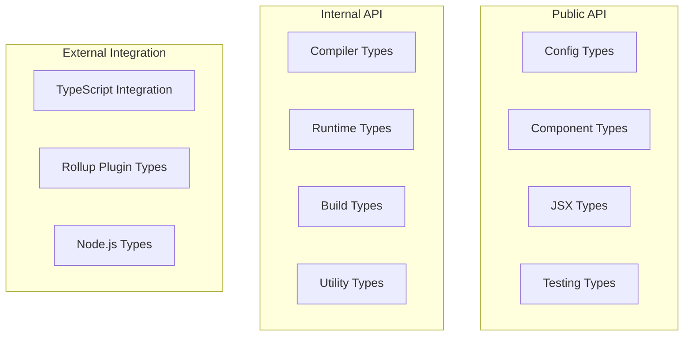

# Declarations Architecture

The Declarations module defines all TypeScript types and interfaces used throughout Stencil. It serves as the contract between different parts of the system and provides type safety for both internal and external APIs.

**Location:** [`src/declarations/`](../src/declarations/)

## Architecture Overview



## Core Type Categories

### Configuration Types

#### Config Interface

The main configuration interface for Stencil projects:

**Location:** [`src/declarations/stencil-public-compiler.ts`](../src/declarations/stencil-public-compiler.ts)

Key interfaces:
- `Config` - Main configuration interface
- `ValidatedConfig` - Post-validation configuration with all required fields
- `DevServerConfig` - Dev server specific configuration
- `TestingConfig` - Testing configuration options

Common usage patterns:
```typescript
import type { Config } from '@stencil/core';

export const config: Config = {
  // Configuration options
};
```

### Component Types

#### Component Decorators

Component metadata and decorator types:

**Location:** [`src/declarations/stencil-public-runtime.ts`](../src/declarations/stencil-public-runtime.ts)

Key interfaces:
- `ComponentOptions` - Options for `@Component()` decorator
- `PropOptions` - Options for `@Prop()` decorator
- `StateOptions` - Options for `@State()` decorator
- `MethodOptions` - Options for `@Method()` decorator
- `EventOptions` - Options for `@Event()` decorator
- `ListenOptions` - Options for `@Listen()` decorator
- `WatchOptions` - Options for `@Watch()` decorator
- `ElementOptions` - Options for `@Element()` decorator

#### Component Interface

**Location:** [`src/declarations/stencil-public-runtime.ts`](../src/declarations/stencil-public-runtime.ts)

- `ComponentInterface` - Base interface all components implement
- `ComponentWillLoad`, `ComponentDidLoad`, etc. - Lifecycle method interfaces

### Runtime Types

Core runtime type definitions:

#### Host Reference

**Location:** [`src/declarations/stencil-private.ts`](../src/declarations/stencil-private.ts)

- `HostRef` - Component instance data structure
- `HostElement` - Enhanced HTMLElement with Stencil properties

#### Virtual DOM

**Location:** [`src/declarations/vdom.ts`](../src/declarations/vdom.ts)

- `VNode` - Virtual DOM node representation
- `VNodeData` - Virtual node attributes and properties
- `ChildType` - Valid child node types

#### Component Runtime Metadata

**Location:** [`src/declarations/stencil-private.ts`](../src/declarations/stencil-private.ts)

- `ComponentRuntimeMeta` - Runtime component metadata
- `ComponentRuntimeMembers` - Member definitions
- `ComponentConstructor` - Component constructor type

### Build Types

Build process type definitions:

#### Build Context

**Location:** [`src/declarations/stencil-private.ts`](../src/declarations/stencil-private.ts)

- `BuildCtx` - Build state and results
- `CompilerBuildResults` - Build output data
- `BuildConditionals` - Feature flags

#### Compiler Context

**Location:** [`src/declarations/stencil-private.ts`](../src/declarations/stencil-private.ts)

- `CompilerCtx` - Persistent compiler state
- `CompilerWorkerContext` - Worker thread context
- `ModuleMap` - Module tracking

#### Module Types

**Location:** [`src/declarations/stencil-private.ts`](../src/declarations/stencil-private.ts)

- `Module` - Compiled module representation
- `ComponentCompilerMeta` - Component metadata during compilation
- `ComponentCompilerProperty` - Property metadata

### Output Target Types

Different output target configurations:

**Location:** [`src/declarations/stencil-public-compiler.ts`](../src/declarations/stencil-public-compiler.ts)

- `OutputTarget` - Base output target interface
- `OutputTargetDist` - Distribution output (`type: 'dist'`)
- `OutputTargetWww` - Web app output (`type: 'www'`)
- `OutputTargetCustom` - Custom output (`type: 'custom'`)
- `OutputTargetDistCustomElements` - Custom elements bundle
- `OutputTargetHydrate` - SSR/hydrate app
- `OutputTargetStats` - Build statistics

### JSX Types

JSX and element type definitions:

**Location:** [`src/declarations/jsx.ts`](../src/declarations/jsx.ts)

- `JSX.IntrinsicElements` - HTML element types
- `JSX.Element` - JSX element type
- `HTMLAttributes` - HTML attribute types
- `DOMAttributes` - DOM event handlers

**Additional JSX types:** [`src/declarations/stencil-public-runtime.ts`](../src/declarations/stencil-public-runtime.ts)
- `LocalJSX` - Component-specific JSX namespace
- `LibraryManagedAttributes` - Attribute management

### System and Utility Types

#### Compiler System

**Location:** [`src/declarations/stencil-private.ts`](../src/declarations/stencil-private.ts)

- `CompilerSystem` - File system abstraction
- `Logger` - Logging interface
- `Cache` - Build cache interface

#### Diagnostics

**Location:** [`src/declarations/stencil-public-compiler.ts`](../src/declarations/stencil-public-compiler.ts)

- `Diagnostic` - Error/warning representation
- `DiagnosticLevel` - Error severity levels
- `DiagnosticMessageChain` - Chained diagnostic messages

## Type Flags and Enums

### Member Flags

**Location:** [`src/utils/constants.ts`](../src/utils/constants.ts)

- `MEMBER_FLAGS` - Bitwise flags for component members
- `HOST_FLAGS` - Component instance state flags
- `VNODE_FLAGS` - Virtual node type flags

### Platform Features

**Location:** [`src/utils/constants.ts`](../src/utils/constants.ts)

- `PLATFORM_FLAGS` - Platform capability flags
- `BUILD` - Build conditionals object

## External Integration Types

### TypeScript Integration

**Location:** [`src/declarations/typescript.ts`](../src/declarations/typescript.ts)

- TypeScript compiler API type imports
- Custom TypeScript transformer types

### Rollup Plugin Types

**Location:** [`src/declarations/rollup.ts`](../src/declarations/rollup.ts)

- Rollup plugin interfaces
- Bundle configuration types

### Node.js Types

**Location:** Various declaration files import from `@types/node`

- File system types
- Process types
- Module types

## Testing Types

Test framework type definitions:

**Location:** [`src/declarations/testing.ts`](../src/declarations/testing.ts)

- `SpecPage` - Unit test page interface
- `E2EPage` - E2E test page interface
- `E2EElement` - E2E element wrapper
- `TestingConfig` - Test configuration
- `JestConfig` - Jest configuration extensions

## Type Guards and Utilities

Runtime type checking utilities:

**Location:** [`src/utils/output-target.ts`](../src/utils/output-target.ts)

- `isOutputTargetDist()`
- `isOutputTargetWww()`
- `isOutputTargetCustom()`
- `isOutputTargetHydrate()`

**Location:** [`src/utils/helpers.ts`](../src/utils/helpers.ts)

- Various type guard functions
- Type assertion utilities

## Best Practices

### Using Declaration Types

1. **Import Types Only**: Use `import type` for type-only imports
2. **Avoid Circular Dependencies**: Be careful with type imports
3. **Use Discriminated Unions**: For type safety with variants
4. **Document Complex Types**: Add JSDoc comments
5. **Prefer Interfaces**: Over type aliases for object shapes

### Finding Type Definitions

1. **Public API**: Start in [`src/declarations/stencil-public-*.ts`](../src/declarations/)
2. **Internal API**: Look in [`src/declarations/stencil-private.ts`](../src/declarations/stencil-private.ts)
3. **Component Types**: Check [`src/declarations/stencil-public-runtime.ts`](../src/declarations/stencil-public-runtime.ts)
4. **Build Types**: See [`src/declarations/stencil-public-compiler.ts`](../src/declarations/stencil-public-compiler.ts)
5. **Use IDE**: "Go to Definition" to find actual types

### Type Evolution

When working with types:

1. **Check Usage**: Search for all usages before changing
2. **Maintain Compatibility**: Consider existing code
3. **Update Tests**: Ensure type tests still pass
4. **Document Changes**: Note breaking changes in commits

## Common Type Patterns

### Configuration Validation

```typescript
// Raw config from user
import type { Config } from '@stencil/core';

// Validated config after processing
import type { ValidatedConfig } from '../../declarations';
```

### Component Metadata

```typescript
// Build time metadata
import type { ComponentCompilerMeta } from '../../declarations';

// Runtime metadata
import type { ComponentRuntimeMeta } from '../../declarations';
```

### Output Target Handling

```typescript
import type { OutputTarget } from '@stencil/core';
import { isOutputTargetDist } from '@utils';

if (isOutputTargetDist(outputTarget)) {
  // TypeScript knows this is OutputTargetDist
}
```

## Future Improvements

1. **Better Type Inference**: Reduce need for explicit types
2. **Template Literal Types**: For more precise string types
3. **Stricter Types**: Remove more `any` usage
4. **Type Generation**: Auto-generate from JSON schemas
5. **Runtime Validation**: Generate validators from types 