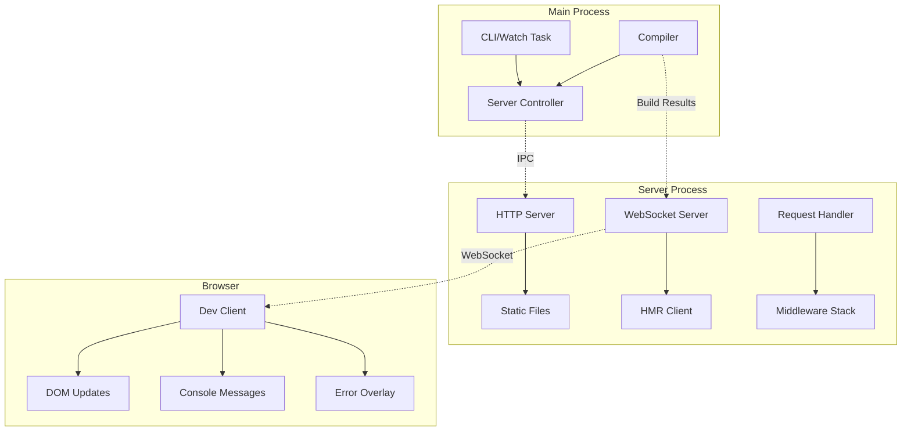

# Dev Server Architecture

The Stencil Dev Server provides a fast development experience with hot module replacement (HMR), automatic rebuilding, and browser synchronization. It runs as a separate process to ensure stability and performance.

## Architecture Overview



## Process Architecture

### Multi-Process Design

The dev server runs in a separate Node.js process:

```typescript
// Main process
const serverProcess = fork(workerPath, [], {
  execArgv: process.execArgv.filter(v => !/^--(debug|inspect)/.test(v)),
  env: process.env,
  cwd: process.cwd(),
  stdio: ['pipe', 'pipe', 'pipe', 'ipc']
});

// Communication
serverProcess.send({ startServer: config });
serverProcess.on('message', handleServerMessage);
```

### IPC Communication

Messages between processes:

```typescript
interface DevServerMessage {
  startServer?: DevServerConfig;
  buildResults?: CompilerBuildResults;
  compilerRequestResults?: CompilerRequestResults;
  closeServer?: boolean;
  error?: { message: string; stack?: string };
}
```

## HTTP Server

### Server Setup

```typescript
const createHttpServer = (config: DevServerConfig) => {
  const app = express();
  
  // Middleware stack
  app.use(compression());
  app.use(cors(config.cors));
  app.use(bodyParser.json());
  
  // Request handling
  app.use(createRequestHandler(config));
  
  // Static file serving
  app.use(express.static(config.root, {
    index: false,
    setHeaders: setCacheHeaders
  }));
  
  return app.listen(config.port, config.address);
};
```

### Request Handler

Processes all incoming requests:

```typescript
const createRequestHandler = (config) => async (req, res, next) => {
  // Check for special routes
  if (req.url === '/dev-server-client.js') {
    return serveDevClient(req, res);
  }
  
  if (req.url.includes('/__stencil_dev_server__')) {
    return handleDevServerRequest(req, res);
  }
  
  // Handle HTML requests
  if (shouldServeIndexHtml(req)) {
    return serveIndexHtml(req, res, config);
  }
  
  // Pass to static file server
  next();
};
```

## WebSocket Server

### WebSocket Setup

```typescript
const createWebSocketServer = (httpServer) => {
  const wss = new WebSocket.Server({ 
    server: httpServer,
    perMessageDeflate: false
  });
  
  wss.on('connection', (ws) => {
    activeConnections.add(ws);
    
    ws.on('message', handleClientMessage);
    ws.on('close', () => activeConnections.delete(ws));
    
    // Send initial state
    ws.send(JSON.stringify({
      type: 'initial',
      buildResults: lastBuildResults
    }));
  });
  
  return wss;
};
```

### HMR Protocol

Messages sent to clients:

```typescript
interface HMRMessage {
  type: 'reload' | 'update' | 'error' | 'console';
  
  // For updates
  updatedComponents?: string[];
  updatedStyles?: string[];
  updatedAssets?: string[];
  
  // For errors
  error?: {
    message: string;
    stack: string;
    file?: string;
    line?: number;
  };
}
```

## Hot Module Replacement

### Build Integration

Receives build results from compiler:

```typescript
const handleBuildResults = (results: BuildResults) => {
  const hmrMessage = {
    type: 'update',
    updatedComponents: results.changedComponents,
    updatedStyles: results.changedStyles,
    buildId: results.buildId,
    hmrTimestamp: Date.now()
  };
  
  // Broadcast to all connected clients
  broadcastMessage(hmrMessage);
};
```

### Client-Side HMR

Dev client handles updates:

```typescript
// Injected into the page
const devClient = {
  connect() {
    const ws = new WebSocket(`ws://${location.host}`);
    
    ws.onmessage = (event) => {
      const msg = JSON.parse(event.data);
      
      switch (msg.type) {
        case 'reload':
          location.reload();
          break;
          
        case 'update':
          this.applyUpdate(msg);
          break;
          
        case 'error':
          this.showError(msg.error);
          break;
      }
    };
  },
  
  applyUpdate(msg) {
    // Update components without full reload
    msg.updatedComponents.forEach(tag => {
      document.querySelectorAll(tag).forEach(elm => {
        elm.forceUpdate();
      });
    });
    
    // Hot swap styles
    msg.updatedStyles.forEach(href => {
      const link = document.querySelector(`link[href*="${href}"]`);
      if (link) {
        link.href = href + '?t=' + msg.hmrTimestamp;
      }
    });
  }
};
```

## Middleware System

### Built-in Middleware

#### History API Fallback

For single-page apps:

```typescript
const historyApiFallback = (config) => (req, res, next) => {
  if (req.method === 'GET' && 
      req.accepts('html') && 
      !req.url.includes('.')) {
    req.url = '/index.html';
  }
  next();
};
```

#### Proxy Middleware

Proxy API requests:

```typescript
const proxyMiddleware = (config) => {
  return Object.entries(config.proxy).map(([path, target]) => {
    return createProxyMiddleware(path, {
      target,
      changeOrigin: true,
      logLevel: 'warn'
    });
  });
};
```

#### Gzip Compression

```typescript
app.use(compression({
  filter: (req, res) => {
    if (req.headers['x-no-compression']) {
      return false;
    }
    return compression.filter(req, res);
  }
}));
```

## Error Handling

### Error Overlay

Shows compilation errors in browser:

```typescript
const showErrorOverlay = (error) => {
  const overlay = document.createElement('div');
  overlay.className = 'dev-server-error-overlay';
  
  overlay.innerHTML = `
    <div class="error-header">
      <h1>Compilation Error</h1>
      <button onclick="this.parentElement.parentElement.remove()">×</button>
    </div>
    <pre class="error-message">${escapeHtml(error.message)}</pre>
    ${error.stack ? `<pre class="error-stack">${escapeHtml(error.stack)}</pre>` : ''}
    ${error.file ? `<div class="error-file">${error.file}:${error.line}:${error.column}</div>` : ''}
  `;
  
  document.body.appendChild(overlay);
};
```

### Console Forwarding

Captures and forwards console logs:

```typescript
// In dev client
['log', 'warn', 'error', 'info'].forEach(method => {
  const original = console[method];
  console[method] = (...args) => {
    original.apply(console, args);
    
    // Forward to dev server
    ws.send(JSON.stringify({
      type: 'console',
      method,
      args: args.map(arg => serialize(arg))
    }));
  };
});
```

## Static File Serving

### MIME Types

Correct content types:

```typescript
const mimeTypes = {
  '.js': 'application/javascript',
  '.mjs': 'application/javascript',
  '.css': 'text/css',
  '.html': 'text/html',
  '.json': 'application/json',
  '.wasm': 'application/wasm',
  '.svg': 'image/svg+xml',
  // ... more types
};

const getMimeType = (filePath) => {
  const ext = path.extname(filePath);
  return mimeTypes[ext] || 'application/octet-stream';
};
```

### Cache Headers

Development-friendly caching:

```typescript
const setCacheHeaders = (res, filePath) => {
  if (filePath.includes('/build/')) {
    // Immutable for build files
    res.setHeader('Cache-Control', 'public, max-age=31536000, immutable');
  } else {
    // No cache for development
    res.setHeader('Cache-Control', 'no-cache, no-store, must-revalidate');
    res.setHeader('Pragma', 'no-cache');
    res.setHeader('Expires', '0');
  }
};
```

## SSL Support

### HTTPS Configuration

```typescript
const createHttpsServer = async (config) => {
  let credentials;
  
  if (config.https === true) {
    // Generate self-signed certificate
    credentials = await generateSelfSignedCert();
  } else {
    // Use provided certificates
    credentials = {
      key: fs.readFileSync(config.https.key),
      cert: fs.readFileSync(config.https.cert)
    };
  }
  
  return https.createServer(credentials, app);
};
```

## Open Browser

### Browser Detection

```typescript
const openBrowser = async (url: string) => {
  const platform = process.platform;
  
  const commands = {
    darwin: 'open',
    win32: 'start',
    linux: 'xdg-open'
  };
  
  const command = commands[platform];
  if (command) {
    exec(`${command} ${url}`);
  }
};
```

## Configuration

### Dev Server Config

```typescript
interface DevServerConfig {
  address: string;
  basePath: string;
  browserUrl: string;
  cors: boolean;
  gzip: boolean;
  historyApiFallback: boolean;
  https: boolean | { key: string; cert: string };
  initialLoadUrl: string;
  logRequests: boolean;
  openBrowser: boolean;
  port: number;
  proxy?: { [path: string]: string };
  reloadStrategy: 'hmr' | 'pageReload' | null;
  root: string;
}
```

### Default Configuration

```typescript
const defaults: DevServerConfig = {
  address: '0.0.0.0',
  basePath: '/',
  browserUrl: 'http://localhost:3333/',
  cors: true,
  gzip: true,
  historyApiFallback: true,
  https: false,
  logRequests: false,
  openBrowser: true,
  port: 3333,
  reloadStrategy: 'hmr',
  root: 'www'
};
```

## Performance

### Request Optimization

- Memory caching for frequently accessed files
- Conditional GET support (ETags)
- Gzip compression
- HTTP/2 push support

### WebSocket Optimization

- Message batching
- Compression for large payloads
- Connection pooling
- Heartbeat for connection health

## Testing

### Dev Server Tests

```typescript
describe('dev-server', () => {
  let server: DevServer;
  
  beforeEach(async () => {
    server = await start({
      root: './test-www',
      port: 0 // Random port
    });
  });
  
  afterEach(() => server.close());
  
  it('should serve static files', async () => {
    const res = await fetch(`${server.browserUrl}/index.html`);
    expect(res.status).toBe(200);
    expect(res.headers.get('content-type')).toBe('text/html');
  });
  
  it('should establish WebSocket connection', (done) => {
    const ws = new WebSocket(server.browserUrl.replace('http', 'ws'));
    ws.on('open', done);
  });
});
```

## Common Issues

### Port Already in Use

```typescript
const findAvailablePort = async (startPort: number) => {
  let port = startPort;
  
  while (true) {
    try {
      await checkPort(port);
      return port;
    } catch (e) {
      port++;
      if (port > startPort + 100) {
        throw new Error('No available ports found');
      }
    }
  }
};
```

### CORS Issues

Proper CORS handling:

```typescript
app.use((req, res, next) => {
  res.header('Access-Control-Allow-Origin', '*');
  res.header('Access-Control-Allow-Methods', 'GET, PUT, POST, DELETE, OPTIONS');
  res.header('Access-Control-Allow-Headers', 'Content-Type, Authorization, Content-Length, X-Requested-With');
  
  if (req.method === 'OPTIONS') {
    res.sendStatus(200);
  } else {
    next();
  }
});
```

## Future Improvements

1. **HTTP/2 Support**: Better performance
2. **Service Worker**: Offline development
3. **Module Federation**: Dev server federation
4. **Better Error Recovery**: Graceful error handling
5. **Plugin System**: Extensible middleware 