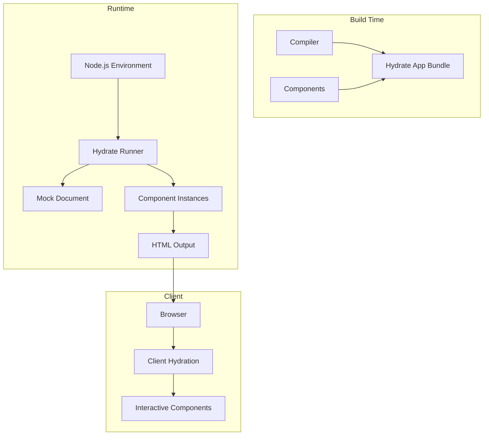

# Hydrate Architecture

The Hydrate module enables server-side rendering (SSR) and static site generation (SSG) for Stencil components. It provides a Node.js environment for rendering components to HTML strings with hydration markers.

## Architecture Overview



## Hydrate App Generation

### Build Process

The compiler generates a special hydrate app:

```typescript
// During build
const generateHydrateApp = async (
  config: Config,
  compilerCtx: CompilerCtx,
  buildCtx: BuildCtx
) => {
  const hydrateAppDirPath = path.join(config.packageDir, 'hydrate');
  
  // Bundle all components for Node.js
  const rollupConfig = {
    input: '@hydrate-entry',
    output: {
      format: 'commonjs',
      file: path.join(hydrateAppDirPath, 'index.js')
    },
    plugins: [
      hydratePlatformPlugin(),
      nodeResolve({ preferBuiltins: true }),
      commonjs()
    ]
  };
  
  const bundle = await rollup(rollupConfig);
  await bundle.write(rollupConfig.output);
};
```

### Entry Point

Generated hydrate app exports:

```typescript
// hydrate/index.js
module.exports = {
  hydrateDocument,
  renderToString,
  createWindowFromHtml,
  serializeNodeToHtml
};
```

## Core APIs

### hydrateDocument

Hydrates an entire document:

```typescript
export const hydrateDocument = async (
  doc: Document,
  options: HydrateDocumentOptions = {}
): Promise<HydrateResults> => {
  const results: HydrateResults = {
    diagnostics: [],
    url: options.url || doc.location.href,
    title: doc.title,
    components: [],
    anchors: [],
    styles: [],
    scripts: [],
    imgs: []
  };
  
  try {
    // Set up hydration context
    const hydrateContext = createHydrateContext(doc, options);
    
    // Find and hydrate all components
    await hydrateComponents(doc.documentElement, hydrateContext);
    
    // Wait for all async operations
    await waitForComponents(hydrateContext);
    
    // Serialize back to HTML
    results.html = serializeDocumentToString(doc, options);
    
  } catch (e) {
    results.diagnostics.push({
      level: 'error',
      type: 'hydrate',
      header: 'Hydrate Error',
      messageText: e.message
    });
  }
  
  return results;
};
```

### renderToString

Renders a component to HTML string:

```typescript
export const renderToString = async (
  html: string,
  options: RenderToStringOptions = {}
): Promise<RenderToStringResults> => {
  // Create document from HTML
  const doc = createDocument(html);
  
  // Hydrate the document
  const hydrateResults = await hydrateDocument(doc, options);
  
  return {
    html: hydrateResults.html,
    diagnostics: hydrateResults.diagnostics
  };
};
```

## Hydration Process

### Component Discovery

Finding components to hydrate:

```typescript
const hydrateComponents = async (
  node: Node,
  context: HydrateContext
) => {
  if (node.nodeType === NODE_TYPE.ElementNode) {
    const element = node as Element;
    const tagName = element.tagName.toLowerCase();
    
    if (context.registeredComponents.has(tagName)) {
      // Hydrate this component
      await hydrateComponent(element, context);
    }
    
    // Recursively hydrate children
    for (const child of Array.from(element.childNodes)) {
      await hydrateComponents(child, context);
    }
  }
};
```

### Component Hydration

Server-side component rendering:

```typescript
const hydrateComponent = async (
  element: Element,
  context: HydrateContext
) => {
  const tagName = element.tagName.toLowerCase();
  const Cstr = context.components[tagName];
  
  // Create host reference
  const hostRef = createHostRef(element);
  
  // Add hydration id
  const hydrationId = context.nextHydrationId++;
  element.setAttribute('s-id', hydrationId);
  
  // Create component instance
  const instance = new Cstr();
  hostRef.$lazyInstance$ = instance;
  
  // Run lifecycle
  await initializeComponent(element, hostRef);
  
  // Add to hydration registry
  context.hydratedComponents.set(hydrationId, {
    element,
    instance,
    hostRef
  });
};
```

## Hydration Markers

### Comment Nodes

Markers for client hydration:

```typescript
const addHydrationMarkers = (
  element: Element,
  hydrationId: string
) => {
  // Start marker
  const startComment = element.ownerDocument.createComment(`s:${hydrationId}`);
  element.parentNode.insertBefore(startComment, element);
  
  // End marker
  const endComment = element.ownerDocument.createComment(`e:${hydrationId}`);
  element.parentNode.insertBefore(endComment, element.nextSibling);
  
  // Child markers for slots
  element.childNodes.forEach((child, index) => {
    if (child.nodeType === NODE_TYPE.ElementNode) {
      child.setAttribute('c-id', `${hydrationId}.${index}`);
    }
  });
};
```

### Slot Content

Preserving slotted content:

```typescript
const serializeSlotContent = (
  slot: HTMLSlotElement,
  hydrationId: string
) => {
  const assignedNodes = slot.assignedNodes();
  
  assignedNodes.forEach((node, index) => {
    // Mark original position
    const marker = document.createComment(`t:${hydrationId}.${index}`);
    node.parentNode.insertBefore(marker, node);
  });
};
```

## Async Rendering

### Waiting for Components

Handling async operations:

```typescript
const waitForComponents = async (context: HydrateContext) => {
  const promises: Promise<any>[] = [];
  
  // Collect all pending operations
  context.hydratedComponents.forEach(({ instance }) => {
    if (instance.componentWillLoad) {
      promises.push(instance.componentWillLoad());
    }
  });
  
  // Wait with timeout
  if (promises.length > 0) {
    await Promise.race([
      Promise.all(promises),
      timeout(context.options.timeout || 15000)
    ]);
  }
};
```

### Streaming Support

Progressive hydration:

```typescript
export const renderToStream = (
  html: string,
  options: RenderToStreamOptions
): ReadableStream => {
  const encoder = new TextEncoder();
  
  return new ReadableStream({
    async start(controller) {
      const doc = createDocument(html);
      const context = createHydrateContext(doc, options);
      
      // Stream initial HTML
      controller.enqueue(encoder.encode('<!DOCTYPE html>\n'));
      
      // Hydrate and stream components
      await streamComponents(doc.documentElement, context, controller);
      
      controller.close();
    }
  });
};
```

## Prerendering

### Static Site Generation

Generating static pages:

```typescript
export const prerenderPages = async (
  config: PrerenderConfig
): Promise<PrerenderResults> => {
  const results: PrerenderResults = {
    diagnostics: [],
    urls: []
  };
  
  // Start dev server
  const devServer = await startDevServer(config);
  
  // Crawl and render pages
  const crawler = createCrawler(config);
  const urlsToRender = await crawler.discoverUrls(config.entryUrls);
  
  for (const url of urlsToRender) {
    const page = await renderPage(devServer, url, config);
    
    // Write to disk
    await writePage(page, config);
    
    results.urls.push({
      url: page.url,
      filePath: page.filePath
    });
  }
  
  await devServer.close();
  return results;
};
```

### URL Discovery

Finding pages to prerender:

```typescript
const discoverUrls = async (
  entryUrls: string[],
  config: PrerenderConfig
): Promise<Set<string>> => {
  const discovered = new Set<string>(entryUrls);
  const toVisit = [...entryUrls];
  
  while (toVisit.length > 0) {
    const url = toVisit.shift();
    const page = await fetchPage(url);
    
    // Extract links
    const links = extractLinks(page.html);
    
    for (const link of links) {
      if (shouldPrerender(link, config) && !discovered.has(link)) {
        discovered.add(link);
        toVisit.push(link);
      }
    }
  }
  
  return discovered;
};
```

## Performance Optimization

### Component Caching

Reusing component instances:

```typescript
class ComponentCache {
  private cache = new Map<string, ComponentConstructor>();
  
  get(tagName: string): ComponentConstructor {
    if (!this.cache.has(tagName)) {
      const Cstr = loadComponent(tagName);
      this.cache.set(tagName, Cstr);
    }
    return this.cache.get(tagName);
  }
  
  clear() {
    this.cache.clear();
  }
}
```

### Parallel Rendering

Concurrent component hydration:

```typescript
const hydrateComponentsParallel = async (
  elements: Element[],
  context: HydrateContext
) => {
  const chunks = chunkArray(elements, 10);
  
  for (const chunk of chunks) {
    await Promise.all(
      chunk.map(element => hydrateComponent(element, context))
    );
  }
};
```

## Client Hydration

### Hydration on Client

Reconnecting server-rendered components:

```typescript
const clientHydrate = (
  elm: HTMLElement,
  cmpMeta: ComponentRuntimeMeta
) => {
  const hydrationId = elm.getAttribute('s-id');
  
  if (hydrationId) {
    // Find server-rendered vdom
    const serverVNode = parseServerVNode(elm, hydrationId);
    
    // Create host ref with existing vdom
    const hostRef = getHostRef(elm);
    hostRef.$vnode$ = serverVNode;
    
    // Mark as hydrated
    hostRef.$flags$ |= HOST_FLAGS.hasHydrated;
  }
};
```

## Configuration

### Hydrate Options

```typescript
interface HydrateDocumentOptions {
  url?: string;
  userAgent?: string;
  cookie?: string;
  referrer?: string;
  direction?: string;
  language?: string;
  buildId?: string;
  clientHydrateAnnotations?: boolean;
  constrainTimeouts?: boolean;
  timeout?: number;
  staticComponents?: string[];
  maxHydrateCount?: number;
  hydrateComponents?: string[];
  excludeComponents?: string[];
}
```

### Prerender Config

```typescript
interface PrerenderConfig {
  entryUrls: string[];
  hydrateOptions?: HydrateDocumentOptions;
  robotsTxt?: (opts: RobotsTxtOpts) => string;
  sitemapXml?: (opts: SitemapXmpOpts) => string;
  baseUrl?: string;
  canonicalUrl?: (url: URL) => string | null;
  crawlUrls?: boolean;
  trailingSlash?: boolean;
  normalizeUrl?: boolean;
  filter?: (url: URL) => boolean;
}
```

## Testing

### Hydrate Testing

```typescript
describe('hydrate', () => {
  it('should render component', async () => {
    const { html } = await renderToString(
      '<my-component name="Test"></my-component>'
    );
    
    expect(html).toContain('s-id="');
    expect(html).toContain('Hello, Test');
  });
  
  it('should handle async components', async () => {
    const { html } = await renderToString(
      '<async-component></async-component>',
      { timeout: 5000 }
    );
    
    expect(html).toContain('Loaded data');
  });
});
```

## Common Issues

### Memory Leaks

Proper cleanup:

```typescript
const cleanup = (context: HydrateContext) => {
  // Clear component instances
  context.hydratedComponents.forEach(({ instance }) => {
    if (instance.disconnectedCallback) {
      instance.disconnectedCallback();
    }
  });
  
  // Clear caches
  context.componentCache.clear();
  context.hydratedComponents.clear();
  
  // Remove global references
  delete global.document;
  delete global.window;
};
```

### Infinite Loops

Preventing render loops:

```typescript
const MAX_HYDRATE_DEPTH = 300;

const hydrateWithDepthCheck = async (
  element: Element,
  context: HydrateContext,
  depth = 0
) => {
  if (depth > MAX_HYDRATE_DEPTH) {
    throw new Error('Maximum hydration depth exceeded');
  }
  
  await hydrateComponent(element, context);
};
```

## Future Improvements

1. **Streaming SSR**: True streaming with Suspense
2. **Partial Hydration**: Hydrate only interactive components  
3. **Edge SSR**: Deploy to edge workers
4. **Component Islands**: Better hydration boundaries
5. **Build-time SSG**: Faster static generation 