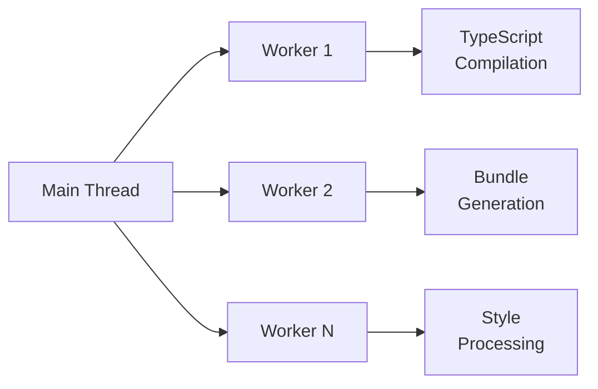

# Stencil Technical Documentation

Welcome to the Stencil technical documentation. This documentation is designed for contributors who want to understand the internal architecture and implementation details of Stencil. It provides comprehensive information about how Stencil works under the hood.

## Overview

Stencil is a compiler that generates Web Components and builds high-performance web applications. It combines the best concepts of the most popular frameworks into a simple build-time tool.

### Architecture Overview

```mermaid
graph TB
    subgraph "Build Time"
        CLI[CLI Entry Point] --> Compiler[Compiler Core]
        Compiler --> TS[TypeScript Compiler]
        Compiler --> Bundler[Rollup Bundler]
        Compiler --> Optimizer[Build Optimizer]
    end
    
    subgraph "Development"
        DevServer[Dev Server] --> HMR[Hot Module Replacement]
        DevServer --> WS[WebSocket Server]
    end
    
    subgraph "Runtime"
        Runtime[Component Runtime] --> VDOM[Virtual DOM]
        Runtime --> LC[Lifecycle Manager]
        Runtime --> PS[Proxy State]
    end
    
    subgraph "Server Side"
        Hydrate[Hydrate App] --> MockDoc[Mock Document]
        Hydrate --> SSR[SSR Renderer]
    end
    
    CLI -.-> DevServer
    Compiler --> Runtime
    Compiler --> Hydrate
```

## Core Components

### [CLI](./cli.md)
**Location:** `/src/cli`

The command-line interface that serves as the entry point for all Stencil operations. It handles:
- Command parsing and validation
- Configuration loading
- Task orchestration (build, serve, test, etc.)
- Version checking and telemetry
- Process management

### [Compiler](./compiler.md)
**Location:** `/src/compiler`

The heart of Stencil that transforms TypeScript/JSX components into optimized web components. Key responsibilities:
- TypeScript transformation and compilation
- Component metadata extraction
- Build optimization and bundling
- Output target generation
- Style processing
- Static analysis
- Build orchestration and caching
- Incremental compilation

### [Runtime](./runtime.md)
**Location:** `/src/client`, `/src/runtime`, `/src/internal`

The client-side code that powers Stencil components in the browser:
- Component lifecycle management
- Virtual DOM implementation
- State management and reactivity
- Event handling
- Lazy loading
- Hydration support

### [Dev Server](./dev-server.md)
**Location:** `/src/dev-server`

Development server with hot module replacement:
- HTTP server for serving builds
- WebSocket server for HMR
- File watching and rebuilding
- Browser auto-refresh
- Error overlay
- Request proxying

### [Hydrate](./hydrate.md)
**Location:** `/src/hydrate`

Server-side rendering and hydration support:
- Node.js rendering environment
- Component pre-rendering
- Static site generation
- Hydration markers
- SEO optimization

### [Mock Doc](./mock-doc.md)
**Location:** `/src/mock-doc`

Lightweight DOM implementation for server-side rendering:
- DOM API implementation
- Window and document globals
- CSS parsing
- HTML parsing and serialization
- Performance optimizations

### [Declarations](./declarations.md)
**Location:** `/src/declarations`

TypeScript type definitions and interfaces that define:
- Public API contracts
- Internal data structures
- Configuration schemas
- Build metadata formats

### Deprecated Components

#### [Testing](./testing-deprecated.md)
**Location:** `/src/testing`

The built-in test runner based on Jest (deprecated). Users should migrate to:
- [Jest Stencil Runner](https://github.com/stenciljs/jest-stencil-runner)
- [WebdriverIO](https://stenciljs.com/docs/testing/webdriverio/overview)
- [Playwright](https://stenciljs.com/docs/testing/playwright/overview)
- [Vitest](https://stenciljs.com/docs/testing/vitest)

#### [Screenshot Testing](./screenshot-deprecated.md)
**Location:** `/src/screenshot`

Visual regression testing (deprecated). Will be removed in the next major version.

## Key Concepts

### Build Process

1. **Configuration Loading**: Parse and validate stencil.config.ts
2. **Discovery**: Find all components in the source
3. **Analysis**: Extract metadata from decorators
4. **Transformation**: Convert TypeScript/JSX to JavaScript
5. **Bundling**: Create optimized bundles
6. **Output Generation**: Generate files for each output target

### Component Lifecycle

Components follow a predictable lifecycle during initialization and updates:

1. **Constructor**: Element created
2. **connectedCallback**: Element added to DOM
3. **componentWillLoad**: Before first render
4. **componentWillRender**: Before each render
5. **render**: Generate virtual DOM
6. **componentDidRender**: After each render
7. **componentDidLoad**: After first render
8. **componentDidUpdate**: After updates
9. **disconnectedCallback**: Element removed from DOM

### Multi-Threading Architecture

Stencil uses a multi-threaded architecture for better performance:



## Building Stencil

### [Scripts Build System](./scripts.md)
**Location:** `/scripts`

The build system used to develop and build Stencil itself:
- Uses esbuild for bundling
- Bundles TypeScript, Terser, and Parse5
- Creates all distributable packages
- Handles release automation
- Validates build outputs

This is separate from Stencil's compiler - it's specifically for building the Stencil project during development.

## Building and Development

To work on Stencil itself:

```bash
# Clone the repository
git clone https://github.com/ionic-team/stencil.git
cd stencil

# Install dependencies
npm install

# Build Stencil
npm run build

# Run tests
npm test

# Start development
npm run dev
```

For detailed compiler documentation and build process information, see the [Compiler](./compiler.md) documentation.