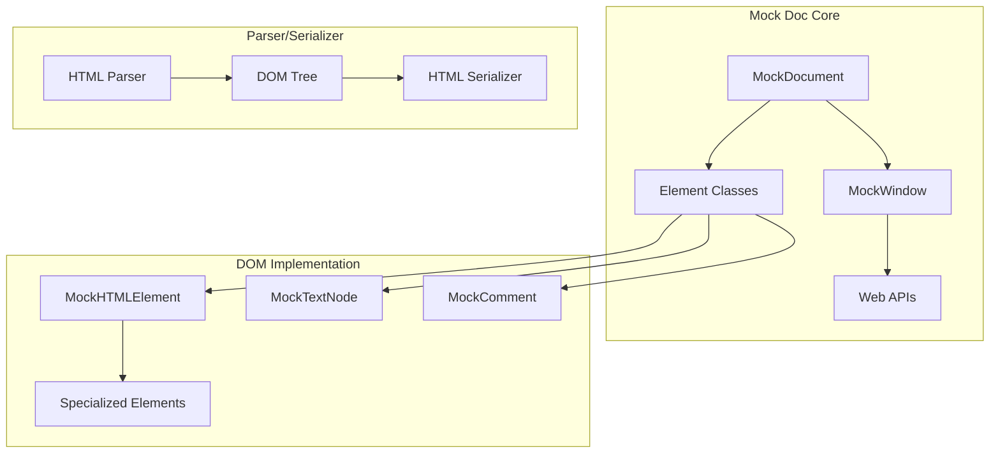

# Mock Doc Architecture

Mock Doc provides a lightweight DOM implementation for server-side rendering in Node.js environments. It implements just enough of the DOM and Web APIs to enable Stencil components to render without a real browser.

**Location:** [`src/mock-doc/`](../src/mock-doc/)

## Architecture Overview



## Core Implementation

### Mock Window

**Location:** [`src/mock-doc/window.ts`](../src/mock-doc/window.ts)

Global object with browser APIs:

```typescript
export class MockWindow implements Window {
  document: MockDocument;
  location: Location;
  navigator: Navigator;
  console: Console;
  
  // Timers
  setTimeout = createTimer('setTimeout');
  clearTimeout = createTimer('clearTimeout');
  setInterval = createTimer('setInterval');
  clearInterval = createTimer('clearInterval');
  
  // Animation
  requestAnimationFrame = (cb: FrameRequestCallback) => {
    return this.setTimeout(() => cb(Date.now()), 0);
  };
  
  // Storage
  localStorage = new MockStorage();
  sessionStorage = new MockStorage();
  
  // Events
  addEventListener = createEventListener(this);
  removeEventListener = removeEventListener(this);
  dispatchEvent = dispatchEvent(this);
  
  // Constructors
  CustomEvent = MockCustomEvent;
  Event = MockEvent;
  KeyboardEvent = MockKeyboardEvent;
  MouseEvent = MockMouseEvent;
}
```

### Mock Document

**Location:** [`src/mock-doc/document.ts`](../src/mock-doc/document.ts)

Document implementation:

```typescript
export class MockDocument extends MockNode implements Document {
  documentElement: MockHTMLElement;
  head: MockHTMLElement;
  body: MockHTMLElement;
  nodeType = NODE_TYPE.DocumentNode;
  
  constructor(html?: string) {
    super(null, null);
    
    if (html) {
      this.parse(html);
    } else {
      this.createDefaultStructure();
    }
  }
  
  createElement(tagName: string): MockElement {
    tagName = tagName.toLowerCase();
    
    switch (tagName) {
      case 'a': return new MockAnchorElement(this);
      case 'form': return new MockFormElement(this);
      case 'img': return new MockImageElement(this);
      case 'input': return new MockInputElement(this);
      case 'script': return new MockScriptElement(this);
      case 'style': return new MockStyleElement(this);
      case 'template': return new MockTemplateElement(this);
      default: return new MockHTMLElement(this, tagName);
    }
  }
  
  createTextNode(text: string): MockTextNode {
    return new MockTextNode(this, text);
  }
  
  createComment(text: string): MockComment {
    return new MockComment(this, text);
  }
  
  createDocumentFragment(): MockDocumentFragment {
    return new MockDocumentFragment(this);
  }
}
```

## Element Implementation

### Base Element

**Location:** [`src/mock-doc/element.ts`](../src/mock-doc/element.ts)

Core element functionality:

```typescript
export class MockElement extends MockNode implements Element {
  attributes = new MockAttributeMap();
  shadowRoot: MockShadowRoot | null = null;
  
  get tagName(): string {
    return this.nodeName;
  }
  
  getAttribute(name: string): string | null {
    const attr = this.attributes.getNamedItem(name);
    return attr ? attr.value : null;
  }
  
  setAttribute(name: string, value: any) {
    const attr = this.attributes.getNamedItem(name);
    
    if (attr) {
      attr.value = String(value);
    } else {
      this.attributes.setNamedItem(new MockAttr(name, String(value)));
    }
    
    // Special handling
    this.attributeChanged(name, value);
  }
  
  removeAttribute(name: string) {
    this.attributes.removeNamedItem(name);
    this.attributeChanged(name, null);
  }
  
  attachShadow(opts: ShadowRootInit): MockShadowRoot {
    if (this.shadowRoot) {
      throw new Error('Element already has shadow root');
    }
    
    this.shadowRoot = new MockShadowRoot(this, opts.mode);
    return this.shadowRoot;
  }
}
```

### Specialized Elements

#### Input Element

**Location:** [`src/mock-doc/forms.ts`](../src/mock-doc/forms.ts)

Form control implementation:

```typescript
export class MockInputElement extends MockHTMLElement implements HTMLInputElement {
  private _value = '';
  private _checked = false;
  
  get value(): string {
    return this._value;
  }
  
  set value(val: string) {
    this._value = String(val);
    this.dispatchEvent(new Event('input', { bubbles: true }));
  }
  
  get checked(): boolean {
    return this._checked;
  }
  
  set checked(val: boolean) {
    this._checked = Boolean(val);
    this.dispatchEvent(new Event('change', { bubbles: true }));
  }
  
  focus() {
    this.dispatchEvent(new FocusEvent('focus'));
  }
  
  blur() {
    this.dispatchEvent(new FocusEvent('blur'));
  }
}
```

#### Style Element

**Location:** [`src/mock-doc/css-style-declaration.ts`](../src/mock-doc/css-style-declaration.ts)

CSS handling:

```typescript
export class MockStyleElement extends MockHTMLElement {
  sheet: MockCSSStyleSheet;
  
  constructor(ownerDocument: MockDocument) {
    super(ownerDocument, 'style');
    this.sheet = new MockCSSStyleSheet(this);
  }
  
  get innerHTML(): string {
    return this.sheet.cssText;
  }
  
  set innerHTML(cssText: string) {
    this.sheet.cssText = cssText;
    // Parse and apply styles
    this.sheet.parse();
  }
}
```

## Node Operations

### Tree Manipulation

**Location:** [`src/mock-doc/node.ts`](../src/mock-doc/node.ts)

DOM tree operations:

```typescript
export abstract class MockNode implements Node {
  parentNode: MockNode | null = null;
  childNodes: MockNode[] = [];
  
  appendChild<T extends Node>(node: T): T {
    // Remove from current parent
    if (node.parentNode) {
      node.parentNode.removeChild(node);
    }
    
    // Add to this node
    this.childNodes.push(node as any);
    (node as any).parentNode = this;
    
    // Connect callback
    connectNode(this.ownerDocument, node);
    
    return node;
  }
  
  insertBefore<T extends Node>(node: T, ref: Node | null): T {
    if (!ref) {
      return this.appendChild(node);
    }
    
    const index = this.childNodes.indexOf(ref as any);
    if (index === -1) {
      throw new Error('Reference node is not a child');
    }
    
    // Remove from current parent
    if (node.parentNode) {
      node.parentNode.removeChild(node);
    }
    
    // Insert at position
    this.childNodes.splice(index, 0, node as any);
    (node as any).parentNode = this;
    
    connectNode(this.ownerDocument, node);
    
    return node;
  }
  
  removeChild<T extends Node>(node: T): T {
    const index = this.childNodes.indexOf(node as any);
    if (index === -1) {
      throw new Error('Node is not a child');
    }
    
    // Remove from children
    this.childNodes.splice(index, 1);
    (node as any).parentNode = null;
    
    // Disconnect callback
    disconnectNode(node);
    
    return node;
  }
}
```

## CSS Implementation

### Style Sheet

**Location:** [`src/mock-doc/css-style-sheet.ts`](../src/mock-doc/css-style-sheet.ts)

Basic CSS parsing:

```typescript
export class MockCSSStyleSheet {
  cssRules: MockCSSRule[] = [];
  
  parse() {
    this.cssRules = parseCss(this.cssText);
  }
  
  insertRule(rule: string, index = this.cssRules.length) {
    const parsed = parseCssRule(rule);
    this.cssRules.splice(index, 0, parsed);
    return index;
  }
  
  deleteRule(index: number) {
    this.cssRules.splice(index, 1);
  }
}
```

### Computed Styles

**Location:** [`src/mock-doc/window.ts`](../src/mock-doc/window.ts) (getComputedStyle function)

Style calculation:

```typescript
const getComputedStyle = (element: MockElement): CSSStyleDeclaration => {
  const styles = new MockCSSStyleDeclaration();
  
  // Inline styles
  Object.assign(styles, element.style);
  
  // Stylesheet rules
  const rules = findMatchingRules(element);
  rules.forEach(rule => {
    Object.assign(styles, rule.style);
  });
  
  return styles;
};
```

## Event System

### Event Dispatcher

**Location:** [`src/mock-doc/event.ts`](../src/mock-doc/event.ts)

Event propagation:

```typescript
const dispatchEvent = (target: EventTarget, event: Event): boolean => {
  const eventPath = buildEventPath(target);
  
  // Capture phase
  for (let i = eventPath.length - 1; i >= 0; i--) {
    if (event.propagationStopped) break;
    
    const listeners = getEventListeners(eventPath[i], event.type, true);
    listeners.forEach(listener => listener.call(eventPath[i], event));
  }
  
  // Target phase
  const targetListeners = getEventListeners(target, event.type, false);
  targetListeners.forEach(listener => listener.call(target, event));
  
  // Bubble phase
  if (event.bubbles && !event.propagationStopped) {
    for (let i = 1; i < eventPath.length; i++) {
      if (event.propagationStopped) break;
      
      const listeners = getEventListeners(eventPath[i], event.type, false);
      listeners.forEach(listener => listener.call(eventPath[i], event));
    }
  }
  
  return !event.defaultPrevented;
};
```

## HTML Parser

### Parse Implementation

**Location:** [`src/mock-doc/parse-html.ts`](../src/mock-doc/parse-html.ts)

Convert HTML to DOM:

```typescript
export const parseHtml = (html: string, doc: MockDocument) => {
  const parser = new MockHTMLParser(doc);
  return parser.parse(html);
};

class MockHTMLParser {
  constructor(private doc: MockDocument) {}
  
  parse(html: string): MockElement {
    const tokens = tokenize(html);
    const root = this.doc.createElement('div');
    const stack: MockElement[] = [root];
    
    for (const token of tokens) {
      switch (token.type) {
        case 'startTag':
          const element = this.doc.createElement(token.tagName);
          token.attrs.forEach(([name, value]) => {
            element.setAttribute(name, value);
          });
          
          stack[stack.length - 1].appendChild(element);
          
          if (!isSelfClosing(token.tagName)) {
            stack.push(element);
          }
          break;
          
        case 'endTag':
          if (stack.length > 1) {
            stack.pop();
          }
          break;
          
        case 'text':
          const text = this.doc.createTextNode(token.content);
          stack[stack.length - 1].appendChild(text);
          break;
      }
    }
    
    return root;
  }
}
```

## HTML Serializer

### Serialize to String

**Location:** [`src/mock-doc/serialize-node.ts`](../src/mock-doc/serialize-node.ts)

Convert DOM to HTML:

```typescript
export const serializeNodeToHtml = (
  node: Node,
  opts: SerializeOptions = {}
): string => {
  switch (node.nodeType) {
    case NODE_TYPE.ElementNode:
      return serializeElement(node as Element, opts);
    case NODE_TYPE.TextNode:
      return serializeText(node as Text, opts);
    case NODE_TYPE.CommentNode:
      return serializeComment(node as Comment);
    case NODE_TYPE.DocumentNode:
      return serializeDocument(node as Document, opts);
    case NODE_TYPE.DocumentFragmentNode:
      return serializeFragment(node as DocumentFragment, opts);
    default:
      return '';
  }
};

const serializeElement = (element: Element, opts: SerializeOptions): string => {
  const tagName = element.tagName.toLowerCase();
  let html = `<${tagName}`;
  
  // Attributes
  for (let i = 0; i < element.attributes.length; i++) {
    const attr = element.attributes.item(i);
    html += ` ${attr.name}="${escapeHtml(attr.value)}"`;
  }
  
  // Void elements
  if (VOID_ELEMENTS.has(tagName)) {
    return html + (opts.pretty ? ' />' : '>');
  }
  
  html += '>';
  
  // Children
  for (const child of element.childNodes) {
    html += serializeNodeToHtml(child, opts);
  }
  
  html += `</${tagName}>`;
  
  return html;
};
```

## Performance Optimizations

### String Building

**Location:** [`src/mock-doc/serialize-node.ts`](../src/mock-doc/serialize-node.ts)

Efficient HTML generation:

```typescript
class StringBuilder {
  private chunks: string[] = [];
  
  append(str: string) {
    this.chunks.push(str);
  }
  
  toString(): string {
    return this.chunks.join('');
  }
}
```

### Node Caching

Reuse common nodes:

```typescript
const nodeCache = new WeakMap<Node, CachedNodeData>();

interface CachedNodeData {
  serializedHtml?: string;
  computedStyle?: CSSStyleDeclaration;
  eventListeners?: Map<string, EventListener[]>;
}
```

## Testing

### Mock Doc Tests

**Location:** [`src/mock-doc/test/`](../src/mock-doc/test/)

```typescript
describe('MockDocument', () => {
  it('should create elements', () => {
    const doc = new MockDocument();
    const div = doc.createElement('div');
    
    expect(div.tagName).toBe('DIV');
    expect(div.ownerDocument).toBe(doc);
  });
  
  it('should parse HTML', () => {
    const doc = new MockDocument('<div id="test">Hello</div>');
    const div = doc.getElementById('test');
    
    expect(div).toBeDefined();
    expect(div.textContent).toBe('Hello');
  });
  
  it('should handle events', () => {
    const doc = new MockDocument();
    const button = doc.createElement('button');
    let clicked = false;
    
    button.addEventListener('click', () => clicked = true);
    button.click();
    
    expect(clicked).toBe(true);
  });
});
```

## Limitations

### Not Implemented

Features not in Mock Doc:
- Layout calculations (getBoundingClientRect)
- Canvas rendering
- Media elements
- Intersection Observer
- Mutation Observer
- Full CSSOM

### Differences from Browser

- No async script loading
- Simplified event loop
- Basic CSS parsing
- No rendering pipeline
