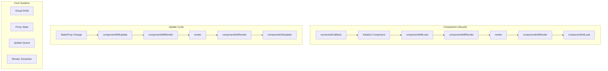

# Runtime Architecture

The Stencil Runtime is the client-side engine that powers components in the browser. It handles component initialization, lifecycle management, rendering, and state updates with minimal overhead.

**Location:**
- [`src/client/`](../src/client/)
- [`src/runtime/`](../src/runtime/)
- [`src/internal/`](../src/internal/)

## Architecture Overview



## Component Lifecycle

### Lifecycle Order

Components follow a strict lifecycle order, especially important for nested components:

```
<parent-component>
  <child-component>
    <grandchild-component></grandchild-component>
  </child-component>
</parent-component>
```

**Initialization Order** (top-down):
1. parent - componentWillLoad
2. child - componentWillLoad
3. grandchild - componentWillLoad
4. grandchild - componentDidLoad
5. child - componentDidLoad
6. parent - componentDidLoad

### Core Lifecycle Methods

#### connectedCallback

When element is added to DOM:

```typescript
connectedCallback() {
  const hostRef = getHostRef(this);
  
  // Register event listeners
  addHostEventListeners(this, hostRef, cmpMeta.$listeners$);
  
  // Find ancestor components
  attachToAncestor(hostRef, hostRef.$ancestorComponent$);
  
  // Start initialization
  initializeComponent(this, hostRef, cmpMeta);
}
```

#### Component Initialization

```typescript
const initializeComponent = async (elm, hostRef, cmpMeta) => {
  if (hostRef.$flags$ & HOST_FLAGS.hasInitializedComponent) {
    return;
  }
  
  // Lazy load component implementation
  const Cstr = await loadModule(cmpMeta, hostRef);
  
  // Create component instance
  hostRef.$flags$ |= HOST_FLAGS.isConstructingInstance;
  new Cstr(hostRef);
  hostRef.$flags$ &= ~HOST_FLAGS.isConstructingInstance;
  
  // Fire lifecycle
  scheduleUpdate(hostRef, true);
};
```

## State Management

### Reactive Properties

The runtime uses ES6 Proxies for reactive state:

```typescript
const proxyComponent = (Cstr, cmpMeta) => {
  cmpMeta.$members$.forEach(([memberName, [memberFlags]]) => {
    if (memberFlags & MEMBER_FLAGS.State || 
        memberFlags & MEMBER_FLAGS.Prop) {
      Object.defineProperty(Cstr.prototype, memberName, {
        get() {
          return getValue(this, memberName);
        },
        set(newValue) {
          setValue(this, memberName, newValue, cmpMeta);
        }
      });
    }
  });
};
```

### Update Queue

Batches multiple updates:

```typescript
const setValue = (ref, propName, newVal, cmpMeta) => {
  const hostRef = getHostRef(ref);
  const oldVal = hostRef.$instanceValues$.get(propName);
  
  if (oldVal !== newVal) {
    hostRef.$instanceValues$.set(propName, newVal);
    
    if (hostRef.$flags$ & HOST_FLAGS.hasRendered) {
      // Schedule update
      scheduleUpdate(hostRef, false);
    }
  }
};
```

## Virtual DOM

### VNode Structure

```typescript
interface VNode {
  $tag$: string | Function;  // Element tag or component
  $elm$: Element;           // DOM reference
  $text$: string;          // Text content
  $children$: VNode[];     // Child nodes
  $attrs$: any;            // Attributes
  $key$: string | number;  // Unique key
}
```

### Render Function

Components return VNodes:

```typescript
render() {
  return h('div', { class: 'container' },
    h('h1', null, this.title),
    h('button', { onClick: this.handleClick }, 'Click me'),
    this.items.map(item => 
      h('li', { key: item.id }, item.name)
    )
  );
}
```

### Diff Algorithm

Efficient patching of DOM:

```typescript
const patch = (oldVNode, newVNode) => {
  if (oldVNode.$tag$ !== newVNode.$tag$) {
    // Replace entire node
    replaceNode(oldVNode, newVNode);
  } else {
    // Update attributes
    updateElement(oldVNode, newVNode);
    
    // Patch children
    patchChildren(oldVNode.$children$, newVNode.$children$);
  }
};
```

## Render Scheduling

### Async Rendering

Updates are batched and scheduled:

```typescript
const scheduleUpdate = (hostRef, isInitialLoad) => {
  if (hostRef.$flags$ & HOST_FLAGS.isQueuedForUpdate) {
    return;
  }
  
  hostRef.$flags$ |= HOST_FLAGS.isQueuedForUpdate;
  
  if (isInitialLoad) {
    // Use microtask for initial load
    queueMicrotask(() => dispatchHooks(hostRef, isInitialLoad));
  } else {
    // Use write task for updates
    writeTask(() => dispatchHooks(hostRef, isInitialLoad));
  }
};
```

### Task Queue

Custom task scheduling:

```typescript
const writeTask = (cb) => {
  if (!pendingWriteTask) {
    pendingWriteTask = true;
    
    if (supportsRAF) {
      requestAnimationFrame(flush);
    } else {
      setTimeout(flush, 0);
    }
  }
  
  writeQueue.push(cb);
};
```

## Lazy Loading

### Component Registration

```typescript
const bootstrapLazy = (lazyBundles) => {
  lazyBundles.forEach(([bundleId, components]) => {
    components.forEach(compactMeta => {
      const cmpMeta = parseComponentMeta(compactMeta);
      
      class HostElement extends HTMLElement {
        connectedCallback() {
          plt.jmp(() => connectedCallback(this));
        }
        
        disconnectedCallback() {
          plt.jmp(() => disconnectedCallback(this));
        }
      }
      
      customElements.define(cmpMeta.$tagName$, HostElement);
    });
  });
};
```

### Dynamic Import

Components loaded on demand:

```typescript
const loadModule = async (cmpMeta, hostRef) => {
  const bundleId = cmpMeta.$lazyBundleId$;
  
  if (!loadedModules.has(bundleId)) {
    const module = await import(
      /* webpackChunkName: "[request]" */
      `./build/${bundleId}.js`
    );
    loadedModules.set(bundleId, module);
  }
  
  return loadedModules.get(bundleId)[cmpMeta.$tagName$];
};
```

## Hydration

### Server-Side Rendering

Markers for hydration:

```html
<my-component s-id="1" class="hydrated">
  <!--s:1.0-->
  <div c-id="1.1">
    <!--t:1.2-->Hello World<!---->
  </div>
  <!--e:1.0-->
</my-component>
```

### Client Hydration

Reuses server-rendered DOM:

```typescript
const clientHydrate = (hostElm, tagName, hostId, hostRef) => {
  const serverHostRef = serverSideConnected.get(hostId);
  
  if (serverHostRef) {
    // Reuse server state
    hostRef.$instanceValues$ = serverHostRef.$instanceValues$;
    
    // Connect to existing DOM
    hostRef.$elm$ = hostElm;
    hostRef.$flags$ |= HOST_FLAGS.hasInitializedComponent;
  }
};
```

## Event System

### Event Decorators

```typescript
@Event() myEvent: EventEmitter<string>;

emitEvent() {
  this.myEvent.emit('data');
}
```

### Event Implementation

```typescript
const createEvent = (ref, name, flags) => {
  const elm = getHostRef(ref).$hostElement$;
  
  return {
    emit: (detail) => {
      const event = new CustomEvent(name, {
        bubbles: !!(flags & EVENT_FLAGS.Bubbles),
        composed: !!(flags & EVENT_FLAGS.Composed),
        cancelable: !!(flags & EVENT_FLAGS.Cancellable),
        detail
      });
      
      elm.dispatchEvent(event);
      return event;
    }
  };
};
```

## Method Decorators

### Async Methods

```typescript
@Method()
async getData() {
  return this.internalData;
}
```

### Method Proxying

```typescript
const proxyMethods = (hostRef, cmpMeta) => {
  cmpMeta.$methods$.forEach(methodName => {
    hostRef.$hostElement$[methodName] = function(...args) {
      const instance = hostRef.$lazyInstance$;
      return instance[methodName].apply(instance, args);
    };
  });
};
```

## Style Encapsulation

### Shadow DOM

True style isolation:

```typescript
if (cmpMeta.$flags$ & CMP_FLAGS.shadowDomEncapsulation) {
  hostElm.attachShadow({ mode: 'open' });
  renderIntoShadow(hostElm.shadowRoot);
}
```

### Scoped CSS

CSS-in-JS style scoping:

```typescript
if (cmpMeta.$flags$ & CMP_FLAGS.scopedCssEncapsulation) {
  const scopeId = getScopeId(cmpMeta);
  hostElm.classList.add(scopeId);
  
  // Transform styles
  styles = scopeCss(styles, scopeId);
}
```

## Performance Optimizations

### Host Ref

Centralized component data:

```typescript
interface HostRef {
  $flags$: number;
  $hostElement$: d.HostElement;
  $cmpMeta$: d.ComponentRuntimeMeta;
  $instanceValues$: Map<string, any>;
  $lazyInstance$: any;
  $onReadyResolve$: (elm: any) => void;
  $onInstanceResolve$: (elm: any) => void;
  $vnode$: d.VNode;
  $ancestorComponent$: d.HostElement;
}
```

### Flags Optimization

Bit flags for memory efficiency:

```typescript
const enum HOST_FLAGS {
  hasConnected = 1 << 0,
  hasRendered = 1 << 1,
  hasInitializedComponent = 1 << 2,
  hasLoadedComponent = 1 << 3,
  isWaitingForChildren = 1 << 4,
  isConstructingInstance = 1 << 5,
  isQueuedForUpdate = 1 << 6,
  hasReflectedAttr = 1 << 7,
  // ... up to 32 flags
}
```

## Platform Abstraction

### Platform Layer

```typescript
const plt = {
  $flags$: 0,
  jmp: (h) => h(),
  raf: (h) => requestAnimationFrame(h),
  ael: (el, eventName, listener, opts) => 
    el.addEventListener(eventName, listener, opts),
  rel: (el, eventName, listener, opts) => 
    el.removeEventListener(eventName, listener, opts)
};
```

## Testing

### Runtime Tests

```typescript
describe('runtime', () => {
  it('should initialize component', async () => {
    const { root } = await newSpecPage({
      components: [MyComponent],
      html: '<my-component></my-component>'
    });
    
    expect(root).toHaveClass('hydrated');
  });
});
```

## Common Issues

### Memory Leaks

Prevent with proper cleanup:

```typescript
disconnectedCallback() {
  // Remove event listeners
  this.removeEventListeners();
  
  // Clear references
  hostRef.$lazyInstance$ = undefined;
  
  // Cancel pending updates
  cancelPendingUpdate(hostRef);
}
```

### Infinite Loops

Avoid in watch callbacks:

```typescript
@Watch('value')
watchHandler(newValue) {
  // DON'T: this.value = transform(newValue);
  // DO: this.internalValue = transform(newValue);
}
```

## Future Improvements

1. **Concurrent Mode**: React-style time slicing
2. **Compile-Time Optimization**: More work at build time
3. **Smaller Runtime**: Further size reductions
4. **Better HMR**: Component state preservation
5. **Debugging Tools**: Runtime inspection 