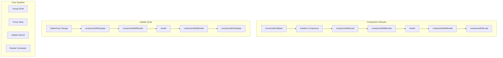

# Runtime Architecture

The Stencil Runtime is the client-side engine that powers components in the browser. It handles component initialization, lifecycle management, rendering, and state updates with minimal overhead.

**Location:**
- [`src/client/`](../src/client/)
- [`src/runtime/`](../src/runtime/)
- [`src/internal/`](../src/internal/)

## Table of Contents

1. [The Magic of BUILD Conditionals](#the-magic-of-build-conditionals)
2. [How the Compiler Analyzes Your Components](#how-the-compiler-analyzes-your-components)
3. [Runtime Dead Code Elimination](#runtime-dead-code-elimination)
4. [Architecture Overview](#architecture-overview)
5. [Component Lifecycle](#component-lifecycle)
6. [State Management](#state-management)
7. [Virtual DOM](#virtual-dom)
8. [Render Scheduling](#render-scheduling)
9. [Lazy Loading](#lazy-loading)
10. [Hydration](#hydration)
11. [Event System](#event-system)
12. [Method Decorators](#method-decorators)
13. [Style Encapsulation](#style-encapsulation)
14. [Performance Optimizations](#performance-optimizations)
15. [Platform Abstraction](#platform-abstraction)
16. [Testing](#testing)
17. [Common Issues](#common-issues)

---

## The Magic of BUILD Conditionals

Here's where Stencil gets clever. Unlike traditional frameworks that ship a monolithic runtime, Stencil analyzes your components at compile-time and creates a custom runtime containing only the features you actually use. It's like having a tailor-made suit instead of buying off the rack.

### How It Works

When you write a component like this:

```typescript
@Component({
  tag: 'my-simple-button',
  shadow: true
})
export class MySimpleButton {
  render() {
    return <button>Click me</button>;
  }
}
```

The compiler scans your component and realizes:
- ✅ You need shadow DOM support
- ✅ You need the render function
- ❌ You don't use `@State` - no reactive state needed
- ❌ You don't use `@Prop` - no property handling needed
- ❌ You don't use `@Method` - no public method proxying needed
- ❌ You don't use events - no event system needed

### The BUILD Object

At the heart of this optimization is the `BUILD` object - a compile-time constant that acts as feature flags throughout the runtime:

```typescript
// Default BUILD object structure
// See: src/app-data/index.ts
export const BUILD = {
  allRenderFn: false,    // Do all components have render()?
  asyncLoading: true,    // Enable async component loading?
  event: false,          // Any components use events?
  hasRenderFn: true,     // At least one component has render()?
  lifecycle: false,      // Any lifecycle methods?
  member: false,         // Props, state, or methods?
  method: false,         // Any @Method decorators?
  mode: false,           // Style modes enabled?
  prop: false,           // Any @Prop decorators?
  reflect: false,        // Props reflected to attributes?
  scoped: false,         // Scoped CSS?
  shadowDom: true,       // Shadow DOM?
  state: false,          // Any @State decorators?
  style: true,           // Components have styles?
  svg: false,            // SVG support needed?
  updatable: false,      // Can components update?
  vdomAttribute: false,  // VDOM attributes?
  vdomClass: false,      // VDOM class handling?
  vdomKey: false,        // VDOM keys?
  vdomListener: false,   // VDOM event listeners?
  vdomRef: false,        // VDOM refs?
  vdomRender: true,      // VDOM rendering?
  vdomStyle: false,      // VDOM inline styles?
  vdomText: true,        // VDOM text nodes?
  watchCallback: false,  // @Watch decorators?
};
```

### Dead Code Elimination in Action

Here's where the magic happens. Throughout the runtime, you'll see code like:

```typescript
// From src/runtime/update-component.ts
if (BUILD.updatable) {
  // This entire block is removed if no components update
  scheduleUpdate(hostRef, false);
}

// From src/runtime/initialize-component.ts
if (BUILD.member && BUILD.lazyLoad) {
  // Property handling only included if needed
  initializeComponent(elm, hostRef, cmpMeta);
}
```

When Rollup bundles your app, it evaluates these conditionals:
- If `BUILD.updatable` is `false`, the entire update system is removed
- If `BUILD.member` is `false`, property/state handling disappears
- If `BUILD.method` is `false`, method proxying vanishes

This isn't just minification - it's complete code elimination!

---

## How the Compiler Analyzes Your Components

The journey begins in the TypeScript transformer pipeline. Let's trace how your component metadata influences the final runtime:

### Step 1: Component Discovery

When the compiler encounters your component, it extracts metadata:

```typescript
// src/compiler/transformers/component-build-conditionals.ts:5-48
export const setComponentBuildConditionals = (cmpMeta: ComponentCompilerMeta) => {
  if (cmpMeta.properties.length > 0) {
    cmpMeta.hasProp = true;
    cmpMeta.hasPropMutable = cmpMeta.properties.some(p => p.mutable);
    cmpMeta.hasReflect = cmpMeta.properties.some(p => p.reflect);
    cmpMeta.hasPropBoolean = cmpMeta.properties.some(p => p.type === 'boolean');
    cmpMeta.hasPropNumber = cmpMeta.properties.some(p => p.type === 'number');
    cmpMeta.hasPropString = cmpMeta.properties.some(p => p.type === 'string');
  }
  
  if (cmpMeta.states.length > 0) {
    cmpMeta.hasState = true;
  }
  
  if (cmpMeta.methods.length > 0) {
    cmpMeta.hasMethod = true;
  }
  
  // ... and so on for every feature
};
```

### Step 2: Build Feature Aggregation

The compiler then aggregates features across ALL components:

```typescript
// src/compiler/app-core/app-data.ts:20-76
export const getBuildFeatures = (cmps: ComponentCompilerMeta[]): BuildFeatures => {
  const slot = cmps.some((c) => c.htmlTagNames.includes('slot'));
  const shadowDom = cmps.some((c) => c.encapsulation === 'shadow');
  const slotRelocation = cmps.some((c) => c.encapsulation !== 'shadow' && c.htmlTagNames.includes('slot'));
  
  return {
    allRenderFn: cmps.every(c => c.hasRenderFn),
    prop: cmps.some(c => c.hasProp),
    state: cmps.some(c => c.hasState),
    method: cmps.some(c => c.hasMethod),
    // ... check every feature across all components
  };
};
```

### Step 3: Runtime Generation

Based on your components, the compiler generates a custom BUILD object:

```typescript
// For a simple app with no state management
export const BUILD = {
  isDev: false,
  isBrowser: true,
  isServer: false,
  isTesting: false,
  member: false,      // No props or state!
  reflect: false,     // No reflected attributes!
  updatable: false,   // Components never update!
  // ... only what you need
};
```

### Step 4: Optimization Magic

The real optimization happens in the bundling phase. The compiler configures Terser with aggressive optimizations:

```typescript
// src/compiler/optimize/optimize-module.ts:60-80
if (opts.sourceTarget !== 'es5' && opts.isCore) {
  if (!isDebug) {
    compressOpts.passes = 2;
    compressOpts.global_defs = {
      supportsListenerOptions: true,
    };
    compressOpts.pure_funcs = compressOpts.pure_funcs || [];
    compressOpts.pure_funcs = ['getHostRef', ...compressOpts.pure_funcs];
  }

  mangleOptions.properties = {
    debug: isDebug,
    ...getTerserManglePropertiesConfig(),
  };

  compressOpts.inline = 1;
  compressOpts.unsafe = true;
  compressOpts.unsafe_undefined = true;
}
```

Terser then transforms code like:

```typescript
// Before
if (BUILD.member) {
  initializeProps(elm, cmpMeta);
}

// After (when BUILD.member = false)
if (false) {
  initializeProps(elm, cmpMeta);
}

// Final (removed entirely!)
// ... nothing ...
```

---

## Runtime Dead Code Elimination

Let's look at real examples of how different component patterns affect the runtime:

### Example 1: Static Component

```typescript
@Component({ tag: 'my-header' })
export class MyHeader {
  render() {
    return <header>Welcome!</header>;
  }
}
```

**Runtime impact:**
- ✅ Basic component registration
- ✅ Render function support
- ❌ No state management (saves ~2KB)
- ❌ No property handling (saves ~3KB)
- ❌ No event system (saves ~1KB)

### Example 2: Interactive Component

```typescript
@Component({ tag: 'my-counter' })
export class MyCounter {
  @State() count = 0;
  
  @Listen('click')
  increment() {
    this.count++;
  }
  
  render() {
    return <div>Count: {this.count}</div>;
  }
}
```

**Runtime impact:**
- ✅ State management system
- ✅ Update scheduling
- ✅ Event listener support
- ✅ Re-rendering logic
- Total runtime: ~8KB (vs ~15KB for full runtime)

### Example 3: Complex Component

```typescript
@Component({ 
  tag: 'my-form',
  formAssociated: true,
  shadow: true,
  styleUrl: 'my-form.css'
})
export class MyForm {
  @Prop() value: string;
  @State() isValid = false;
  @Event() myChange: EventEmitter;
  
  @Method()
  async validate() {
    // validation logic
  }
  
  @Watch('value')
  valueChanged() {
    this.validate();
  }
  
  render() {
    // complex render logic
  }
}
```

**Runtime impact:**
- ✅ Full property system with watchers
- ✅ Event emitter system
- ✅ Method proxying
- ✅ Form association APIs
- ✅ Shadow DOM with styles
- Total runtime: ~12KB (still less than most frameworks!)

---

## Architecture Overview

Now that we understand how the compiler optimizes the runtime, let's explore the runtime architecture itself:



## Component Lifecycle

### Lifecycle Order

Components follow a strict lifecycle order, especially important for nested components:

```
<parent-component>
  <child-component>
    <grandchild-component></grandchild-component>
  </child-component>
</parent-component>
```

**Initialization Order** (top-down):
1. parent - componentWillLoad
2. child - componentWillLoad
3. grandchild - componentWillLoad
4. grandchild - componentDidLoad
5. child - componentDidLoad
6. parent - componentDidLoad

### Core Lifecycle Methods

#### connectedCallback

When element is added to DOM:

```typescript
// Simplified version - see full implementation at:
// src/runtime/connected-callback.ts
connectedCallback() {
  const hostRef = getHostRef(this);
  
  // Only included if BUILD.hostListener is true
  if (BUILD.hostListener) {
    addHostEventListeners(this, hostRef, cmpMeta.$listeners$);
  }
  
  // Only included if components use context
  if (BUILD.asyncLoading) {
    attachToAncestor(hostRef, hostRef.$ancestorComponent$);
  }
  
  // Start initialization
  initializeComponent(this, hostRef, cmpMeta);
}
```

Notice how even the `connectedCallback` is optimized! If your app doesn't use `@Listen` decorators, the entire event listener system is removed.

#### Component Initialization

```typescript
// src/runtime/initialize-component.ts:23-90
const initializeComponent = async (elm, hostRef, cmpMeta) => {
  if ((hostRef.$flags$ & HOST_FLAGS.hasInitializedComponent) === 0) {
    hostRef.$flags$ |= HOST_FLAGS.hasInitializedComponent;
    
    const bundleId = cmpMeta.$lazyBundleId$;
    
    // This entire lazy loading section is removed if BUILD.lazyLoad is false
    if (BUILD.lazyLoad && bundleId) {
      const Cstr = await loadModule(cmpMeta, hostRef);
      
      // Property proxying only added if components have props/state
      if (BUILD.member && !Cstr.isProxied) {
        proxyComponent(Cstr, cmpMeta, PROXY_FLAGS.proxyState);
        Cstr.isProxied = true;
      }
      
      // Instance creation tracking only if needed
      if (BUILD.member) {
        hostRef.$flags$ |= HOST_FLAGS.isConstructingInstance;
      }
      
      new Cstr(hostRef);
      
      if (BUILD.member) {
        hostRef.$flags$ &= ~HOST_FLAGS.isConstructingInstance;
      }
    }
    
    // Schedule first render
    scheduleUpdate(hostRef, true);
  }
};
```

The initialization is heavily optimized:
- No lazy loading code if `BUILD.lazyLoad` is false
- No property proxying if `BUILD.member` is false
- No instance tracking if components don't have members

## State Management

### Reactive Properties

State management is one of the most optimized parts of Stencil. If your components don't use `@State` or `@Prop`, the entire reactive system is eliminated!

```typescript
// src/runtime/proxy-component.ts:24-89
const proxyComponent = (Cstr, cmpMeta, flags) => {
  // This entire function is removed if BUILD.member is false!
  if (BUILD.member) {
    cmpMeta.$members$.forEach(([memberName, [memberFlags]]) => {
      // Only props included if BUILD.prop is true
      if (BUILD.prop && memberFlags & MEMBER_FLAGS.Prop) {
        definePropertyAccessor(Cstr.prototype, memberName, memberFlags);
      }
      
      // Only state included if BUILD.state is true
      if (BUILD.state && memberFlags & MEMBER_FLAGS.State) {
        definePropertyAccessor(Cstr.prototype, memberName, memberFlags);
      }
    });
  }
};
```

### Optimized Property Handling

Stencil even optimizes based on property types:

```typescript
// src/runtime/set-value.ts:getValue
const getValue = (ref, propName) => {
  // Type-specific optimizations
  if (BUILD.propBoolean && isBooleanProp) {
    return ref.$instanceValues$.get(propName) === true;
  }
  
  if (BUILD.propNumber && isNumberProp) {
    return Number(ref.$instanceValues$.get(propName));
  }
  
  if (BUILD.propString && isStringProp) {
    return String(ref.$instanceValues$.get(propName) || '');
  }
  
  // Generic fallback only if needed
  return ref.$instanceValues$.get(propName);
};
```

### Update Queue

Batches multiple updates:

```typescript
// src/runtime/set-value.ts:setValue
const setValue = (ref, propName, newVal, cmpMeta) => {
  const hostRef = getHostRef(ref);
  const oldVal = hostRef.$instanceValues$.get(propName);
  
  if (oldVal !== newVal) {
    hostRef.$instanceValues$.set(propName, newVal);
    
    if (hostRef.$flags$ & HOST_FLAGS.hasRendered) {
      // Schedule update
      scheduleUpdate(hostRef, false);
    }
  }
};
```

## Virtual DOM

Stencil's Virtual DOM implementation is based on the excellent [Snabbdom](https://github.com/snabbdom/snabbdom) library, but heavily optimized for Stencil's specific use cases. The VDOM allows Stencil to efficiently update only the parts of the DOM that have actually changed, rather than re-rendering entire component trees.

### History and Evolution

Stencil's VDOM started as a fork of Snabbdom, chosen for its:
- Small size (~3KB)
- Simplicity and performance
- Modular architecture
- Proven track record in production

However, Stencil has significantly modified it to:
- Use shorter property names for better minification (`$tag$` vs `tag`)
- Remove unused features based on BUILD conditionals
- Integrate tightly with the component lifecycle
- Add Stencil-specific optimizations

### VNode Structure

```typescript
// src/declarations/vdom.ts
interface VNode {
  $tag$: string | Function;  // Element tag or component constructor
  $elm$: Element;           // Reference to actual DOM element
  $text$: string;          // Text content for text nodes
  $children$: VNode[];     // Array of child VNodes
  $attrs$: any;            // HTML attributes (id, class, etc.)
  $key$: string | number;  // Unique key for efficient list updates
}
```

The property names might look unusual, but they're optimized for minification. After compression, `$tag$` becomes just `t`, saving precious bytes.

### Creating VNodes with h()

The `h()` function (short for "hyperscript") creates VNode objects:

```typescript
// src/runtime/vdom/h.ts
export const h = (tag, vnodeData, ...children) => {
  const vnode: VNode = {
    $tag$: tag,
    $children$: null,
    $elm$: null,
    $text$: null,
    $attrs$: vnodeData,
    $key$: vnodeData?.key
  };
  
  // Process children - flatten arrays, convert primitives to text nodes
  if (children.length > 0) {
    vnode.$children$ = [];
    for (let i = 0; i < children.length; i++) {
      const child = children[i];
      if (Array.isArray(child)) {
        // Flatten arrays (common with .map())
        vnode.$children$.push(...child);
      } else if (isPrimitive(child)) {
        // Convert strings/numbers to text nodes
        vnode.$children$.push({ $text$: String(child) });
      } else {
        vnode.$children$.push(child);
      }
    }
  }
  
  return vnode;
};
```

### Render Function

Components use JSX which compiles to `h()` calls:

```typescript
// JSX in your component:
render() {
  return (
    <div class="container">
      <h1>{this.title}</h1>
      <button onClick={() => this.handleClick()}>
        Click me
      </button>
      <ul>
        {this.items.map(item => 
          <li key={item.id}>{item.name}</li>
        )}
      </ul>
    </div>
  );
}

// Compiles to:
render() {
  return h('div', { class: 'container' },
    h('h1', null, this.title),
    h('button', { onClick: () => this.handleClick() }, 'Click me'),
    h('ul', null,
      this.items.map(item => 
        h('li', { key: item.id }, item.name)
      )
    )
  );
}
```

### The Diff Algorithm

The heart of the VDOM is the diffing algorithm that determines what changed:

```typescript
// src/runtime/vdom/vdom-render.ts
const patch = (oldVNode: VNode, newVNode: VNode, isInitialRender = false) => {
  const elm = oldVNode.$elm$;
  
  // Different tags? Replace the whole element
  if (oldVNode.$tag$ !== newVNode.$tag$) {
    const newElm = createElm(newVNode, null);
    elm.parentNode.replaceChild(newElm, elm);
    return;
  }
  
  // Same tag - update the existing element
  newVNode.$elm$ = elm;
  
  // Update attributes (only if BUILD.vdomAttribute is true)
  if (BUILD.vdomAttribute) {
    updateElement(elm, oldVNode.$attrs$, newVNode.$attrs$);
  }
  
  // Update children
  updateChildren(elm, oldVNode.$children$, newVNode.$children$);
};
```

### Optimized Attribute Updates

Stencil optimizes attribute updates based on what features you use:

```typescript
// src/runtime/vdom/update-element.ts
const updateElement = (elm: Element, oldAttrs = {}, newAttrs = {}) => {
  // Only included if components use attributes
  if (BUILD.vdomAttribute) {
    // Remove old attributes
    for (const name in oldAttrs) {
      if (!(name in newAttrs)) {
        removeAttribute(elm, name);
      }
    }
    
    // Add/update new attributes
    for (const name in newAttrs) {
      if (oldAttrs[name] !== newAttrs[name]) {
        setAttribute(elm, name, newAttrs[name]);
      }
    }
  }
  
  // Class handling only if used
  if (BUILD.vdomClass && oldAttrs.class !== newAttrs.class) {
    elm.className = newAttrs.class || '';
  }
  
  // Style handling only if used
  if (BUILD.vdomStyle && oldAttrs.style !== newAttrs.style) {
    updateStyle(elm, oldAttrs.style, newAttrs.style);
  }
  
  // Event listeners only if used
  if (BUILD.vdomListener) {
    updateListeners(elm, oldAttrs, newAttrs);
  }
};
```

### Key-based Reordering

One of the most important optimizations is key-based list reconciliation:

```typescript
// When rendering lists, always use keys!
render() {
  return (
    <ul>
      {this.items.map(item => (
        <li key={item.id}>  {/* Key enables efficient reordering */}
          {item.name}
        </li>
      ))}
    </ul>
  );
}
```

Without keys, Stencil has to update each list item in place. With keys, it can:
1. Identify which items were added/removed/moved
2. Reuse existing DOM nodes by moving them
3. Preserve component state during reorders

### VDOM Optimizations

Stencil applies several optimizations to the VDOM:

#### 1. Static Hoisting
```typescript
// The compiler can detect static vnodes and hoist them
const STATIC_HEADER = h('h1', { class: 'header' }, 'Welcome');

render() {
  return h('div', null,
    STATIC_HEADER,  // Reused, not recreated
    h('p', null, this.dynamicContent)
  );
}
```

#### 2. Conditional Features
```typescript
// If no components use refs, this code is eliminated
if (BUILD.vdomRef && vnode.$attrs$.ref) {
  vnode.$attrs$.ref(elm);
}

// If no components use keys, key handling is removed
if (BUILD.vdomKey && vnode.$key$) {
  elm.key = vnode.$key$;
}
```

#### 3. Text Node Optimization
```typescript
// Direct text content optimization
if (BUILD.vdomText && children.length === 1 && children[0].$text$) {
  // Fast path: set textContent directly
  elm.textContent = children[0].$text$;
} else {
  // Slow path: full child reconciliation
  updateChildren(elm, oldChildren, newChildren);
}
```

### VDOM vs Direct DOM Manipulation

While VDOM provides a clean programming model, Stencil knows when to bypass it:

```typescript
// For simple text updates, Stencil can use direct DOM
if (BUILD.allRenderFn && !BUILD.vdomRender) {
  // No VDOM needed - direct textContent update
  elm.textContent = instance.render();
}
```

This is another example of Stencil's philosophy: use the right tool for the job, not one-size-fits-all.

## Render Scheduling

### Async Rendering

Updates are batched and scheduled:

```typescript
// src/runtime/update-component.ts:scheduleUpdate
const scheduleUpdate = (hostRef, isInitialLoad) => {
  if (hostRef.$flags$ & HOST_FLAGS.isQueuedForUpdate) {
    return;
  }
  
  hostRef.$flags$ |= HOST_FLAGS.isQueuedForUpdate;
  
  if (isInitialLoad) {
    // Use microtask for initial load
    queueMicrotask(() => dispatchHooks(hostRef, isInitialLoad));
  } else {
    // Use write task for updates
    writeTask(() => dispatchHooks(hostRef, isInitialLoad));
  }
};
```

### Task Queue

Custom task scheduling:

```typescript
// src/runtime/task-queue.ts
const writeTask = (cb) => {
  if (!pendingWriteTask) {
    pendingWriteTask = true;
    
    if (supportsRAF) {
      requestAnimationFrame(flush);
    } else {
      setTimeout(flush, 0);
    }
  }
  
  writeQueue.push(cb);
};
```

## Lazy Loading

### Component Registration

```typescript
// src/runtime/bootstrap-lazy.ts:24-98
const bootstrapLazy = (lazyBundles) => {
  lazyBundles.forEach(([bundleId, components]) => {
    components.forEach(compactMeta => {
      const cmpMeta = parseComponentMeta(compactMeta);
      
      class HostElement extends HTMLElement {
        connectedCallback() {
          plt.jmp(() => connectedCallback(this));
        }
        
        disconnectedCallback() {
          plt.jmp(() => disconnectedCallback(this));
        }
      }
      
      customElements.define(cmpMeta.$tagName$, HostElement);
    });
  });
};
```

### Dynamic Import

Components loaded on demand:

```typescript
// src/client/client-load-module.ts
const loadModule = async (cmpMeta, hostRef) => {
  const bundleId = cmpMeta.$lazyBundleId$;
  
  if (!loadedModules.has(bundleId)) {
    const module = await import(
      /* webpackChunkName: "[request]" */
      `./build/${bundleId}.js`
    );
    loadedModules.set(bundleId, module);
  }
  
  return loadedModules.get(bundleId)[cmpMeta.$tagName$];
};
```

## Hydration

### Server-Side Rendering

Markers for hydration:

```html
<my-component s-id="1" class="hydrated">
  <!--s:1.0-->
  <div c-id="1.1">
    <!--t:1.2-->Hello World<!---->
  </div>
  <!--e:1.0-->
</my-component>
```

### Client Hydration

Reuses server-rendered DOM:

```typescript
// src/runtime/client-hydrate.ts
const clientHydrate = (hostElm, tagName, hostId, hostRef) => {
  const serverHostRef = serverSideConnected.get(hostId);
  
  if (serverHostRef) {
    // Reuse server state
    hostRef.$instanceValues$ = serverHostRef.$instanceValues$;
    
    // Connect to existing DOM
    hostRef.$elm$ = hostElm;
    hostRef.$flags$ |= HOST_FLAGS.hasInitializedComponent;
  }
};
```

## Event System

### Event Decorators

```typescript
@Event() myEvent: EventEmitter<string>;

emitEvent() {
  this.myEvent.emit('data');
}
```

### Event Implementation

```typescript
// src/runtime/event-emitter.ts
const createEvent = (ref, name, flags) => {
  const elm = getHostRef(ref).$hostElement$;
  
  return {
    emit: (detail) => {
      const event = new CustomEvent(name, {
        bubbles: !!(flags & EVENT_FLAGS.Bubbles),
        composed: !!(flags & EVENT_FLAGS.Composed),
        cancelable: !!(flags & EVENT_FLAGS.Cancellable),
        detail
      });
      
      elm.dispatchEvent(event);
      return event;
    }
  };
};
```

## Method Decorators

### Async Methods

```typescript
@Method()
async getData() {
  return this.internalData;
}
```

### Method Proxying

```typescript
// Implementation found in proxy-component.ts
const proxyMethods = (hostRef, cmpMeta) => {
  cmpMeta.$methods$.forEach(methodName => {
    hostRef.$hostElement$[methodName] = function(...args) {
      const instance = hostRef.$lazyInstance$;
      return instance[methodName].apply(instance, args);
    };
  });
};
```

## Style Encapsulation

### Shadow DOM

True style isolation:

```typescript
if (cmpMeta.$flags$ & CMP_FLAGS.shadowDomEncapsulation) {
  hostElm.attachShadow({ mode: 'open' });
  renderIntoShadow(hostElm.shadowRoot);
}
```

### Scoped CSS

CSS-in-JS style scoping:

```typescript
if (cmpMeta.$flags$ & CMP_FLAGS.scopedCssEncapsulation) {
  const scopeId = getScopeId(cmpMeta);
  hostElm.classList.add(scopeId);
  
  // Transform styles
  styles = scopeCss(styles, scopeId);
}
```

## Performance Optimizations

### Host Ref

Centralized component data:

```typescript
// src/declarations/stencil-private.ts
interface HostRef {
  $flags$: number;
  $hostElement$: d.HostElement;
  $cmpMeta$: d.ComponentRuntimeMeta;
  $instanceValues$: Map<string, any>;
  $lazyInstance$: any;
  $onReadyResolve$: (elm: any) => void;
  $onInstanceResolve$: (elm: any) => void;
  $vnode$: d.VNode;
  $ancestorComponent$: d.HostElement;
}
```

### Flags Optimization

Bit flags for memory efficiency:

```typescript
// src/utils/constants.ts
const enum HOST_FLAGS {
  hasConnected = 1 << 0,
  hasRendered = 1 << 1,
  hasInitializedComponent = 1 << 2,
  hasLoadedComponent = 1 << 3,
  isWaitingForChildren = 1 << 4,
  isConstructingInstance = 1 << 5,
  isQueuedForUpdate = 1 << 6,
  hasReflectedAttr = 1 << 7,
  // ... up to 32 flags
}
```

## Platform Abstraction

### Platform Layer

The platform abstraction layer (`plt`) is designed for optimal minification:

```typescript
// src/client/index.ts
const plt = {
  $flags$: 0,
  // Short property names for better minification
  jmp: (h) => h(),
  raf: (h) => requestAnimationFrame(h),
  ael: (el, eventName, listener, opts) => 
    el.addEventListener(eventName, listener, opts),
  rel: (el, eventName, listener, opts) => 
    el.removeEventListener(eventName, listener, opts)
};
```

These short names might look cryptic, but they serve a purpose:
- `jmp` (jump) wraps microtasks
- `raf` wraps requestAnimationFrame
- `ael`/`rel` wrap addEventListener/removeEventListener

After minification, these save precious bytes!

## Testing

### Runtime Tests

```typescript
describe('runtime', () => {
  it('should initialize component', async () => {
    const { root } = await newSpecPage({
      components: [MyComponent],
      html: '<my-component></my-component>'
    });
    
    expect(root).toHaveClass('hydrated');
  });
});
```

## Common Issues

### Memory Leaks

Prevent with proper cleanup:

```typescript
disconnectedCallback() {
  // Remove event listeners
  this.removeEventListeners();
  
  // Clear references
  hostRef.$lazyInstance$ = undefined;
  
  // Cancel pending updates
  cancelPendingUpdate(hostRef);
}
```

### Infinite Loops

Avoid in watch callbacks:

```typescript
@Watch('value')
watchHandler(newValue) {
  // DON'T: this.value = transform(newValue);
  // DO: this.internalValue = transform(newValue);
}
```
