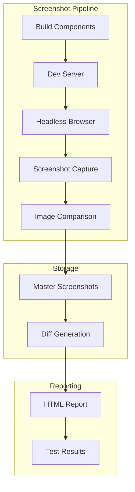

# Screenshot Testing (Deprecated)

> **⚠️ DEPRECATED**: Screenshot testing is deprecated and will be removed in the next major version. Please migrate to modern visual regression testing tools.

## Migration Paths

### Recommended Alternatives

1. **[Percy](https://percy.io/)**: Visual testing platform with CI integration
2. **[Chromatic](https://www.chromatic.com/)**: Visual testing for component libraries
3. **[Playwright Visual Testing](https://playwright.dev/docs/test-snapshots)**: Built-in visual comparisons
4. **[BackstopJS](https://github.com/garris/BackstopJS)**: Visual regression testing
5. **[Applitools](https://applitools.com/)**: AI-powered visual testing

## Legacy Architecture

> **Note**: This documentation is preserved for projects still using the deprecated screenshot testing.



## Configuration

### Screenshot Config

```typescript
// stencil.config.ts
export const config: Config = {
  testing: {
    screenshotConnector: 'puppeteer',
    
    // Screenshot options
    screenshot: {
      // Browser viewport
      viewport: {
        width: 1200,
        height: 800
      },
      
      // Capture options
      fullPage: true,
      omitBackground: false,
      
      // Comparison thresholds
      pixelmatchThreshold: 0.1,
      allowableMismatchedPixels: 100,
      allowableMismatchedRatio: 0.05,
      
      // Wait strategies
      waitBeforeScreenshot: 500,
      
      // File naming
      fileNamePattern: '{spec}-{desc}-{os}-{browser}-{width}x{height}.png'
    }
  }
};
```

## Writing Screenshot Tests

### Basic Screenshot Test

```typescript
import { E2EPage, newE2EPage } from '@stencil/core/testing';

describe('screenshot', () => {
  let page: E2EPage;
  
  beforeEach(async () => {
    page = await newE2EPage();
  });
  
  it('captures default state', async () => {
    await page.setContent(`
      <my-component name="Test"></my-component>
    `);
    
    await page.waitForChanges();
    
    // Capture screenshot
    await page.compareScreenshot();
  });
  
  it('captures hover state', async () => {
    await page.setContent(`
      <my-button>Click me</my-button>
    `);
    
    const button = await page.find('my-button');
    await button.hover();
    
    await page.compareScreenshot('button-hover');
  });
});
```

### Advanced Screenshot Testing

```typescript
describe('advanced screenshots', () => {
  it('captures multiple viewports', async () => {
    const viewports = [
      { width: 320, height: 568 },  // Mobile
      { width: 768, height: 1024 }, // Tablet
      { width: 1920, height: 1080 } // Desktop
    ];
    
    for (const viewport of viewports) {
      const page = await newE2EPage();
      await page.setViewport(viewport);
      await page.setContent('<my-app></my-app>');
      
      await page.compareScreenshot(
        `app-${viewport.width}x${viewport.height}`
      );
    }
  });
  
  it('captures component states', async () => {
    const page = await newE2EPage();
    await page.setContent('<my-form></my-form>');
    
    // Default state
    await page.compareScreenshot('form-default');
    
    // Focus state
    const input = await page.find('input');
    await input.focus();
    await page.compareScreenshot('form-focused');
    
    // Error state
    await page.$eval('my-form', (el: any) => {
      el.showError = true;
    });
    await page.waitForChanges();
    await page.compareScreenshot('form-error');
  });
});
```

## Screenshot Comparison

### Comparison Options

```typescript
await page.compareScreenshot('my-screenshot', {
  // Clip to specific area
  clip: {
    x: 100,
    y: 100,
    width: 200,
    height: 200
  },
  
  // Custom threshold
  pixelmatchThreshold: 0.2,
  
  // Allow more differences
  allowableMismatchedPixels: 200,
  
  // Disable animations
  disableAnimations: true,
  
  // Wait for fonts
  waitForFonts: true
});
```

### Handling Dynamic Content

```typescript
it('handles dynamic content', async () => {
  await page.setContent(`
    <my-component>
      <div class="timestamp">${new Date().toString()}</div>
    </my-component>
  `);
  
  // Hide dynamic elements
  await page.addStyleTag({
    content: '.timestamp { visibility: hidden !important; }'
  });
  
  await page.compareScreenshot('component-no-timestamp');
});
```

## Master Screenshots

### Generating Masters

```bash
# Generate master screenshots
npm run test.screenshot -- --updateScreenshot

# Generate for specific test
npm run test.screenshot -- --updateScreenshot --spec=button
```

### Master Storage

```
screenshot/
├── master/
│   ├── button-default-darwin-chrome-1200x800.png
│   ├── button-hover-darwin-chrome-1200x800.png
│   └── form-error-darwin-chrome-1200x800.png
├── diff/
│   └── button-hover-darwin-chrome-1200x800.diff.png
└── compare/
    └── results.json
```

## Platform Support

### Cross-Platform Testing

```typescript
const platforms = [
  { os: 'darwin', browser: 'chrome' },
  { os: 'win32', browser: 'edge' },
  { os: 'linux', browser: 'firefox' }
];

// Mock different platforms
beforeEach(async () => {
  const platform = platforms[0];
  
  page = await newE2EPage({
    userAgent: getUserAgent(platform),
    viewport: {
      width: 1200,
      height: 800,
      deviceScaleFactor: platform.os === 'darwin' ? 2 : 1
    }
  });
});
```

## CI Integration

### GitHub Actions Example

```yaml
- name: Screenshot Tests
  run: |
    npm run test.screenshot
    
- name: Upload Screenshots
  if: failure()
  uses: actions/upload-artifact@v2
  with:
    name: screenshot-diffs
    path: screenshot/diff/
```

## Debugging Failed Screenshots

### Local Comparison

```bash
# View comparison report
npm run test.screenshot -- --serve

# Opens browser with visual diff report
```

### Debug Mode

```typescript
it('debug screenshot', async () => {
  await page.setContent('<my-component></my-component>');
  
  // Take debug screenshot
  const screenshot = await page.screenshot({
    path: 'debug-screenshot.png',
    fullPage: true
  });
  
  // Log pixel data
  console.log('Screenshot size:', screenshot.length);
});
```

## Known Issues

1. **Platform Differences**: Font rendering varies by OS
2. **Animation Timing**: Inconsistent animation states
3. **Performance**: Slow test execution
4. **Storage Size**: Large screenshot files
5. **Flakiness**: Random failures due to timing

## Why It's Deprecated

1. **Maintenance Burden**: Complex browser automation
2. **Better Alternatives**: Modern tools with better features
3. **Performance Issues**: Slow and resource-intensive
4. **Limited Features**: Basic comparison only
5. **Cross-Browser Issues**: Inconsistent results

## Migration Example

### To Playwright

```typescript
// Old Stencil screenshot test
it('captures button', async () => {
  const page = await newE2EPage();
  await page.setContent('<my-button>Click</my-button>');
  await page.compareScreenshot();
});

// New Playwright test
import { test, expect } from '@playwright/test';

test('captures button', async ({ page }) => {
  await page.goto('/');
  await page.setContent('<my-button>Click</my-button>');
  await expect(page).toHaveScreenshot('button.png');
});
```

### To Percy

```typescript
// Install Percy
npm install --save-dev @percy/cli @percy/playwright

// New test with Percy
import { test } from '@playwright/test';
import { percySnapshot } from '@percy/playwright';

test('captures button', async ({ page }) => {
  await page.goto('/button');
  await percySnapshot(page, 'Button Component');
});
```

## Support Timeline

- **Deprecated**: v2.0.0 (2021)
- **Removed**: Next major version (v5.0.0)
- **Migration Period**: ~2 years

For new projects, please use one of the recommended modern visual testing tools. 