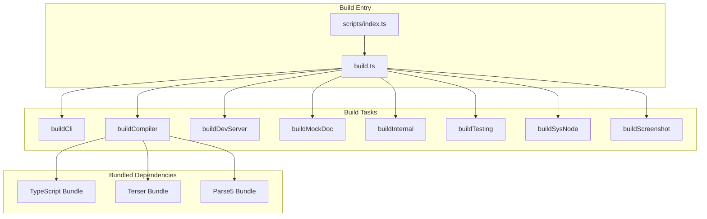

# Scripts Build System

The Scripts directory contains the build system used to develop and build Stencil itself. This is separate from Stencil's compiler that builds user projects - this is specifically for building the Stencil compiler and its related modules.

**Location:** [`scripts/`](../scripts/)

## Overview

The build system uses **esbuild** as its primary bundler to create all the distributable packages that make up Stencil. It handles bundling, minification, TypeScript compilation, and packaging of various Stencil components.



## Directory Structure

```
scripts/
├── build.ts                    # Main build orchestrator
├── index.ts                    # Entry point
├── release.ts                  # Release automation
├── release-tasks.ts            # Release task definitions
├── tsconfig.json               # TypeScript config for scripts
├── updateSelectorEngine.ts     # Playwright selector engine updater
│
├── esbuild/                    # ESBuild configurations
│   ├── cli.ts                  # CLI bundle config
│   ├── compiler.ts             # Compiler bundle config
│   ├── dev-server.ts           # Dev server bundle config
│   ├── internal.ts             # Internal packages bundle config
│   ├── mock-doc.ts             # Mock DOM bundle config
│   ├── screenshot.ts           # Screenshot bundle config
│   ├── sys-node.ts             # Node system bundle config
│   ├── testing.ts              # Testing bundle config
│   └── utils/                  # Build utilities
│       ├── typescript-source.ts
│       ├── terser.ts
│       ├── parse5.ts
│       └── ...
│
├── utils/                      # General utilities
│   ├── options.ts              # Build options
│   ├── banner.ts               # File banners
│   ├── bundle-dts.ts           # TypeScript declarations bundler
│   └── ...
│
└── test/                       # Build validation
    └── validate-build.ts       # Post-build validation
```

## Build Process

### 1. Entry Point

**Location:** `scripts/index.ts`

The build starts here when running `npm run build`:

```typescript
const stencilProjectRoot = join(__dirname, '..');
const args = process.argv.slice(2);
build.run(stencilProjectRoot, args);
```

### 2. Build Orchestration

**Location:** `scripts/build.ts`

The main build runner that coordinates all build tasks:

```typescript
export async function buildAll(opts: BuildOptions) {
  await Promise.all([
    buildCli(opts),
    buildCompiler(opts),
    buildDevServer(opts),
    buildMockDoc(opts),
    buildScreenshot(opts),
    buildSysNode(opts),
    buildTesting(opts),
    buildInternal(opts),
  ]);
}
```

All builds run in parallel for maximum efficiency.

### 3. Build Options

**Location:** `scripts/utils/options.ts`

Build configuration is centralized:
- Version management
- Directory paths
- Build flags (prod, CI, watch)
- Dependency versions

## Bundled Dependencies

Stencil bundles several key dependencies directly into its output to ensure consistency and avoid version conflicts:

### TypeScript Bundling

**Location:** `scripts/esbuild/utils/typescript-source.ts`

TypeScript is bundled and patched:
1. The TypeScript compiler is read from `node_modules`
2. Object.defineProperty calls are modified to be configurable
3. The result is cached for faster rebuilds

```typescript
// TypeScript properties need to be configurable for our patches
const TS_PROP_DEFINER = `__defProp(target, name, { 
  get: all[name], 
  enumerable: true,
  configurable: true  // Added by Stencil
});`;
```

### Terser Bundling

**Location:** `scripts/esbuild/utils/terser.ts`

Terser is bundled for JavaScript minification:
- Used in production builds
- Cached based on version
- Provides consistent minification across environments

### Parse5 Bundling

**Location:** `scripts/esbuild/utils/parse5.ts`

Parse5 is bundled for HTML parsing:
- Used by mock-doc for server-side rendering
- Bundled with Rollup (legacy from previous build system)
- Version-specific caching

## Build Outputs

Each build task creates a specific output package:

### Compiler (`/compiler`)
- Main Stencil compiler
- Includes bundled TypeScript, Terser, and Parse5
- Entry: `stencil.js`

### CLI (`/cli`)
- Command-line interface
- Both ESM and CommonJS builds
- Entry: `index.js` / `index.cjs`

### Dev Server (`/dev-server`)
- Development server with HMR
- Includes WebSocket server
- Entry: `index.js`

### Internal (`/internal`)
- Shared internal modules
- Client runtime
- Hydrate platform
- App data/globals

### Mock Doc (`/mock-doc`)
- Server-side DOM implementation
- Includes bundled Parse5
- Entry: `index.cjs` / `index.js`

### Testing (`/testing`)
- Jest integration
- Testing utilities
- Entry: `index.js`

### Sys Node (`/sys/node`)
- Node.js system abstraction
- File system operations
- Entry: `index.js`

### Screenshot (`/screenshot`)
- Visual regression testing (deprecated)
- Entry: `index.js`

## ESBuild Configuration

### Base Configuration

**Location:** `scripts/esbuild/utils/index.ts`

Common settings for all bundles:
```typescript
{
  bundle: true,
  format: 'esm' | 'cjs',
  platform: 'node',
  target: ['node16'],
  sourcemap: 'external',
  minify: isProd,
  logLevel: 'info'
}
```

### Aliases

Path aliases are used extensively:
- `@platform` → Platform-specific code
- `@utils` → Shared utilities
- `@app-data` → Build conditionals
- `@sys-api-node` → Node system API

### External Dependencies

Most Node.js dependencies are externalized except:
- TypeScript (bundled)
- Terser (bundled)
- Parse5 (bundled)

## Development Workflow

### Building Stencil

```bash
# Development build
npm run build

# Production build
npm run build -- --prod

# Watch mode
npm run build -- --watch

# Validate build
npm run build -- --validate-build
```

### Build Caching

The build system implements several caching strategies:
1. **TypeScript Bundle Cache**: Based on TypeScript version
2. **Terser Bundle Cache**: Based on Terser version
3. **Parse5 Bundle Cache**: Based on Parse5 version
4. **DTS Bundle Cache**: For TypeScript declarations

### Incremental Builds

In watch mode, only changed files trigger rebuilds of affected bundles.

## Release Process

### Release Tasks

**Location:** `scripts/release-tasks.ts`

Automated release process:
1. Validate version
2. Install dependencies
3. Build TypeScript (`tsc.prod`)
4. Bundle all packages
5. Update changelog
6. Publish to npm
7. Tag git commit

### Version Management

Versions can be:
- Semantic version words: `major`, `minor`, `patch`
- Explicit versions: `4.0.0`
- Pre-release versions: `4.0.0-beta.1`

## Build Validation

**Location:** `scripts/test/validate-build.ts`

Post-build validation ensures:
1. All expected files exist
2. Package.json files are correct
3. TypeScript declarations compile
4. Tree-shaking works properly
5. No unexpected dependencies

## Common Issues

### TypeScript Patching

The TypeScript bundling process patches TypeScript to:
- Make properties configurable for monkey-patching
- Enable in-memory file system usage
- Support custom transformers

### Circular Dependencies

The build carefully manages module loading order to avoid circular dependencies between packages.

### Platform-Specific Code

Different bundles for:
- Node.js environments (compiler, CLI)
- Browser environments (client runtime)
- Hybrid environments (testing, dev server)

## Future Improvements

1. **Build Performance**: Investigate faster bundling strategies
2. **Dependency Updates**: Automate bundled dependency updates
3. **Build Analytics**: Add timing and size tracking
4. **Cache Management**: Smarter cache invalidation
5. **Monorepo Structure**: Consider splitting into separate packages 