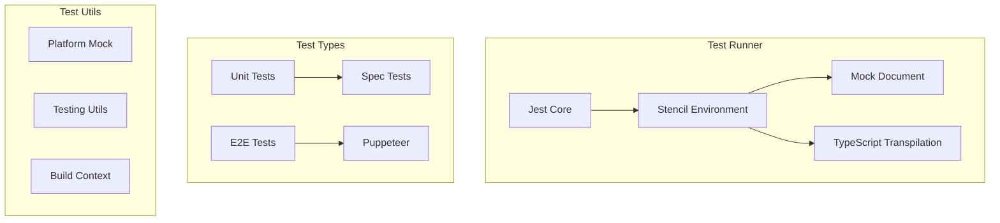

# Testing (Deprecated)

> **⚠️ DEPRECATED**: The built-in Stencil test runner is deprecated and only supports Jest v27-29. Please migrate to one of the recommended alternatives below.

**Location:** [`src/testing/`](../src/testing/)

## Migration Paths

### Recommended Alternatives

1. **[Jest Stencil Runner](https://github.com/stenciljs/jest-stencil-runner)**: Updated Jest environment for Stencil
2. **[WebdriverIO](https://stenciljs.com/docs/testing/webdriverio/overview)**: Cross-browser e2e testing
3. **[Playwright](https://stenciljs.com/docs/testing/playwright/overview)**: Modern e2e testing framework
4. **[Vitest](https://stenciljs.com/docs/testing/vitest)**: Fast unit testing with Vite

## Legacy Architecture

> **Note**: This documentation is preserved for projects still using the deprecated test runner.



## Configuration

### Testing Config

```typescript
// stencil.config.ts
export const config: Config = {
  testing: {
    // Jest configuration
    coverageDirectory: './coverage',
    coverageReporters: ['json', 'lcov', 'text'],
    collectCoverageFrom: ['src/**/*.{ts,tsx}'],
    
    // Test patterns
    testMatch: ['**/*.(spec|e2e).ts?(x)'],
    
    // Environment
    testEnvironment: '@stencil/core/testing',
    
    // Transforms
    transform: {
      '^.+\\.(ts|tsx|js|jsx|css)$': '@stencil/core/testing'
    },
    
    // Module resolution
    moduleNameMapper: {
      '@utils': '<rootDir>/src/utils'
    }
  }
};
```

## Test Types

### Unit Tests (spec.ts)

Component logic testing:

```typescript
import { newSpecPage } from '@stencil/core/testing';
import { MyComponent } from './my-component';

describe('my-component', () => {
  it('renders', async () => {
    const page = await newSpecPage({
      components: [MyComponent],
      html: '<my-component></my-component>'
    });
    
    expect(page.root).toEqualHtml(`
      <my-component>
        <div>Hello, World!</div>
      </my-component>
    `);
  });
  
  it('updates on prop change', async () => {
    const page = await newSpecPage({
      components: [MyComponent],
      html: '<my-component name="Test"></my-component>'
    });
    
    expect(page.rootInstance.name).toBe('Test');
    
    page.root.name = 'Updated';
    await page.waitForChanges();
    
    expect(page.root.textContent).toContain('Updated');
  });
});
```

### E2E Tests (e2e.ts)

Browser-based testing:

```typescript
import { newE2EPage } from '@stencil/core/testing';

describe('my-component e2e', () => {
  it('renders', async () => {
    const page = await newE2EPage();
    await page.setContent('<my-component></my-component>');
    
    const element = await page.find('my-component');
    expect(element).toHaveClass('hydrated');
  });
  
  it('emits events', async () => {
    const page = await newE2EPage();
    await page.setContent('<my-component></my-component>');
    
    const eventSpy = await page.spyOnEvent('myEvent');
    
    const button = await page.find('my-component >>> button');
    await button.click();
    
    expect(eventSpy).toHaveReceivedEvent();
    expect(eventSpy).toHaveReceivedEventDetail({ value: 42 });
  });
});
```

## Testing Utilities

### Mock Platform

Platform API mocking:

```typescript
import { mockDocument, mockWindow } from '@stencil/core/testing';

const win = mockWindow();
const doc = mockDocument();

// Mock APIs
win.localStorage.setItem('key', 'value');
doc.createElement('div');
```

### Test Utils

Helper functions:

```typescript
// Wait for async updates
await waitForChanges();

// Flush promises
await flushPromises();

// Mock fetch
mockFetch({
  '/api/data': { status: 200, data: { id: 1 } }
});

// Mock console
const consoleSpy = mockConsole();
```

## Jest Environment

### Custom Environment

Stencil's Jest environment setup:

```typescript
// jest/jest-environment.ts
export class StencilEnvironment extends NodeEnvironment {
  constructor(config: Config) {
    super(config);
    
    // Set up globals
    this.global.fetch = mockFetch;
    this.global.CSS = mockCSS;
    this.global.CSSStyleSheet = MockCSSStyleSheet;
  }
  
  async setup() {
    await super.setup();
    
    // Initialize platform
    const { win, doc } = mockPlatform();
    this.global.window = win;
    this.global.document = doc;
  }
}
```

### Transform

TypeScript/JSX transformation:

```typescript
// jest/jest-preprocessor.ts
export const process = (
  sourceText: string,
  sourcePath: string,
  config: Config
) => {
  if (sourcePath.endsWith('.tsx') || sourcePath.endsWith('.ts')) {
    const transformed = transformSync(sourceText, {
      filename: sourcePath,
      presets: ['@babel/preset-typescript'],
      plugins: [
        ['@babel/plugin-transform-typescript', { isTSX: true }],
        '@babel/plugin-syntax-jsx',
        'babel-plugin-transform-stencil-jsx'
      ]
    });
    
    return transformed.code;
  }
  
  return sourceText;
};
```

## Common Patterns

### Testing Lifecycle

```typescript
describe('lifecycle', () => {
  it('calls lifecycle methods', async () => {
    let componentWillLoadCalled = false;
    let componentDidLoadCalled = false;
    
    @Component({ tag: 'test-lifecycle' })
    class TestLifecycle {
      componentWillLoad() {
        componentWillLoadCalled = true;
      }
      
      componentDidLoad() {
        componentDidLoadCalled = true;
      }
      
      render() {
        return <div>Test</div>;
      }
    }
    
    const page = await newSpecPage({
      components: [TestLifecycle],
      html: '<test-lifecycle></test-lifecycle>'
    });
    
    expect(componentWillLoadCalled).toBe(true);
    expect(componentDidLoadCalled).toBe(true);
  });
});
```

### Testing Events

```typescript
it('emits custom events', async () => {
  const page = await newSpecPage({
    components: [MyComponent],
    html: '<my-component></my-component>'
  });
  
  const eventSpy = jest.fn();
  page.root.addEventListener('myEvent', eventSpy);
  
  // Trigger event
  page.rootInstance.emitEvent();
  
  expect(eventSpy).toHaveBeenCalledWith(
    expect.objectContaining({
      detail: { message: 'Hello' }
    })
  );
});
```

### Testing Async Operations

```typescript
it('loads async data', async () => {
  mockFetch({
    '/api/user': {
      status: 200,
      json: async () => ({ name: 'John' })
    }
  });
  
  const page = await newSpecPage({
    components: [UserComponent],
    html: '<user-component></user-component>'
  });
  
  // Wait for async operations
  await page.waitForChanges();
  
  expect(page.root.textContent).toContain('John');
});
```

## Known Limitations

1. **Jest Version Lock**: Only supports Jest 27-29
2. **Performance**: Slower than modern alternatives
3. **Browser Support**: Limited real browser testing
4. **Module Support**: Issues with ESM modules
5. **Debugging**: Poor source map support

## Why It's Deprecated

1. **Maintenance Burden**: Complex Jest integration
2. **Performance Issues**: Slow test execution
3. **Limited Features**: Missing modern testing capabilities
4. **Better Alternatives**: Superior tools now available
5. **Technical Debt**: Accumulated complexity
