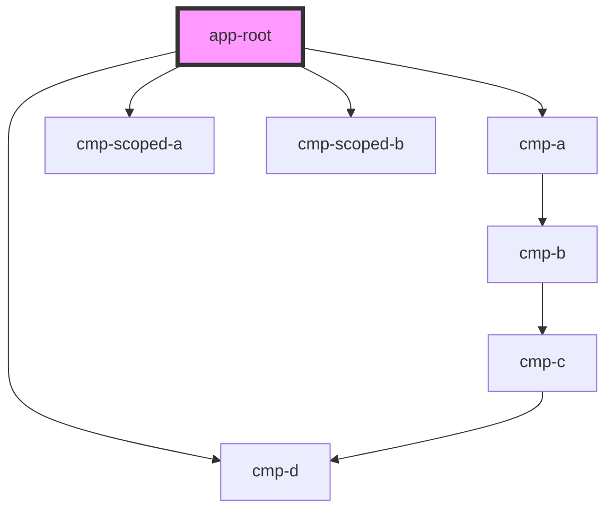

# app-root

<!-- Auto Generated Below -->

## Dependencies

### Depends on

- [cmp-a](../cmp-a)
- [cmp-d](../cmp-d)
- [cmp-scoped-a](../cmp-scoped-a)
- [cmp-scoped-b](../cmp-scoped-b)

### Graph

----------------------------------------------

*Built with [StencilJS](https://stenciljs.com/)*
