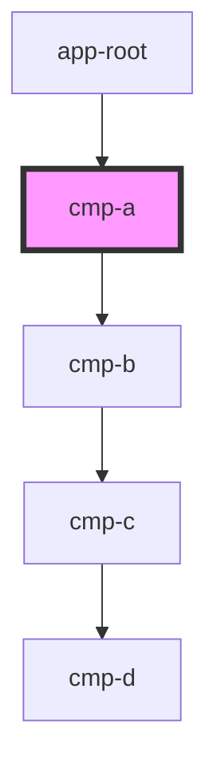

# cmp-a

<!-- Auto Generated Below -->

## Dependencies

### Used by

 - [app-root](../app-root)

### Depends on

- [cmp-b](../cmp-b)

### Graph

----------------------------------------------

*Built with [StencilJS](https://stenciljs.com/)*
