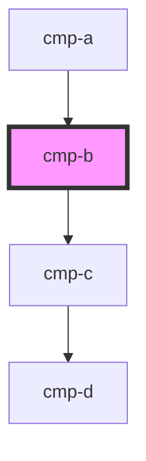

# cmp-b

<!-- Auto Generated Below -->

## Dependencies

### Used by

 - [cmp-a](../cmp-a)

### Depends on

- [cmp-c](../cmp-c)

### Graph

----------------------------------------------

*Built with [StencilJS](https://stenciljs.com/)*
