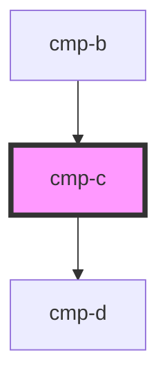

# cmp-c

<!-- Auto Generated Below -->

## Dependencies

### Used by

 - [cmp-b](../cmp-b)

### Depends on

- [cmp-d](../cmp-d)

### Graph

----------------------------------------------

*Built with [StencilJS](https://stenciljs.com/)*
