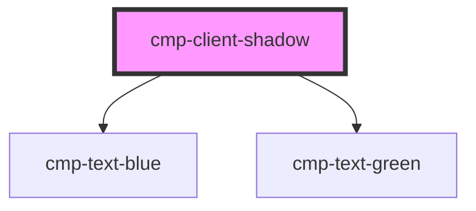

# cmp-client-shadow

<!-- Auto Generated Below -->

## Dependencies

### Depends on

- [cmp-text-blue](../cmp-text-blue)
- [cmp-text-green](../cmp-text-green)

### Graph

----------------------------------------------

*Built with [StencilJS](https://stenciljs.com/)*
