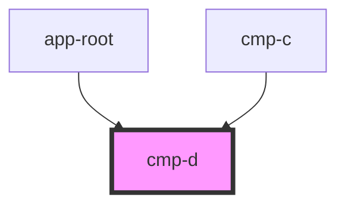

# cmp-d

<!-- Auto Generated Below -->

## Properties

| Property   | Attribute   | Description | Type     | Default |
| ---------- | ----------- | ----------- | -------- | ------- |
| `uniqueId` | `unique-id` |             | `string` | `''`    |

## Dependencies

### Used by

 - [app-root](../app-root)
 - [cmp-c](../cmp-c)

### Graph

----------------------------------------------

*Built with [StencilJS](https://stenciljs.com/)*
