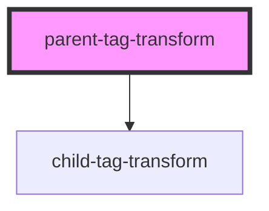

# parent-tag-transform

<!-- Auto Generated Below -->

## Methods

### `createChildTagElement() => Promise<HTMLChildTagTransformElement>`

#### Returns

Type: `Promise<HTMLChildTagTransformElement>`

### `customElementsGetChild() => Promise<CustomElementConstructor>`

#### Returns

Type: `Promise<CustomElementConstructor>`

### `querySelectorAllChildTags() => Promise<NodeListOf<HTMLChildTagTransformElement>>`

#### Returns

Type: `Promise<NodeListOf<HTMLChildTagTransformElement>>`

### `querySelectorChildTags() => Promise<HTMLChildTagTransformElement>`

#### Returns

Type: `Promise<HTMLChildTagTransformElement>`

## Dependencies

### Depends on

- [child-tag-transform](.)

### Graph

----------------------------------------------

*Built with [StencilJS](https://stenciljs.com/)*
