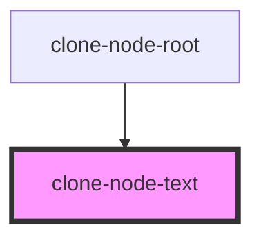

# clone-node-text

<!-- Auto Generated Below -->

## Dependencies

### Used by

 - [clone-node-root](.)

### Graph

----------------------------------------------

*Built with [StencilJS](https://stenciljs.com/)*
