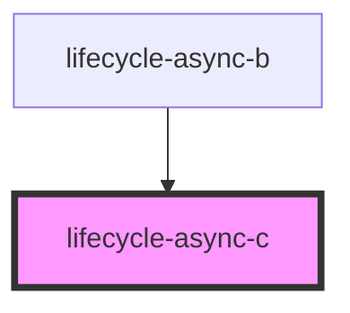

# lifecycle-async-c

<!-- Auto Generated Below -->

## Properties

| Property | Attribute | Description | Type     | Default |
| -------- | --------- | ----------- | -------- | ------- |
| `value`  | `value`   |             | `string` | `''`    |

## Events

| Event             | Description | Type               |
| ----------------- | ----------- | ------------------ |
| `lifecycleLoad`   |             | `CustomEvent<any>` |
| `lifecycleUpdate` |             | `CustomEvent<any>` |

## Dependencies

### Used by

 - [lifecycle-async-b](.)

### Graph

----------------------------------------------

*Built with [StencilJS](https://stenciljs.com/)*
