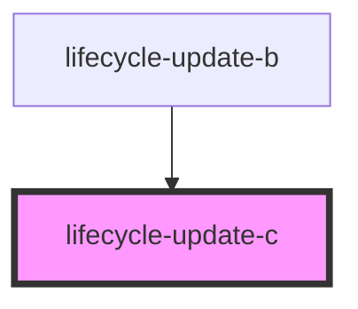

# lifecycle-update-c

<!-- Auto Generated Below -->

## Properties

| Property | Attribute | Description | Type     | Default |
| -------- | --------- | ----------- | -------- | ------- |
| `value`  | `value`   |             | `number` | `0`     |

## Dependencies

### Used by

 - [lifecycle-update-b](.)

### Graph

----------------------------------------------

*Built with [StencilJS](https://stenciljs.com/)*
