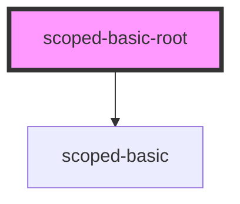

# scoped-basic-root

<!-- Auto Generated Below -->

## Dependencies

### Depends on

- [scoped-basic](.)

### Graph

----------------------------------------------

*Built with [StencilJS](https://stenciljs.com/)*
