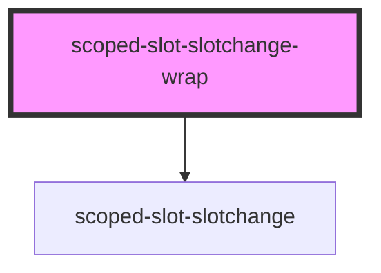

# scoped-slot-slotchange-wrap

<!-- Auto Generated Below -->

## Properties

| Property          | Attribute           | Description | Type      | Default |
| ----------------- | ------------------- | ----------- | --------- | ------- |
| `swapSlotContent` | `swap-slot-content` |             | `boolean` | `false` |

## Dependencies

### Depends on

- [scoped-slot-slotchange](.)

### Graph

----------------------------------------------

*Built with [StencilJS](https://stenciljs.com/)*
