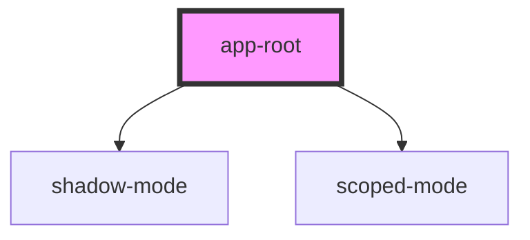

# app-root

<!-- Auto Generated Below -->

## Dependencies

### Depends on

- [shadow-mode](../shadow-mode)
- [scoped-mode](../scoped-mode)

### Graph

----------------------------------------------

*Built with [StencilJS](https://stenciljs.com/)*
