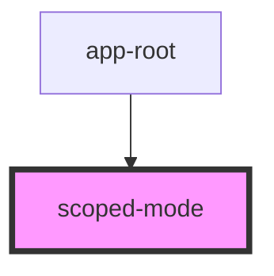

# scoped-mode

<!-- Auto Generated Below -->

## Properties

| Property | Attribute | Description      | Type                  | Default     |
| -------- | --------- | ---------------- | --------------------- | ----------- |
| `mode`   | `mode`    | This is the mode | `'buford' \| 'griff'` | `undefined` |

## Dependencies

### Used by

 - [app-root](../app-root)

### Graph

----------------------------------------------

*Built with [StencilJS](https://stenciljs.com/)*
