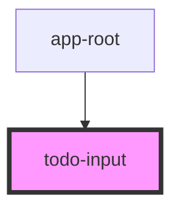

# todo-input

<!-- Auto Generated Below -->

## Events

| Event         | Description | Type               |
| ------------- | ----------- | ------------------ |
| `inputSubmit` |             | `CustomEvent<any>` |

## Dependencies

### Used by

 - [app-root](../app-root)

### Graph

----------------------------------------------

*Built with [StencilJS](https://stenciljs.com/)*
