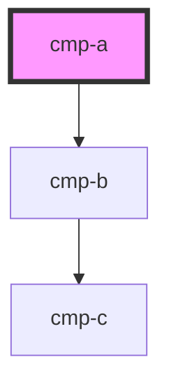
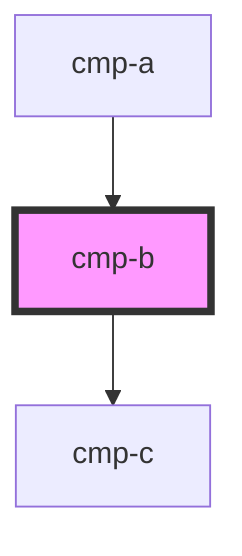
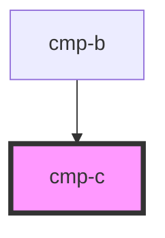

# cmp-c

<!-- Auto Generated Below -->

## `cmp-a`

### Dependencies

### Depends on

- [cmp-b](.)

### Graph

## `cmp-b`

### Dependencies

### Used by

 - [cmp-a](.)

### Depends on

- [cmp-c](.)

### Graph

## `cmp-c`

### Dependencies

### Used by

 - [cmp-b](.)

### Graph

----------------------------------------------

*Built with [StencilJS](https://stenciljs.com/)*
