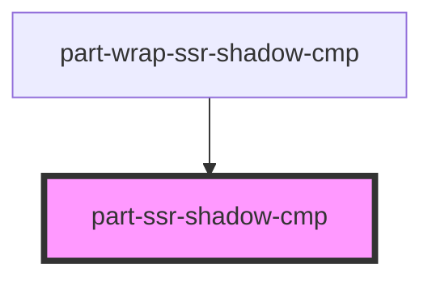
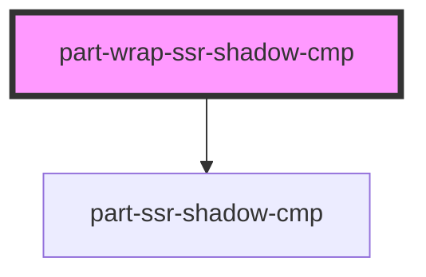
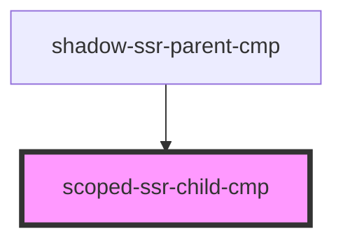
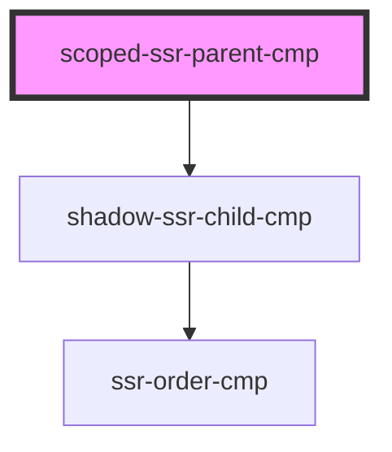
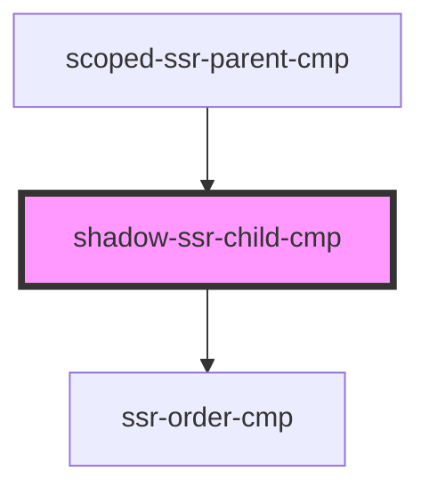
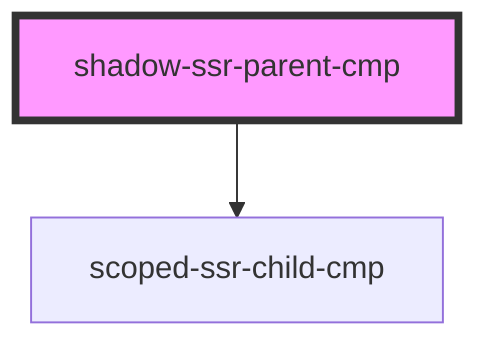
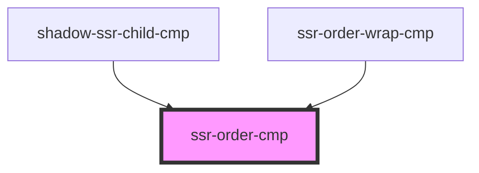
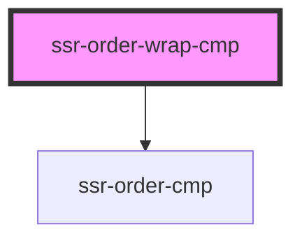

# ssr-order-wrap-cmp

<!-- Auto Generated Below -->

## `part-ssr-shadow-cmp`

### Properties

| Property   | Attribute  | Description | Type      | Default     |
| ---------- | ---------- | ----------- | --------- | ----------- |
| `selected` | `selected` |             | `boolean` | `undefined` |

### Slots

| Slot            | Description      |
| --------------- | ---------------- |
|                 | The default slot |
| `"client-only"` |                  |
| `"top"`         |                  |

### Shadow Parts

| Part          | Description |
| ------------- | ----------- |
| `"container"` |             |

### Dependencies

### Used by

 - [part-wrap-ssr-shadow-cmp](.)

### Graph

## `part-wrap-ssr-shadow-cmp`

### Properties

| Property   | Attribute  | Description | Type      | Default     |
| ---------- | ---------- | ----------- | --------- | ----------- |
| `selected` | `selected` |             | `boolean` | `undefined` |

### Slots

| Slot | Description      |
| ---- | ---------------- |
|      | The default slot |

### Dependencies

### Depends on

- [part-ssr-shadow-cmp](.)

### Graph

## `scoped-ssr-child-cmp`

### Slots

| Slot | Description      |
| ---- | ---------------- |
|      | The default slot |

### Dependencies

### Used by

 - [shadow-ssr-parent-cmp](.)

### Graph

## `scoped-ssr-parent-cmp`

### Slots

| Slot       | Description      |
| ---------- | ---------------- |
|            | The default slot |
| `"things"` |                  |

### Dependencies

### Depends on

- [shadow-ssr-child-cmp](.)

### Graph

## `shadow-ssr-child-cmp`

### Slots

| Slot | Description      |
| ---- | ---------------- |
|      | The default slot |

### Dependencies

### Used by

 - [scoped-ssr-parent-cmp](.)

### Depends on

- [ssr-order-cmp](.)

### Graph

## `shadow-ssr-parent-cmp`

### Slots

| Slot       | Description      |
| ---------- | ---------------- |
|            | The default slot |
| `"things"` |                  |

### Dependencies

### Depends on

- [scoped-ssr-child-cmp](.)

### Graph

## `slow-ssr-prop`

### Properties

| Property  | Attribute | Description | Type       | Default |
| --------- | --------- | ----------- | ---------- | ------- |
| `anArray` | --        |             | `string[]` | `[]`    |

## `ssr-order-cmp`

### Slots

| Slot | Description      |
| ---- | ---------------- |
|      | The default slot |

### Dependencies

### Used by

 - [shadow-ssr-child-cmp](.)
 - [ssr-order-wrap-cmp](.)

### Graph

## `ssr-order-wrap-cmp`

### Slots

| Slot       | Description      |
| ---------- | ---------------- |
|            | The default slot |
| `"things"` |                  |

### Dependencies

### Depends on

- [ssr-order-cmp](.)

### Graph

----------------------------------------------

*Built with [StencilJS](https://stenciljs.com/)*
