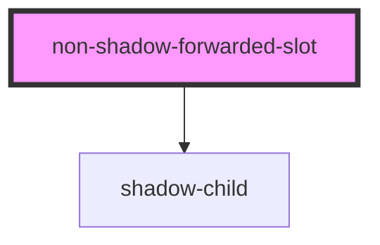
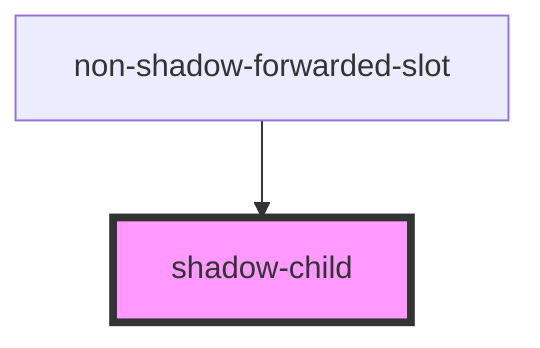

# shadow-wrapper

<!-- Auto Generated Below -->

## `non-shadow-forwarded-slot`

### Dependencies

### Depends on

- [shadow-child](.)

### Graph

## `shadow-child`

### Dependencies

### Used by

 - [non-shadow-forwarded-slot](.)

### Graph

----------------------------------------------

*Built with [StencilJS](https://stenciljs.com/)*
