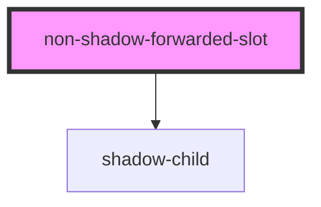
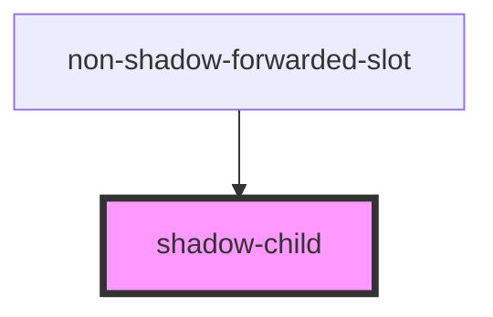

# shadow-wrapper

<!-- Auto Generated Below -->

## `hydrated-sibling-accessors`

### Slots

| Slot            | Description      |
| --------------- | ---------------- |
|                 | The default slot |
| `"second-slot"` |                  |

## `non-shadow-child`

### Slots

| Slot | Description      |
| ---- | ---------------- |
|      | The default slot |

## `non-shadow-forwarded-slot`

### Slots

| Slot | Description      |
| ---- | ---------------- |
|      | The default slot |

### Dependencies

### Depends on

- [shadow-child](.)

### Graph

## `non-shadow-multi-slots`

### Slots

| Slot            | Description      |
| --------------- | ---------------- |
|                 | The default slot |
| `"second-slot"` |                  |

## `non-shadow-wrapper`

### Slots

| Slot | Description      |
| ---- | ---------------- |
|      | The default slot |

## `shadow-child`

### Slots

| Slot | Description      |
| ---- | ---------------- |
|      | The default slot |

### Dependencies

### Used by

 - [non-shadow-forwarded-slot](.)

### Graph

## `shadow-wrapper`

### Slots

| Slot | Description      |
| ---- | ---------------- |
|      | The default slot |

----------------------------------------------

*Built with [StencilJS](https://stenciljs.com/)*
