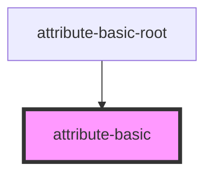
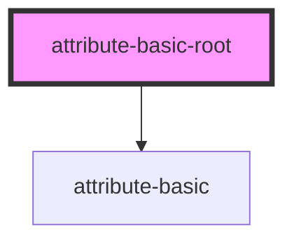

# attribute-basic-root

<!-- Auto Generated Below -->

## `attribute-basic`

### Properties

| Property     | Attribute        | Description | Type     | Default            |
| ------------ | ---------------- | ----------- | -------- | ------------------ |
| `customAttr` | `my-custom-attr` |             | `string` | `'my-custom-attr'` |
| `getter`     | `getter`         |             | `string` | `'getter'`         |
| `multiWord`  | `multi-word`     |             | `string` | `'multiWord'`      |
| `single`     | `single`         |             | `string` | `'single'`         |

### Dependencies

### Used by

 - [attribute-basic-root](.)

### Graph

## `attribute-basic-root`

### Dependencies

### Depends on

- [attribute-basic](.)

### Graph

----------------------------------------------

*Built with [StencilJS](https://stenciljs.com/)*
