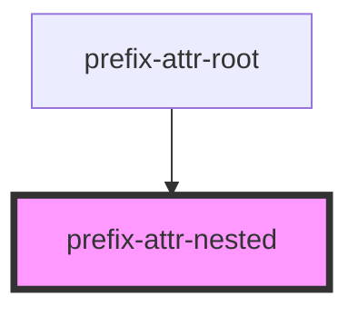
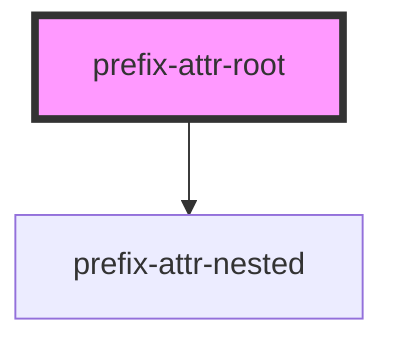

# prefix-attr-root

<!-- Auto Generated Below -->

## `prefix-attr-nested`

### Properties

| Property         | Attribute         | Description | Type                          | Default     |
| ---------------- | ----------------- | ----------- | ----------------------------- | ----------- |
| `count`          | `count`           |             | `number \| undefined`         | `undefined` |
| `enabled`        | `enabled`         |             | `boolean \| undefined`        | `undefined` |
| `message`        | `message`         |             | `string \| undefined`         | `undefined` |
| `nullValue`      | `null-value`      |             | `null \| string \| undefined` | `undefined` |
| `undefinedValue` | `undefined-value` |             | `string \| undefined`         | `undefined` |

### Dependencies

### Used by

 - [prefix-attr-root](.)

### Graph

## `prefix-attr-root`

### Dependencies

### Depends on

- [prefix-attr-nested](.)

### Graph

----------------------------------------------

*Built with [StencilJS](https://stenciljs.com/)*
