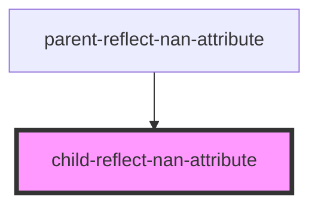
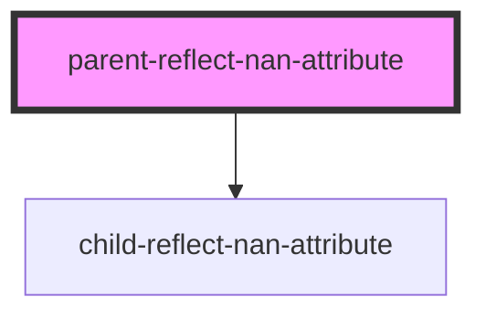

# parent-reflect-nan-attribute

<!-- Auto Generated Below -->

## `child-reflect-nan-attribute`

### Properties

| Property | Attribute | Description | Type     | Default     |
| -------- | --------- | ----------- | -------- | ----------- |
| `val`    | `val`     |             | `number` | `undefined` |

### Dependencies

### Used by

 - [parent-reflect-nan-attribute](.)

### Graph

## `parent-reflect-nan-attribute`

### Dependencies

### Depends on

- [child-reflect-nan-attribute](.)

### Graph

----------------------------------------------

*Built with [StencilJS](https://stenciljs.com/)*
