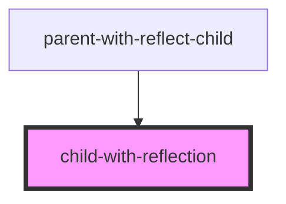
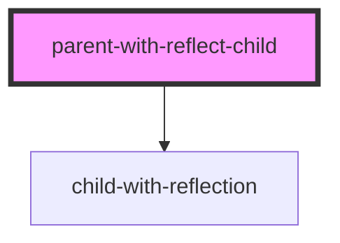

# parent-with-reflect-child

<!-- Auto Generated Below -->

## `child-with-reflection`

### Properties

| Property | Attribute | Description | Type  | Default     |
| -------- | --------- | ----------- | ----- | ----------- |
| `val`    | `val`     |             | `any` | `undefined` |

### Dependencies

### Used by

 - [parent-with-reflect-child](.)

### Graph

## `parent-with-reflect-child`

### Dependencies

### Depends on

- [child-with-reflection](.)

### Graph

----------------------------------------------

*Built with [StencilJS](https://stenciljs.com/)*
