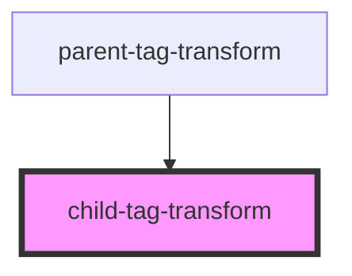
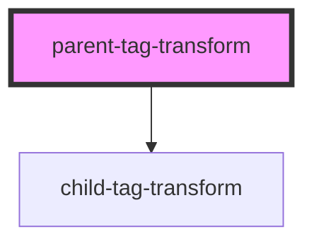

# parent-tag-transform

<!-- Auto Generated Below -->

## `child-tag-transform`

### Properties

| Property  | Attribute | Description | Type     | Default              |
| --------- | --------- | ----------- | -------- | -------------------- |
| `message` | `message` |             | `string` | `'Hello from Child'` |

### Methods

### `closestParentTag() => Promise<HTMLParentTagTransformElement | null>`

#### Returns

Type: `Promise<HTMLParentTagTransformElement | null>`

### Dependencies

### Used by

 - [parent-tag-transform](.)

### Graph

```mermaid
graph TD;
  parent-tag-transform --> child-tag-transform
  style child-tag-transform fill:#f9f,stroke:#333,stroke-width:4px
```

## `parent-tag-transform`

### Methods

### `createChildTagElement() => Promise<HTMLChildTagTransformElement>`

#### Returns

Type: `Promise<HTMLChildTagTransformElement>`

### `customElementsGetChild() => Promise<CustomElementConstructor | undefined>`

#### Returns

Type: `Promise<CustomElementConstructor | undefined>`

### `querySelectorAllChildTags() => Promise<NodeListOf<HTMLChildTagTransformElement>>`

#### Returns

Type: `Promise<NodeListOf<HTMLChildTagTransformElement>>`

### `querySelectorChildTags() => Promise<HTMLChildTagTransformElement | null>`

#### Returns

Type: `Promise<HTMLChildTagTransformElement | null>`

### Dependencies

### Depends on

- [child-tag-transform](.)

### Graph

```mermaid
graph TD;
  parent-tag-transform --> child-tag-transform
  style parent-tag-transform fill:#f9f,stroke:#333,stroke-width:4px
```

----------------------------------------------

*Built with [StencilJS](https://stenciljs.com/)*
