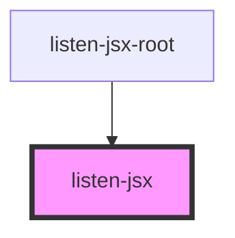
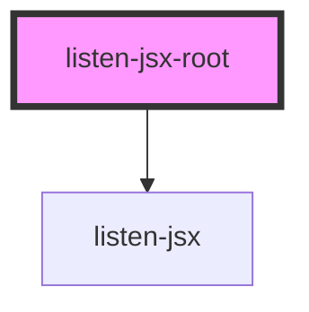

# listen-jsx-root

<!-- Auto Generated Below -->

## `listen-jsx`

### Dependencies

### Used by

 - [listen-jsx-root](.)

### Graph

## `listen-jsx-root`

### Dependencies

### Depends on

- [listen-jsx](.)

### Graph

----------------------------------------------

*Built with [StencilJS](https://stenciljs.com/)*
