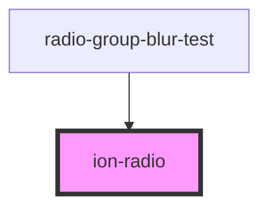
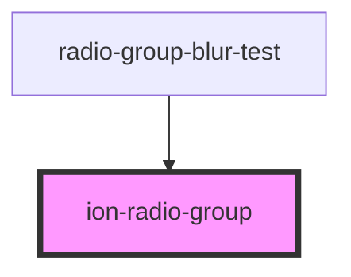
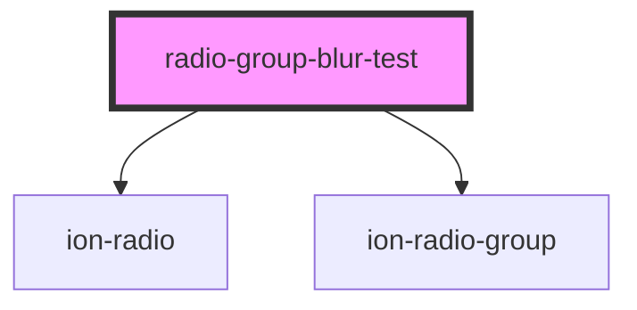

# radio-group-blur-test

<!-- Auto Generated Below -->

## `ion-radio`

### Properties

| Property | Attribute | Description | Type     | Default        |
| -------- | --------- | ----------- | -------- | -------------- |
| `name`   | `name`    |             | `string` | `this.inputId` |
| `value`  | `value`   |             | `any`    | `undefined`    |

### Events

| Event      | Description | Type                |
| ---------- | ----------- | ------------------- |
| `ionBlur`  |             | `CustomEvent<void>` |
| `ionFocus` |             | `CustomEvent<void>` |

### Methods

### `setButtonTabindex(value: number) => Promise<void>`

#### Parameters

| Name    | Type     | Description |
| ------- | -------- | ----------- |
| `value` | `number` |             |

#### Returns

Type: `Promise<void>`

### `setFocus(ev?: globalThis.Event) => Promise<void>`

#### Parameters

| Name | Type                 | Description |
| ---- | -------------------- | ----------- |
| `ev` | `Event \| undefined` |             |

#### Returns

Type: `Promise<void>`

### Shadow Parts

| Part          | Description |
| ------------- | ----------- |
| `"container"` |             |
| `"mark"`      |             |

### Dependencies

### Used by

 - [radio-group-blur-test](.)

### Graph

## `ion-radio-group`

### Properties

| Property              | Attribute               | Description | Type                                                                                 | Default        |
| --------------------- | ----------------------- | ----------- | ------------------------------------------------------------------------------------ | -------------- |
| `allowEmptySelection` | `allow-empty-selection` |             | `boolean`                                                                            | `false`        |
| `compareWith`         | `compare-with`          |             | `((currentValue: any, compareValue: any) => boolean) \| null \| string \| undefined` | `undefined`    |
| `errorText`           | `error-text`            |             | `string \| undefined`                                                                | `undefined`    |
| `helperText`          | `helper-text`           |             | `string \| undefined`                                                                | `undefined`    |
| `name`                | `name`                  |             | `string`                                                                             | `this.inputId` |
| `value`               | `value`                 |             | `any`                                                                                | `undefined`    |

### Events

| Event            | Description | Type               |
| ---------------- | ----------- | ------------------ |
| `ionChange`      |             | `CustomEvent<any>` |
| `ionValueChange` |             | `CustomEvent<any>` |

### Dependencies

### Used by

 - [radio-group-blur-test](.)

### Graph

## `radio-group-blur-test`

### Dependencies

### Depends on

- [ion-radio](.)
- [ion-radio-group](.)

### Graph

----------------------------------------------

*Built with [StencilJS](https://stenciljs.com/)*
