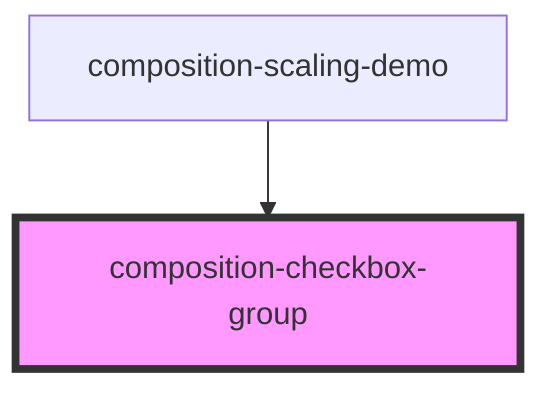
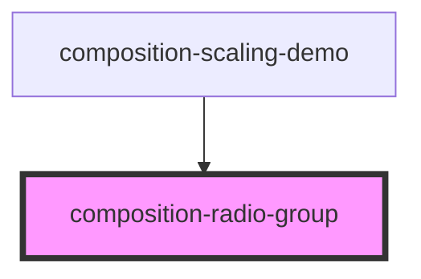
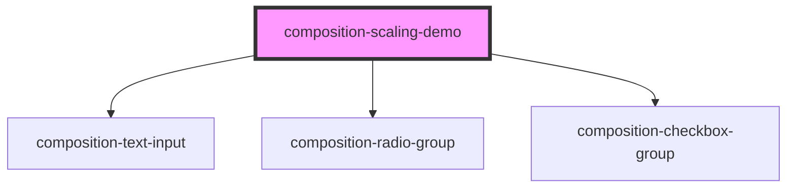
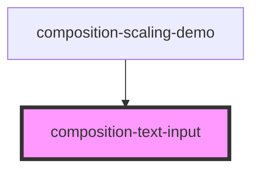

# composition-text-input

<!-- Auto Generated Below -->

## `composition-checkbox-group`

### Events

| Event         | Description | Type                    |
| ------------- | ----------- | ----------------------- |
| `valueChange` |             | `CustomEvent<string[]>` |

### Dependencies

### Used by

 - [composition-scaling-demo](.)

### Graph

## `composition-radio-group`

### Events

| Event         | Description | Type                  |
| ------------- | ----------- | --------------------- |
| `valueChange` |             | `CustomEvent<string>` |

### Dependencies

### Used by

 - [composition-scaling-demo](.)

### Graph

## `composition-scaling-demo`

### Overview

Main component that demonstrates composition-based scaling
with 3 components and 2 controllers (ValidationController and FocusController)

### Dependencies

### Depends on

- [composition-text-input](.)
- [composition-radio-group](.)
- [composition-checkbox-group](.)

### Graph

## `composition-text-input`

### Dependencies

### Used by

 - [composition-scaling-demo](.)

### Graph

----------------------------------------------

*Built with [StencilJS](https://stenciljs.com/)*
