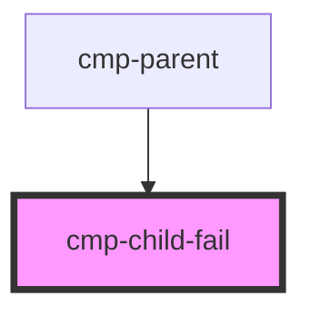
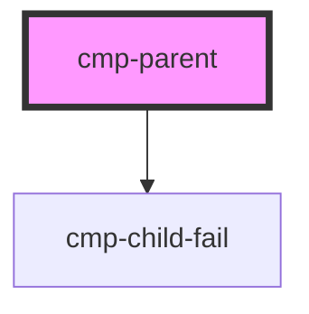

# cmp-parent

<!-- Auto Generated Below -->

## `cmp-child-fail`

### Dependencies

### Used by

 - [cmp-parent](.)

### Graph

## `cmp-parent`

### Dependencies

### Depends on

- [cmp-child-fail](.)

### Graph

----------------------------------------------

*Built with [StencilJS](https://stenciljs.com/)*
