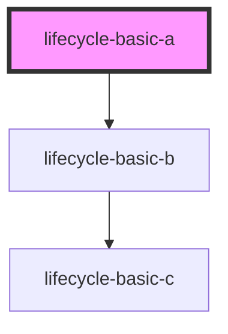
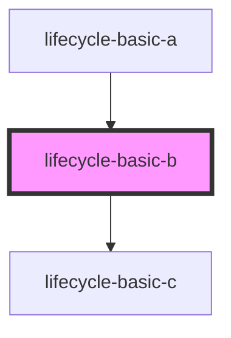
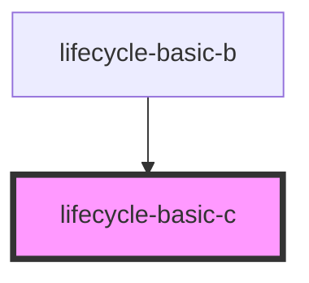

# lifecycle-basic-c

<!-- Auto Generated Below -->

## `lifecycle-basic-a`

### Dependencies

### Depends on

- [lifecycle-basic-b](.)

### Graph

## `lifecycle-basic-b`

### Properties

| Property | Attribute | Description | Type     | Default |
| -------- | --------- | ----------- | -------- | ------- |
| `value`  | `value`   |             | `string` | `''`    |

### Events

| Event             | Description | Type               |
| ----------------- | ----------- | ------------------ |
| `lifecycleLoad`   |             | `CustomEvent<any>` |
| `lifecycleUpdate` |             | `CustomEvent<any>` |

### Dependencies

### Used by

 - [lifecycle-basic-a](.)

### Depends on

- [lifecycle-basic-c](.)

### Graph

## `lifecycle-basic-c`

### Properties

| Property | Attribute | Description | Type     | Default |
| -------- | --------- | ----------- | -------- | ------- |
| `value`  | `value`   |             | `string` | `''`    |

### Events

| Event             | Description | Type               |
| ----------------- | ----------- | ------------------ |
| `lifecycleLoad`   |             | `CustomEvent<any>` |
| `lifecycleUpdate` |             | `CustomEvent<any>` |

### Dependencies

### Used by

 - [lifecycle-basic-b](.)

### Graph

----------------------------------------------

*Built with [StencilJS](https://stenciljs.com/)*
