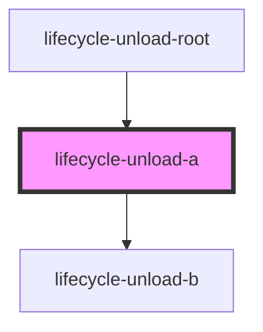
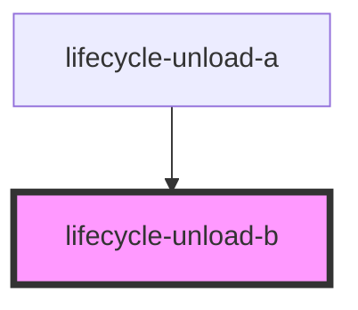
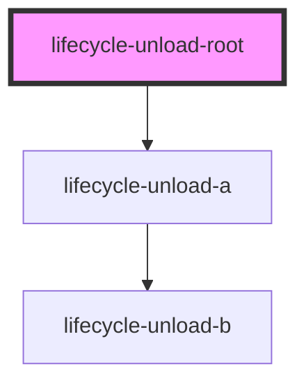

# lifecycle-unload-root

<!-- Auto Generated Below -->

## `lifecycle-unload-a`

### Dependencies

### Used by

 - [lifecycle-unload-root](.)

### Depends on

- [lifecycle-unload-b](.)

### Graph

## `lifecycle-unload-b`

### Dependencies

### Used by

 - [lifecycle-unload-a](.)

### Graph

## `lifecycle-unload-root`

### Dependencies

### Depends on

- [lifecycle-unload-a](.)

### Graph

----------------------------------------------

*Built with [StencilJS](https://stenciljs.com/)*
