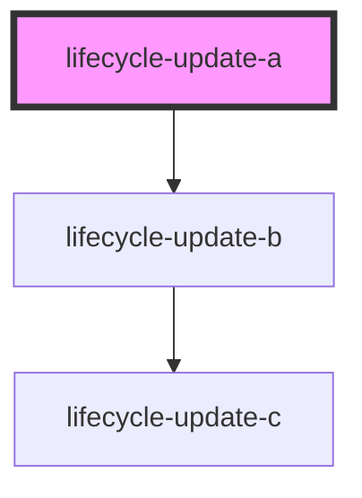
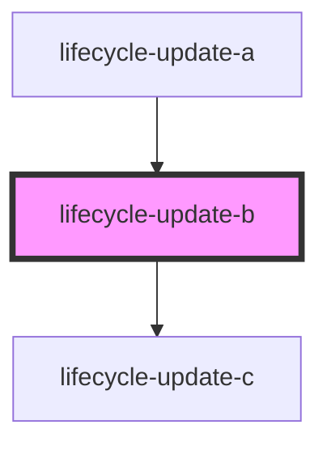
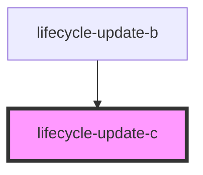

# lifecycle-update-c

<!-- Auto Generated Below -->

## `lifecycle-update-a`

### Dependencies

### Depends on

- [lifecycle-update-b](.)

### Graph

## `lifecycle-update-b`

### Properties

| Property | Attribute | Description | Type     | Default |
| -------- | --------- | ----------- | -------- | ------- |
| `value`  | `value`   |             | `number` | `0`     |

### Dependencies

### Used by

 - [lifecycle-update-a](.)

### Depends on

- [lifecycle-update-c](.)

### Graph

## `lifecycle-update-c`

### Properties

| Property | Attribute | Description | Type     | Default |
| -------- | --------- | ----------- | -------- | ------- |
| `value`  | `value`   |             | `number` | `0`     |

### Dependencies

### Used by

 - [lifecycle-update-b](.)

### Graph

----------------------------------------------

*Built with [StencilJS](https://stenciljs.com/)*
