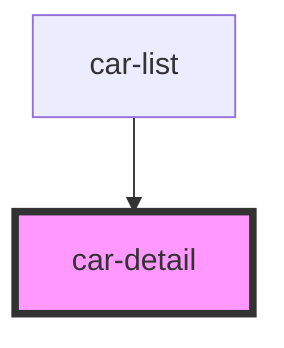
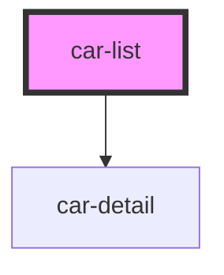

# car-detail

<!-- Auto Generated Below -->

## `car-detail`

### Properties

| Property | Attribute | Description | Type      | Default     |
| -------- | --------- | ----------- | --------- | ----------- |
| `car`    | `car`     |             | `CarData` | `undefined` |

### Dependencies

### Used by

 - [car-list](.)

### Graph

## `car-list`

### Overview

Component that helps display a list of cars

### Properties

| Property   | Attribute | Description | Type        | Default     |
| ---------- | --------- | ----------- | ----------- | ----------- |
| `cars`     | `cars`    |             | `CarData[]` | `undefined` |
| `selected` | --        |             | `CarData`   | `undefined` |

### Events

| Event         | Description | Type                   |
| ------------- | ----------- | ---------------------- |
| `carSelected` |             | `CustomEvent<CarData>` |

### Slots

| Slot       | Description                      |
| ---------- | -------------------------------- |
| `"header"` | The slot for the header content. |

### Shadow Parts

| Part    | Description                                 |
| ------- | ------------------------------------------- |
| `"car"` | The shadow part to target to style the car. |

### Dependencies

### Depends on

- [car-detail](.)

### Graph

----------------------------------------------

*Built with [StencilJS](https://stenciljs.com/)*
