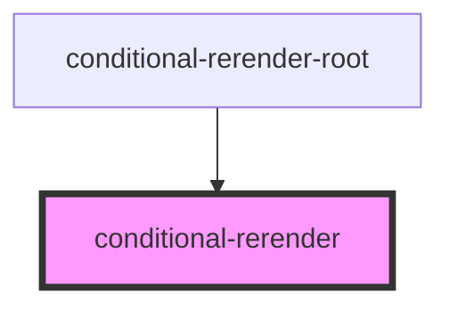
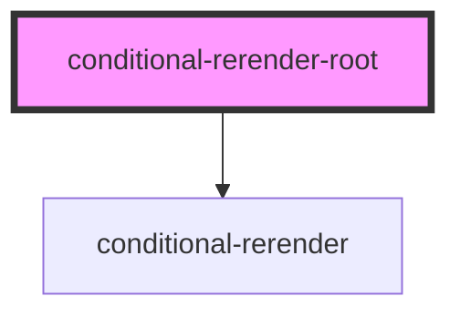

# conditional-rerender-root

<!-- Auto Generated Below -->

## `conditional-rerender`

### Dependencies

### Used by

 - [conditional-rerender-root](.)

### Graph

## `conditional-rerender-root`

### Dependencies

### Depends on

- [conditional-rerender](.)

### Graph

----------------------------------------------

*Built with [StencilJS](https://stenciljs.com/)*
