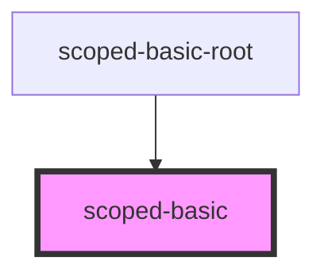
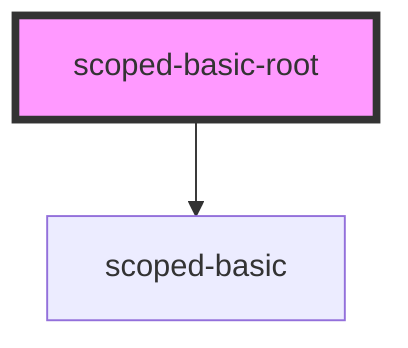

# scoped-basic-root

<!-- Auto Generated Below -->

## `scoped-basic`

### Dependencies

### Used by

 - [scoped-basic-root](.)

### Graph

## `scoped-basic-root`

### Dependencies

### Depends on

- [scoped-basic](.)

### Graph

----------------------------------------------

*Built with [StencilJS](https://stenciljs.com/)*
