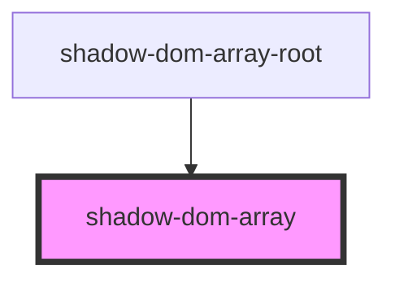
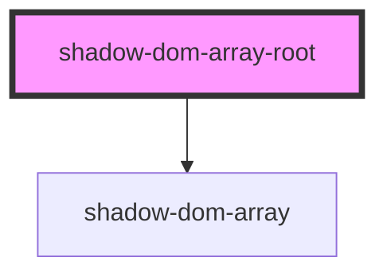

# shadow-dom-array-root

<!-- Auto Generated Below -->

## `shadow-dom-array`

### Properties

| Property | Attribute | Description | Type       | Default |
| -------- | --------- | ----------- | ---------- | ------- |
| `values` | --        |             | `number[]` | `[]`    |

### Dependencies

### Used by

 - [shadow-dom-array-root](.)

### Graph

## `shadow-dom-array-root`

### Dependencies

### Depends on

- [shadow-dom-array](.)

### Graph

----------------------------------------------

*Built with [StencilJS](https://stenciljs.com/)*
