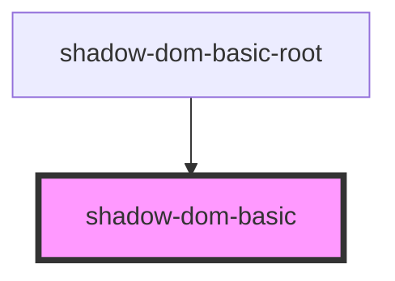
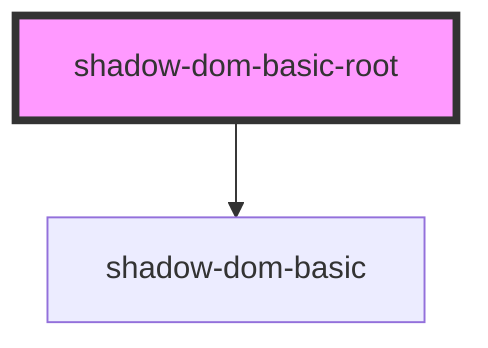

# shadow-dom-basic-root

<!-- Auto Generated Below -->

## `shadow-dom-basic`

### Dependencies

### Used by

 - [shadow-dom-basic-root](.)

### Graph

## `shadow-dom-basic-root`

### Dependencies

### Depends on

- [shadow-dom-basic](.)

### Graph

----------------------------------------------

*Built with [StencilJS](https://stenciljs.com/)*
